# Lab 46: Distributed Schema Design

In this lab, you will design and implement a distributed relational database schema using Citus. You will deploy a 3-node Citus cluster (1 Coordinator + 2 Workers) directly using Docker Compose in your Poridhi environment. Then, you will configure multi-tenant data models, deploying an `orders` transaction table as a sharded distributed table and a `products` catalog as a globally replicated reference table.

<p align="center">
  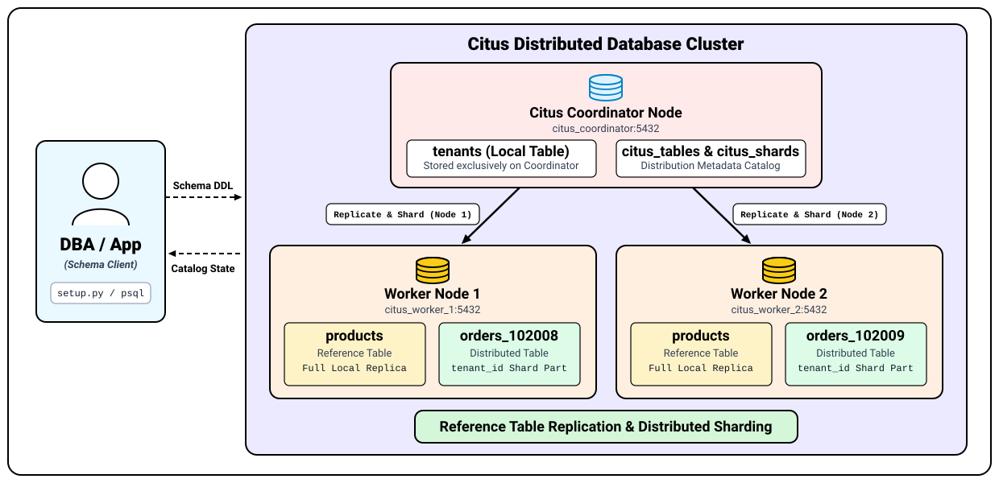
</p>

---

## Concept

| Term | Definition | Best Use Case | SQL Command |
|---|---|---|---|
| **Distributed Table** | Rows are horizontally partitioned into shards across worker nodes based on a distribution column (hash key). | High-volume transaction tables (`orders`, `events`, `clicks`). | `create_distributed_table('table', 'col')` |
| **Reference Table** | Fully duplicated in its entirety on every worker node across the cluster. | Smaller, frequently joined lookup tables (`products`, `categories`, `plans`). | `create_reference_table('table')` |
| **Local Table** | Normal PostgreSQL table that resides only on the coordinator node. | Administrative metadata, user authentication, migration logs. | Standard `CREATE TABLE` |
| **Co-location** | Storing related rows from different tables with the same distribution key on the same physical worker node to enable local joins. | Joining `orders` and `order_items` on `tenant_id`. | Automatic when sharing distribution key |

When designing a distributed schema:
- **Reference tables** allow worker nodes to perform instant, in-memory local joins without needing to query across the network.
- **Distributed tables** ensure write operations and large table queries scale horizontally across all available cluster nodes.

---

## Objectives

- Deploy a 3-node Citus cluster (1 Coordinator + 2 Workers) using Docker Compose.
- Register worker nodes and verify cluster health.
- Define SQLAlchemy models for `tenants`, `products`, and `orders`.
- Replicate lookup tables across all worker nodes using Citus's `create_reference_table()`.
- Distribute transaction tables across worker shards using Citus's `create_distributed_table()`.
- Verify schema distribution and inspect shard placement via PostgreSQL metadata tables (`citus_tables` and `citus_shards`).

---

## Project Structure

```text
flask-schema-lab/
├── citus/
│   └── docker-compose.yml
└── app/
    ├── requirements.txt
    ├── database.py
    └── setup.py
```

---

## Step 1: Deploy Citus Cluster using Docker Compose

Create a dedicated directory for the Citus cluster and define the cluster services:

```bash
mkdir -p ~/flask-schema-lab/citus
cd ~/flask-schema-lab/citus
```

<p align="center">
  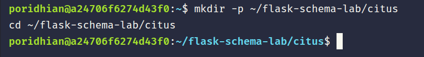
</p>

Create `docker-compose.yml`:

```bash
cat << 'EOF' > docker-compose.yml
version: '3.8'
services:
  coordinator:
    image: citusdata/citus:12.1
    container_name: citus_coordinator
    restart: always
    ports:
      - "5432:5432"
    environment:
      - POSTGRES_PASSWORD=citus_password
      - POSTGRES_USER=citus
      - POSTGRES_DB=citus
    command: ["-c", "listen_addresses=*"]

  worker1:
    image: citusdata/citus:12.1
    container_name: citus_worker_1
    restart: always
    environment:
      - POSTGRES_PASSWORD=citus_password
      - POSTGRES_USER=citus
      - POSTGRES_DB=citus

  worker2:
    image: citusdata/citus:12.1
    container_name: citus_worker_2
    restart: always
    environment:
      - POSTGRES_PASSWORD=citus_password
      - POSTGRES_USER=citus
      - POSTGRES_DB=citus
EOF
```

<p align="center">
  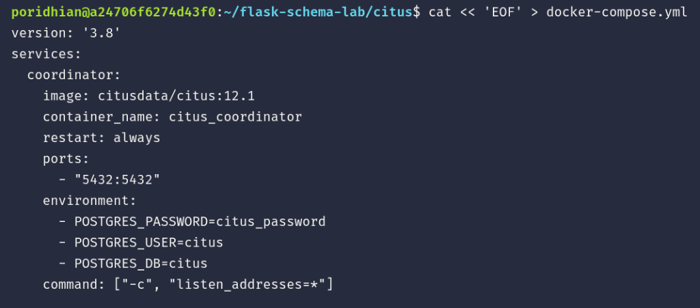
</p>

Start the Citus cluster:

```bash
docker compose up -d || docker-compose up -d
```

<p align="center">
  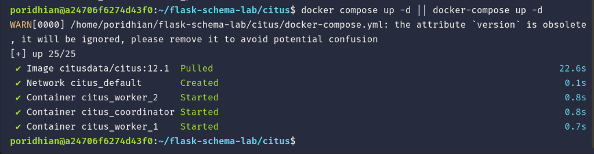
</p>

Wait 10 seconds for PostgreSQL instances to initialize, then register the worker nodes with the coordinator:

```bash
sleep 10
docker exec citus_coordinator psql -U citus -d citus -c "SELECT citus_add_node('worker1', 5432);"
docker exec citus_coordinator psql -U citus -d citus -c "SELECT citus_add_node('worker2', 5432);"
```

<p align="center">
  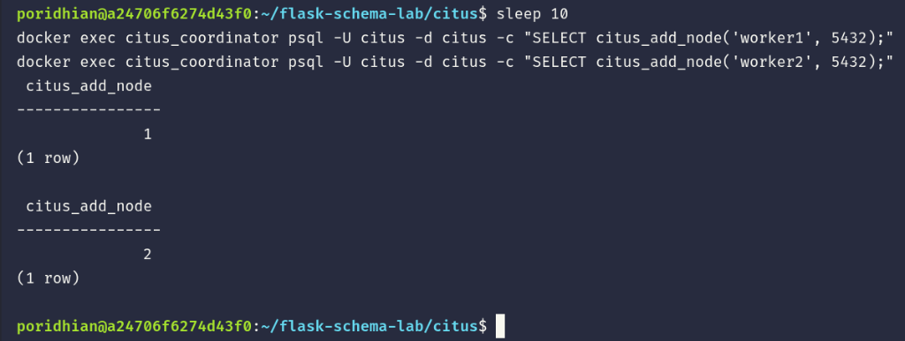
</p>

---

## Step 2: Verify Active Citus Worker Nodes

Check that both worker nodes are connected and active:

```bash
docker exec -it citus_coordinator psql -U citus -d citus -c "SELECT * FROM citus_get_active_worker_nodes();"
```

Expected Output:

```text
 node_name | node_port 
-----------+-----------
 worker1   |      5432
 worker2   |      5432
(2 rows)
```

<p align="center">
  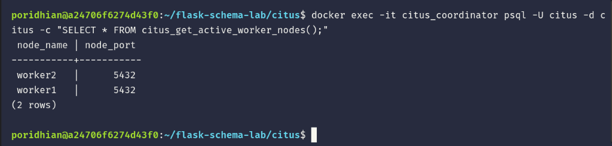
</p>

---

## Step 3: Set Up Application Environment & Dependencies

Navigate to your workspace directory, create the `app` folder, and configure the Python environment:

```bash
cd ~/flask-schema-lab
mkdir -p app && cd app

python3 -m venv venv
source venv/bin/activate
```

<p align="center">
  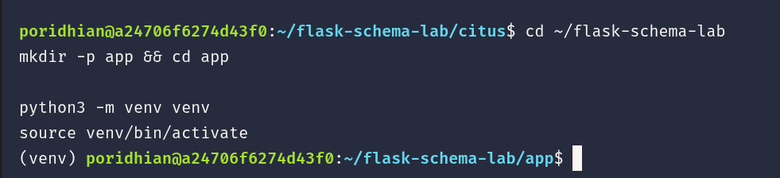
</p>

Create `requirements.txt`:

```bash
cat << 'EOF' > requirements.txt
Flask==3.0.0
psycopg2-binary==2.9.9
Flask-SQLAlchemy==3.1.1
EOF
```

<p align="center">
  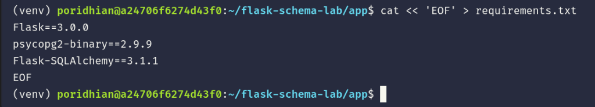
</p>

Install the dependencies:

```bash
pip install -r requirements.txt
```

<p align="center">
  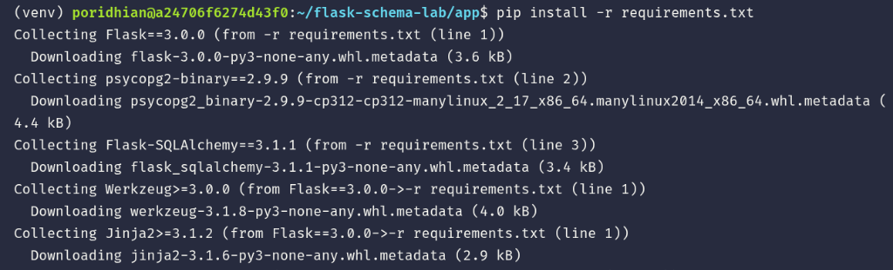
</p>

---

## Step 4: Define Database Models

Create `flask-schema-lab/app/database.py` to define the models:

```bash
cat << 'EOF' > database.py
from flask_sqlalchemy import SQLAlchemy

db = SQLAlchemy()

class Tenant(db.Model):
    __tablename__ = 'tenants'
    id = db.Column(db.Integer, primary_key=True)
    name = db.Column(db.String(100), nullable=False)

class Product(db.Model):
    __tablename__ = 'products'
    # Reference table: Replicated to all worker nodes
    id = db.Column(db.Integer, primary_key=True)
    name = db.Column(db.String(100), nullable=False)
    price = db.Column(db.Float, nullable=False)

class Order(db.Model):
    __tablename__ = 'orders'
    # Distributed table: Sharded across workers by tenant_id
    id = db.Column(db.Integer, primary_key=True, autoincrement=True)
    tenant_id = db.Column(db.Integer, primary_key=True)
    product_id = db.Column(db.Integer, nullable=False)
    quantity = db.Column(db.Integer, nullable=False)
EOF
```

<p align="center">
  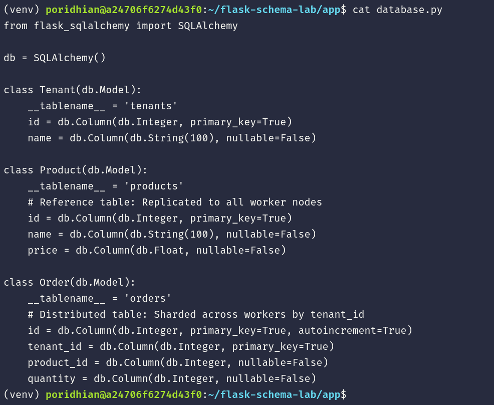
</p>

---

## Step 5: Implement Schema Distribution Script

Create `flask-schema-lab/app/setup.py` to initialize tables, replicate `products` as a reference table, and distribute `orders` across worker shards:

```bash
cat << 'EOF' > setup.py
import os
from flask import Flask
from sqlalchemy import text
from database import db

app = Flask(__name__)
COORDINATOR_IP = os.environ.get("COORDINATOR_IP", "127.0.0.1")
app.config['SQLALCHEMY_DATABASE_URI'] = f'postgresql://citus:citus_password@{COORDINATOR_IP}:5432/citus'
app.config['SQLALCHEMY_TRACK_MODIFICATIONS'] = False
db.init_app(app)

def initialize_database():
    with app.app_context():
        # 1. Create base PostgreSQL tables on coordinator
        db.create_all()
        print("Standard tables created.")

        # 2. Convert products table into a Reference Table (Replicated across all workers)
        try:
            db.session.execute(text("SELECT create_reference_table('products');"))
            db.session.commit()
            print("Products table replicated successfully as Reference Table.")
        except Exception as e:
            db.session.rollback()
            print(f"Products table setup status: {e}")

        # 3. Convert orders table into a Distributed Table (Sharded by tenant_id)
        try:
            db.session.execute(text("SELECT create_distributed_table('orders', 'tenant_id');"))
            db.session.commit()
            print("Orders table distributed successfully across shards by tenant_id.")
        except Exception as e:
            db.session.rollback()
            print(f"Orders table setup status: {e}")

if __name__ == '__main__':
    initialize_database()
EOF
```

<p align="center">
  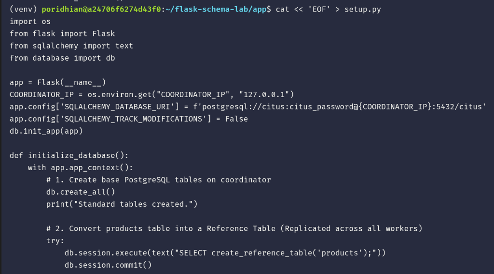
</p>

---

## Step 6: Run Schema Initialization

Run the initialization script inside the virtual environment:

```bash
cd ~/flask-schema-lab/app
source venv/bin/activate
python3 setup.py
```

Expected Output:

```text
Standard tables created.
Products table replicated successfully as Reference Table.
Orders table distributed successfully across shards by tenant_id.
```

<p align="center">
  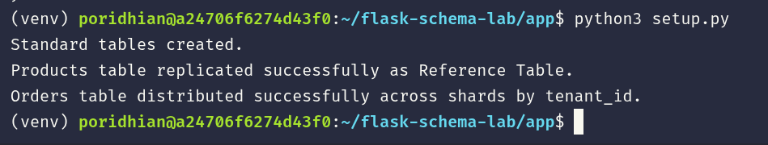
</p>

---

## Step 7: Verify Distributed Schema & Shards

### 1. Verify Table Types via `citus_tables`

Connect to the Citus coordinator and query the cluster catalog table `citus_tables` to inspect the distribution strategy:

```bash
docker exec -it citus_coordinator psql -U citus -d citus -c \
"SELECT table_name, citus_table_type, distribution_column FROM citus_tables;"
```

Expected Output:

```text
 table_name | citus_table_type | distribution_column 
------------+------------------+---------------------
 orders     | distributed      | tenant_id
 products   | reference        | <none>
(2 rows)
```

<p align="center">
  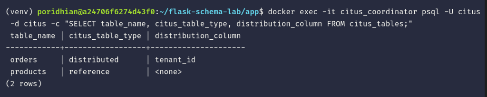
</p>

Explanation:
- `products`: Has table type `reference` (present in full on every worker node).
- `orders`: Has table type `distributed` with `distribution_column` set to `tenant_id` (partitioned across workers).

### 2. Verify Shard Distribution via `citus_shards`

Check the shard placement across `worker1` and `worker2`:

```bash
docker exec -it citus_coordinator psql -U citus -d citus -c \
"SELECT shardid, table_name, nodename, nodeport FROM citus_shards WHERE table_name = 'orders'::regclass LIMIT 6;"
```

Expected Output:

```text
 shardid | table_name | nodename | nodeport 
---------+------------+----------+----------
  102009 | orders     | worker1  |     5432
  102010 | orders     | worker2  |     5432
  102011 | orders     | worker1  |     5432
  102012 | orders     | worker2  |     5432
  102013 | orders     | worker1  |     5432
  102014 | orders     | worker2  |     5432
(6 rows)
```

<p align="center">
  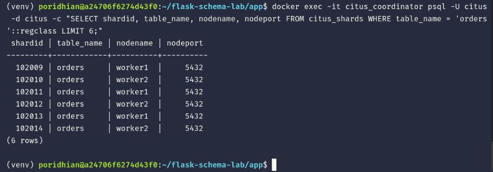
</p>

---

## Verification Summary

| # | Command / Query | Expected Result | Technical Verification |
|---|---|---|---|
| 1 | `SELECT * FROM citus_get_active_worker_nodes();` | `worker1`, `worker2` active | Multi-node cluster is healthy |
| 2 | `python3 setup.py` | `Products replicated... Orders distributed...` | Citus DDL operations execute successfully |
| 3 | Query `citus_tables` | `products` = `reference`, `orders` = `distributed` | Tables are correctly cataloged |
| 4 | Query `citus_shards` | Shards balanced across worker nodes | Data partitions are physically distributed |

---

## Conclusion

You have successfully designed and deployed a production-ready distributed relational schema using Citus. By setting `orders` as a distributed table sharded on `tenant_id`, writes and queries scale linearly across worker nodes. By creating `products` as a globally replicated reference table, worker nodes can execute local table joins with zero network latency.
