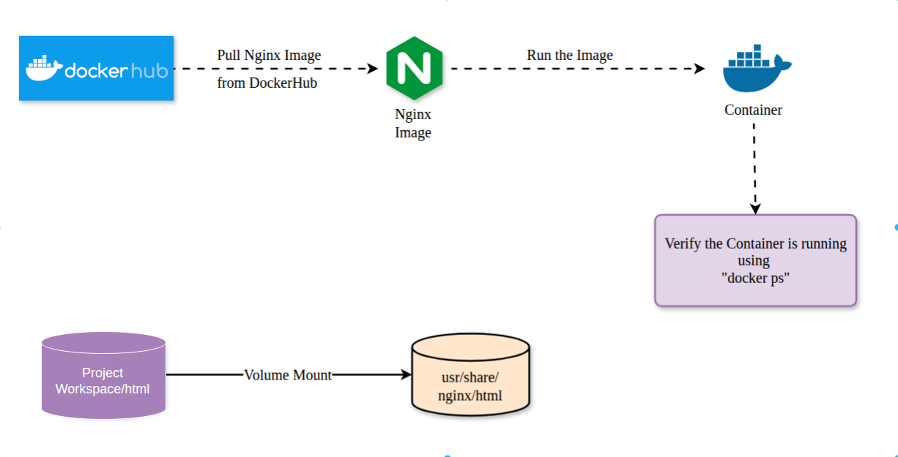
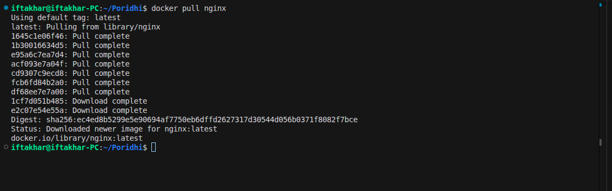
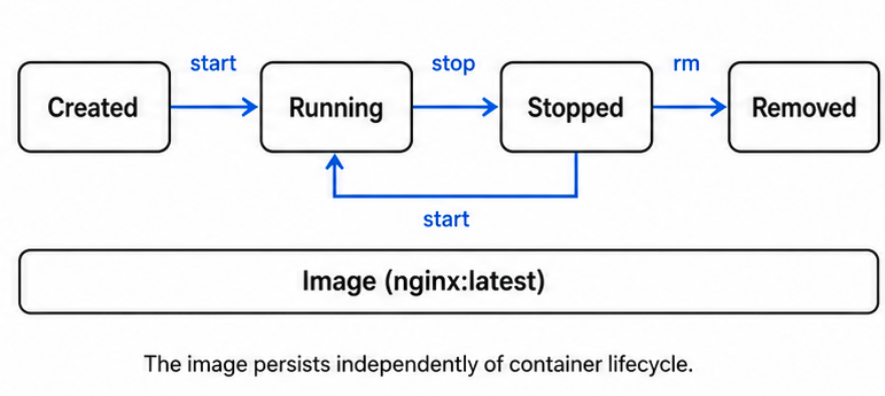
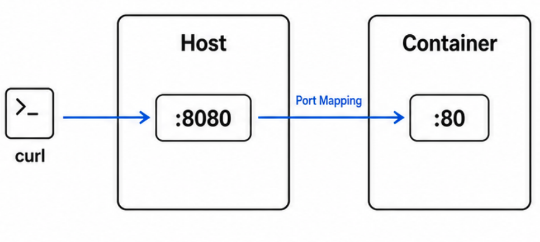
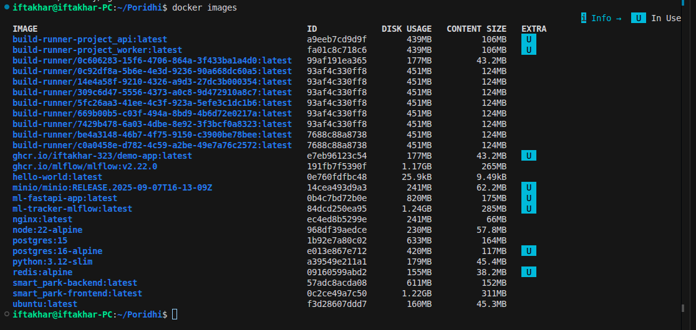
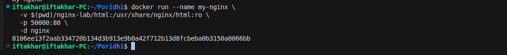
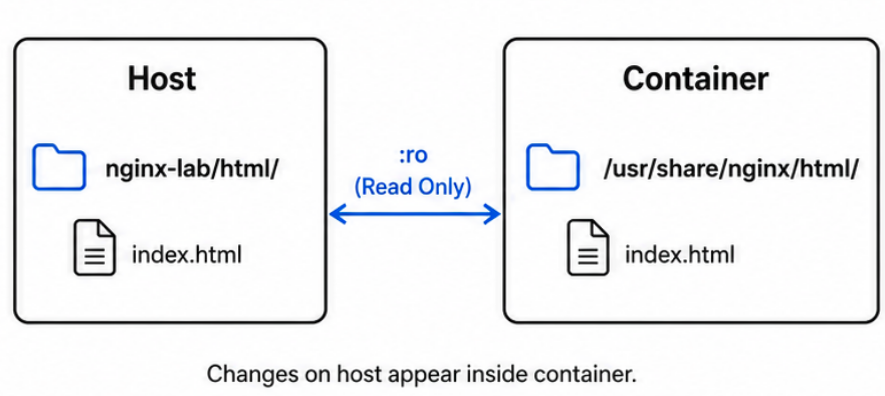
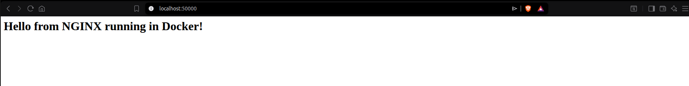
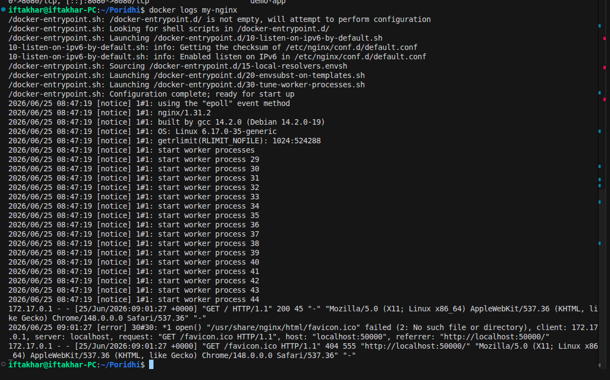
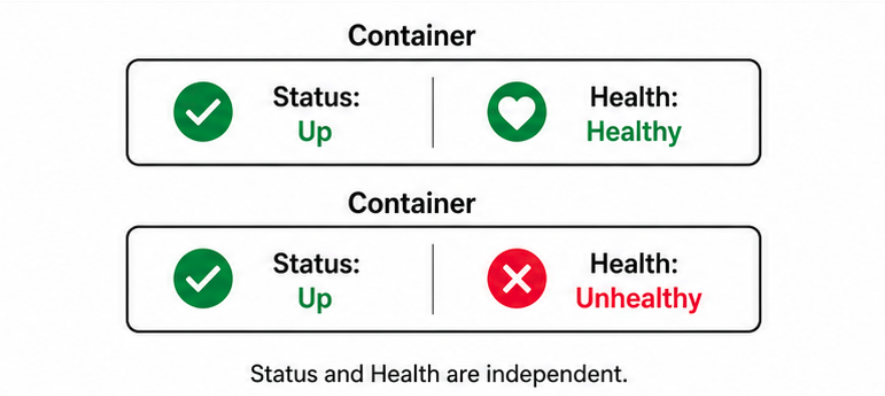

# Running an NGINX Web Server in a Docker Container

> **Prerequisites:** Familiarity with terminal commands and a basic understanding of how web servers respond to HTTP requests.

---

## Table of Contents

1. [Introduction](#introduction)
2. [Learning Objectives](#learning-objectives)
3. [Prologue: The Challenge](#prologue-the-challenge)
4. [Environment Setup](#environment-setup)
5. [Chapter 1: Images and the Docker Hub Registry](#chapter-1-images-and-the-docker-hub-registry)
6. [Chapter 2: Serving Content with Volume Mounts](#chapter-2-serving-content-with-volume-mounts)
7. [Chapter 3: Inspecting a Running Container](#chapter-3-inspecting-a-running-container)
8. [Chapter 4: Container Lifecycle Management](#chapter-4-container-lifecycle-management)
9. [Epilogue: The Complete System](#epilogue-the-complete-system)
10. [The Principles](#the-principles)
11. [Troubleshooting](#troubleshooting)
12. [Next Steps](#next-steps)
13. [Additional Resources](#additional-resources)

---

## Introduction

This lab teaches you how to deploy an NGINX web server inside a Docker container. You will pull an official image from Docker Hub, mount a custom HTML directory into the container, manage the container lifecycle, and verify a running web service.

By the end, you will have a reproducible web server environment that runs identically anywhere Docker is available.

---

## Learning Objectives

By the end of this lab, you will be able to:

- Pull a Docker image from Docker Hub and verify it locally.
- Create a custom HTML page and serve it from a running Docker container.
- Configure port mapping and volume mounts in a `docker run` command.
- Analyze container status, logs, and networking using Docker CLI commands.
- Debug container state when the service is unreachable.
- Optimize the mount configuration by selecting read-only access where appropriate.
- Evaluate the difference between container status and container health.

---

## Prologue: The Challenge

You join a team that maintains a set of internal documentation portals. A colleague built one locally and it works on their machine. When the service moves to a shared server, nothing works: missing dependencies, wrong versions, port conflicts.

The infrastructure lead assigns you a task:

> Containerize the web server so the environment is reproducible anywhere. Use NGINX in Docker.

Your deliverable: a running NGINX container that serves a custom HTML page, mapped to a host port, with its content directory mounted from the project workspace.

---

## Environment Setup

**Step 1.** Open a terminal session.

**Step 2.** Verify Docker is available:

```bash
docker --version
```

<details>
<summary>Expected output</summary>

```text
Docker version 24.x.x, build ...
```

</details>

**Step 3.** Create the project directory structure:

```bash
mkdir -p nginx-lab/html
```

---

## Chapter 1: Images and the Docker Hub Registry

Docker does not require you to build every image from scratch. Docker Hub provides official, maintained images for common software. Before running a container, you pull its image.

### 1.1 What You Will Build

You will pull the official NGINX image and verify it is available on your local machine.

### 1.2 Think First

Consider the following two statements:

> "The NGINX image is running."
> "The NGINX container is running."

Which statement is technically accurate, and what is the difference between an image and a container?

<details>
<summary>Answer</summary>

Only a container can run. An image is a read-only template: a snapshot of a filesystem and configuration. A container is a running instance created from that image.

One image can produce many containers simultaneously, each isolated from the others.

The accurate statement is: "The NGINX container is running."

</details>

### 1.3 Pull the NGINX Image

Run the following command to download the latest official NGINX image from Docker Hub:

```bash
docker pull nginx
```

Docker downloads each layer of the image in parallel and confirms each layer as it completes.

<p align="center">
  
</p>

<details>
<summary>Expected output</summary>

```text
Using default tag: latest
latest: Pulling from library/nginx
1645c1e06f46: Pull complete
1b30016634d5: Pull complete
e95a6c7ea7d4: Pull complete
acf093e7a04f: Pull complete
cd9307c9ecd8: Pull complete
fcb6fd84b2a0: Pull complete
df68ee7e7a80: Pull complete
1cf7d051b485: Download complete
e2c07e54e55a: Download complete
Digest: sha256:ec4ed8b5299e5e90694af7750eb6dffd2627317d30544d056b0371f8082f7bce
Status: Downloaded newer image for nginx:latest
docker.io/library/nginx:latest
```

</details>

### 1.4 Verify the Download

Confirm the image is available locally:

```bash
docker images
```

<p align="center">
  
</p>

Predict: which columns will this command display?

<details>
<summary>Answer</summary>

The columns are `REPOSITORY`, `TAG`, `IMAGE ID`, `CREATED`, and `SIZE`. The `nginx` image with tag `latest` appears in the list.

```text
REPOSITORY   TAG       IMAGE ID       CREATED       SIZE
nginx        latest    ec4ed8b5299e   2 weeks ago   241MB
```

</details>

### 1.5 Checkpoint

- [ ] `docker pull nginx` completed without errors.
- [ ] `docker images` lists `nginx` with the `latest` tag.
- [ ] You can explain the difference between an image and a container.

---

## Chapter 2: Serving Content with Volume Mounts

An NGINX container started without configuration serves only its default welcome page. To serve your own content, you mount a local directory into the container's web root. Any HTML file placed in that directory becomes immediately available through the running server.

### 2.1 What You Will Build

You will create a custom HTML file, run the NGINX container with a volume mount and port mapping, and verify the server returns your custom content.

### 2.2 Think First

The NGINX server inside the container listens on port 80. Your host machine cannot directly access port 80 inside the container.

What does the `-p 8080:80` flag accomplish, and which number refers to the host?

<details>
<summary>Answer</summary>

The `-p` flag maps a host port to a container port. The format is `host_port:container_port`.

`-p 8080:80` means requests arriving at port 8080 on your host are forwarded to port 80 inside the container. The first number (8080) is the host port.

Without this mapping, the container's network is isolated and unreachable from outside.

<p align="center">
  
</p>

</details>

### 2.3 Create the HTML Page

```bash
echo '<h1>Hello from NGINX running in Docker!</h1>' > nginx-lab/html/index.html
```

```bash
cat nginx-lab/html/index.html
```

<details>
<summary>Expected output</summary>

```html
<h1>Hello from NGINX running in Docker!</h1>
```

</details>

### 2.4 Run the NGINX Container

Complete the following `docker run` command by filling in the blanks:

```bash
docker run --name my-nginx \
  -v $(pwd)/nginx-lab/html:/usr/share/nginx/html:___ \   # Blank 1: read-only mode
  -p ___:80 \                                            # Blank 2: host port
  -_ nginx                                                # Blank 3: detached flag
```

Hints:

- Blank 1: two-letter abbreviation for "read-only".
- Blank 2: use port 8080 (a common choice).
- Blank 3: single-letter flag.

<details>
<summary>Solution</summary>

```bash
docker run --name my-nginx \
  -v $(pwd)/nginx-lab/html:/usr/share/nginx/html:ro \
  -p 8080:80 \
  -d nginx
```

| Flag | Purpose |
|---|---|
| `--name my-nginx` | Assigns a human-readable name to the container. |
| `-v .../html:/usr/share/nginx/html:ro` | Mounts the local directory into the container web root, read-only. |
| `-p 8080:80` | Maps host port 8080 to container port 80. |
| `-d` | Runs the container in detached (background) mode. |

On Windows PowerShell, replace `$(pwd)` with `${PWD}`.

<p align="center">
  
</p>

</details>

<p align="center">
  
</p>

<details>
<summary>Expected output (container ID)</summary>

```text
8106ee13f2aab334720b134d3b913e9b0a42f1712b13d8fcbeba0b3150a0066bb
```

</details>

### 2.5 Test and Verify

Predict: what will the following command return?

```bash
curl http://localhost:8080
```

<details>
<summary>Expected output</summary>

```html
<h1>Hello from NGINX running in Docker!</h1>
```

The request reaches port 8080 on the host. The host forwards it to port 80 inside the container. NGINX reads `index.html` from the mounted volume and returns its contents.

The same result appears when visiting `http://localhost:8080` in a browser:

<p align="center">
  
</p>

</details>

### 2.6 Experiment: Remove the Port Mapping

Stop and remove the container, then start a new one without `-p 8080:80`:

```bash
docker stop my-nginx
docker rm my-nginx

docker run --name my-nginx \
  -v $(pwd)/nginx-lab/html:/usr/share/nginx/html:ro \
  -d nginx
```

Now run:

```bash
curl http://localhost:8080
```

What happens, and why?

<details>
<summary>Answer</summary>

The request fails with `Connection refused`. Without `-p`, the container's port 80 is not reachable from the host. The container's network namespace is isolated by default, so the host cannot reach it.

This is a deliberate failure experiment: it demonstrates why explicit port mapping is required.

Restore the correct setup before continuing:

```bash
docker stop my-nginx
docker rm my-nginx
```

</details>

### 2.7 Matching Exercise

Match each flag to its purpose:

| Flag | Purpose |
|---|---|
| `--name my-nginx` | A. Run detached. |
| `-v ...:ro` | B. Map host port to container port. |
| `-p 8080:80` | C. Mount a host directory read-only. |
| `-d` | D. Assign a name to the container. |

<details>
<summary>Answer</summary>

- `--name my-nginx` → D
- `-v ...:ro` → C
- `-p 8080:80` → B
- `-d` → A

</details>

### 2.8 Checkpoint

- [ ] Container started without errors and returned a container ID.
- [ ] `curl http://localhost:8080` returns your custom HTML.
- [ ] You can explain what `:ro` prevents and why it matters for web serving.
- [ ] You can predict what happens if `-p 8080:80` is omitted.

---

## Chapter 3: Inspecting a Running Container

A container running in detached mode produces no output in the terminal. Docker provides commands to inspect its state, examine its logs, and confirm network configuration without interrupting the service.

### 3.1 Think First

A teammate tells you a container shows status `Up 2 minutes (unhealthy)`. What does this indicate, and how does it differ from `Up 2 minutes`?

<details>
<summary>Answer</summary>

- `Up 2 minutes` means the container process is running.
- `Up 2 minutes (unhealthy)` means the process is running, but a configured health check is failing. The process has not crashed, but the service inside it is not passing its own readiness tests.

In production, a load balancer should route traffic only to healthy containers.

<p align="center">
  
</p>

</details>

### 3.2 Check Running Containers

```bash
docker ps
```

<p align="center">
  
</p>

<details>
<summary>Expected output</summary>

```text
CONTAINER ID   IMAGE   COMMAND                  CREATED         STATUS        PORTS                  NAMES
8106ee13f2aa   nginx   "/docker-entrypoint…"   3 minutes ago   Up 3 minutes  0.0.0.0:8080->80/tcp   my-nginx
```

Verify in the output:

| Column | Expected value |
|---|---|
| `NAMES` | `my-nginx` |
| `STATUS` | `Up` |
| `PORTS` | `0.0.0.0:8080->80/tcp` |

</details>

### 3.3 View Container Logs

```bash
docker logs my-nginx
```

Predict: what type of information will appear in NGINX logs?

<details>
<summary>Expected output (abbreviated)</summary>

<p align="center">
  
</p>

```text
/docker-entrypoint.sh: Configuration complete; ready for start up
2026/06/25 08:47:19 [notice] 1#1: start worker processes
172.17.0.1 - - [25/Jun/2026:09:01:27 +0000] "GET / HTTP/1.1" 200 45 "-" "curl/7.81.0"
172.17.0.1 - - [25/Jun/2026:09:01:27 +0000] "GET /favicon.ico HTTP/1.1" 404 555 ...
```

The logs show three phases: entrypoint configuration, worker process startup, and access or error log entries. A `404` entry for `/favicon.ico` is expected because browsers request this file automatically.

</details>

### 3.4 Experiment: Observing Live Log Updates

1. Run `docker logs my-nginx` and note the current number of access log entries.
2. In another terminal tab, run `curl http://localhost:8080` three times.
3. Run `docker logs my-nginx` again.

What changed?

<details>
<summary>Answer</summary>

Three new access log entries appear, one per `curl` request. Each entry records the client IP, timestamp, HTTP method, path, and status code.

</details>

### 3.5 Think First

In a production system, why would you monitor these logs rather than only checking that the container is `Up`?

<details>
<summary>Answer</summary>

Container status confirms the process is running. Logs reveal what the process is actually doing.

A container can be `Up` while returning 500 errors on every request, rejecting authentication, or logging repeated connection failures to a database. Status checks confirm liveness. Logs reveal behavior.

</details>

### 3.6 Checkpoint

- [ ] `docker ps` shows `my-nginx` with status `Up`.
- [ ] `docker logs my-nginx` displays startup and access entries.
- [ ] You can identify the HTTP method, path, and status code in a log line.
- [ ] You can explain the difference between container status and container health.

---

## Chapter 4: Container Lifecycle Management

Containers are ephemeral by design. A deployment workflow involves starting, stopping, restarting, and eventually removing containers as application versions change. These operations leave the underlying image intact.

### 4.1 The Container Lifecycle

| Note | Detail |
|---|---|
| `docker start` | Brings a Stopped container back to Running. Does not work after `docker rm`. |
| Image safety | The `nginx:latest` image is never affected by `stop` or `rm`. It persists until you run `docker rmi`. |

<p align="center">
  
</p>

### 4.2 Think First

After `docker stop my-nginx`, can you run `docker start my-nginx`? After `docker rm my-nginx`, can you run `docker start my-nginx`?

<details>
<summary>Answer</summary>

`docker stop` halts the container process but preserves the container record. `docker start` can restart it.

`docker rm` deletes the container record entirely. `docker start` fails because the named container no longer exists.

The image (`nginx:latest`) is not affected by either operation.

</details>

### 4.3 Stop the Container

```bash
docker stop my-nginx
```

Predict: will `my-nginx` appear in `docker ps` output?

<details>
<summary>Answer</summary>

No. `docker ps` shows only running containers. To see all containers including stopped ones:

```bash
docker ps -a
```

```text
CONTAINER ID   IMAGE   COMMAND            CREATED         STATUS                     NAMES
8106ee13f2aa   nginx   "/docker-entry…"   10 minutes ago  Exited (0) 30 seconds ago  my-nginx
```

</details>

### 4.4 Restart the Container

```bash
docker start my-nginx
```

```bash
curl http://localhost:8080
```

<details>
<summary>Expected output</summary>

```html
<h1>Hello from NGINX running in Docker!</h1>
```

</details>

### 4.5 Remove the Container

```bash
docker stop my-nginx
docker rm my-nginx
```

Verify the image remains after container removal:

```bash
docker images
```

<details>
<summary>Expected output (image still present)</summary>

```text
REPOSITORY   TAG       IMAGE ID       CREATED       SIZE
nginx        latest    ec4ed8b5299e   2 weeks ago   241MB
```

</details>

### 4.6 Experiment: Start a Removed Container

Run:

```bash
docker start my-nginx
```

What error do you see, and what does it tell you?

<details>
<summary>Answer</summary>

```text
Error response from daemon: No such container: my-nginx
```

The container record no longer exists. `docker start` cannot recreate it. To run NGINX again, you must use `docker run` to create a new container from the image.

This is a deliberate failure experiment: it demonstrates that `docker rm` is irreversible and that images, not containers, are the durable artifact.

</details>

### 4.7 Checkpoint

- [ ] `docker stop` halted the container and it no longer appears in `docker ps`.
- [ ] `docker start` restarted it and the web page was accessible again.
- [ ] `docker rm` removed the container but the image remains in `docker images`.
- [ ] You can explain when `docker ps` versus `docker ps -a` is appropriate.

---

## Epilogue: The Complete System

The container runs in isolation, serves custom content from a mounted directory, and exposes a predictable port to the host.

### Endpoint Table

| Endpoint | Component | Port |
|---|---|---|
| Host (external access) | `localhost:8080` | 8080 |
| Container (internal listener) | NGINX | 80 |
| Host content directory | `nginx-lab/html/` | n/a |
| Container web root | `/usr/share/nginx/html` | n/a |

### Command Reference

| Command | Purpose |
|---|---|
| `docker pull nginx` | Download image from Docker Hub. |
| `docker images` | List available local images. |
| `docker run --name my-nginx -v ... -p 8080:80 -d nginx` | Create and start container. |
| `docker ps` | List running containers. |
| `docker ps -a` | List all containers, including stopped. |
| `docker logs my-nginx` | View container output. |
| `docker stop my-nginx` | Halt the container. |
| `docker start my-nginx` | Restart a stopped container. |
| `docker rm my-nginx` | Delete the container record. |

### End-to-End Verification

Run the full sequence in one go:

```bash
# 1. Pull image
docker pull nginx

# 2. Create content
mkdir -p nginx-lab/html
echo '<h1>Hello from NGINX running in Docker!</h1>' > nginx-lab/html/index.html

# 3. Run container
docker run --name my-nginx \
  -v $(pwd)/nginx-lab/html:/usr/share/nginx/html:ro \
  -p 8080:80 \
  -d nginx

# 4. Verify
docker ps
curl http://localhost:8080
docker logs my-nginx

# 5. Cleanup
docker stop my-nginx
docker rm my-nginx
```

---

## The Principles

- Validate at system boundaries. The host port, container port, and volume mount are explicit contracts between host and container.
- Fail fast on missing inputs. A wrong path in `-v` or a duplicate container name produces immediate, clear errors.
- Design for observability. Status, logs, and port mappings each reveal a different aspect of container behavior.
- Reuse resources. One image produces many containers. Stop and remove containers freely; the image persists.
- Prefer explicit behavior over defaults. Read-only mounts, named containers, and explicit port mappings remove ambiguity.
- Separate content from infrastructure. The HTML directory lives on the host. Updates apply immediately, without rebuilding the container.

---

## Troubleshooting

### Error: `port is already allocated`

| Field | Detail |
|---|---|
| Cause | Another process is using the specified host port. |
| Solution | Choose a different host port, or free the port: |

```bash
lsof -ti:8080 | xargs kill -9
```

### Error: `Conflict. The container name "/my-nginx" is already in use`

| Field | Detail |
|---|---|
| Cause | A container named `my-nginx` already exists (possibly stopped). |
| Solution | Remove the existing container first: |

```bash
docker rm my-nginx
```

### Error: `curl: (7) Failed to connect to localhost port 8080: Connection refused`

| Field | Detail |
|---|---|
| Cause | The container is not running, or the port mapping does not match. |
| Solution | Inspect container state and port mapping: |

```bash
docker ps
docker inspect my-nginx | grep -A5 Mounts
```

---

## Next Steps

1. Serve a multi-page HTML site by adding additional files to `nginx-lab/html/` and navigating to them by path.
2. Write a custom `nginx.conf` and mount it into the container to configure custom routing rules.
3. Replace the `:ro` mount with a writable mount and observe what permissions the NGINX process holds inside the container.
4. Build a custom image with a Dockerfile that includes the HTML at build time rather than via a runtime mount.

---

## Additional Resources

- [Docker CLI Reference](https://docs.docker.com/reference/cli/docker/)
- [Official NGINX Docker Image](https://hub.docker.com/_/nginx)
- [Docker Volume Documentation](https://docs.docker.com/storage/volumes/)
