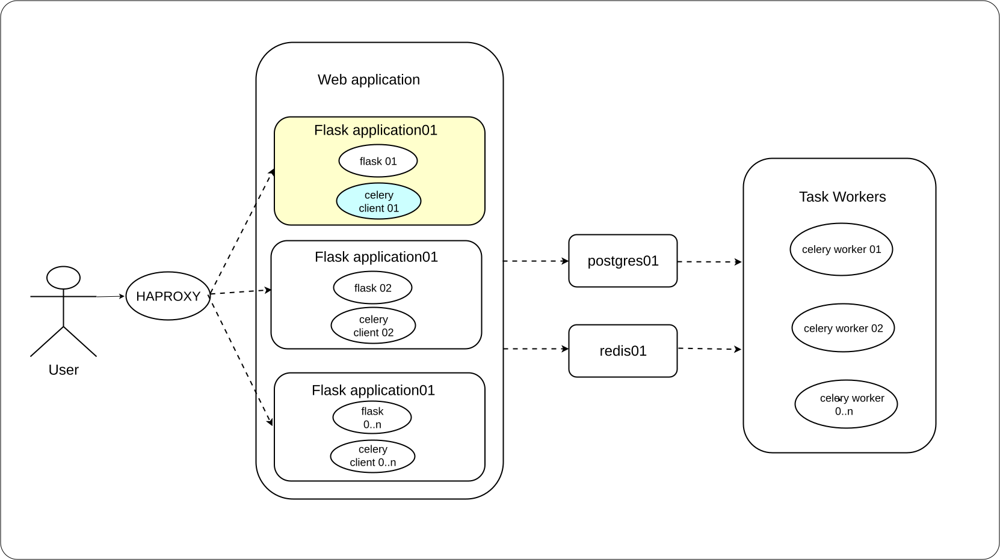

# Lab 5: Asynchronous Processing with Celery

## Overview

A modern web API must respond to HTTP requests almost instantly to avoid blocking client threads and exhausting server resources. When an API endpoint triggers long-running tasks like sending emails, generating PDFs, or processing media, handling them synchronously degrades performance under heavy load. Celery addresses this bottleneck by offloading time-consuming operations to independent background worker processes using a message broker like Redis. In this lab, you will learn the core Celery architecture, trace task lifecycles, and build an asynchronous Flask application.

<p align="center">
  
</p>

---

## 1. Core Concepts & Architecture

### Why Synchronous Processing Fails Under Load

In a synchronous single-threaded worker, the worker process stays occupied for the full duration of a long-running task. Other requests routed to that worker wait until it becomes free. With a limited number of worker processes, this produces request queuing and increased latency across the entire service.

Adding more API server instances only partially addresses this. It increases the number of concurrent long-running requests the system can absorb, but it does not reduce the cost of any individual request. Resources stay tied up for the full task duration, and scaling API servers to absorb long-running work is significantly more expensive than scaling dedicated background workers.

#### Comparing the Two Flows

**Without Celery (Synchronous):**

```text
The client sends a request.
The Flask API performs the long task (such as sending an email or generating a PDF) immediately.
The client waits until the task finishes.
Only after the task completes does the API send a response back to the client.
```

**With Celery (Asynchronous):**

```text
The client sends a request to the Flask API.
The Flask API creates a background task and places it in the Redis queue.
The API immediately returns a response to the client without waiting.
A Celery worker picks up the task from the Redis queue and executes the long-running task in the background.
```

In the synchronous flow, the client waits at the end of the entire execution chain. In the asynchronous flow, the client receives a response immediately while the background execution runs in parallel.

---

### The Celery Architecture Components

Celery solves the blocking problem by moving task execution out of the API process entirely using an intermediary message broker.

| Component | Responsibility |
|---|---|
| Flask API | Receives the HTTP request, creates a task message, sends it to the broker, and returns an immediate response |
| Redis Broker (Queue) | Stores task messages until a worker is available to fetch and process them |
| Celery Worker | A separate process that continuously fetches tasks from the broker and executes them |
| Result Backend | Stores the outcome of a completed task so it can be retrieved later |

- **Broker:** Message queue that holds tasks (Redis / RabbitMQ).
- **Worker:** Independent background process that executes tasks.
- **Result Backend:** Database (Redis) used to check status or obtain task return values.

---

### Tracing the End-to-End Workflow

<p align="center">
  
</p>

At the moment the Flask API returns its HTTP response, the underlying task has not completed yet. The API returns a response as soon as the task message is queued in Redis. The actual execution happens afterward in the worker process.

| Aspect | Without Celery (Synchronous) | With Celery (Asynchronous) |
|---|---|---|
| Request duration | Equal to task duration | Near-instant |
| Task execution location | Inside the API request handler | Separate worker process |
| API availability during task | Blocked | Free to handle other requests |
| Result retrieval | Returned directly in response | Retrieved separately via result backend |

---

### Deciding When to Use Celery

Offload a task to Celery when it depends on an external, slow, or unreliable resource — a mail server, a transcoding pipeline, a third-party API — or takes more than a few hundred milliseconds.

| Task type | Handling | Reason |
|---|---|---|
| Form validation | Synchronous | Fast; client needs the result immediately |
| Video transcoding | Asynchronous | Can take minutes; API should return processing status |
| Password reset email | Asynchronous | Depends on external mail server latency |
| Account balance lookup | Synchronous | Simple database read; queueing overhead unnecessary |

---

## 2. Environment Setup & Prerequisites

1. Update system packages:
   ```bash
   sudo apt update -y
   ```

2. Clear ports `6379` (Redis) and `5000` (Flask):
   ```bash
   sudo fuser -k 6379/tcp || true
   sudo fuser -k 5000/tcp || true
   sudo systemctl stop redis-server || true
   ```

3. Create working directory and virtual environment:
   ```bash
   mkdir -p celery-lab && cd celery-lab
   python3 -m venv venv
   source venv/bin/activate
   ```

4. Install Flask, Celery, and Redis client:
   ```bash
   pip install flask celery redis
   ```

   <p align="center">
     
   </p>

5. Install and start Redis server:
   ```bash
   sudo apt install -y redis-server
   sudo systemctl start redis-server
   redis-cli ping # Expected: PONG
   ```

---

## 3. Step-by-Step Code Implementation

Create `app.py` inside the `celery-lab` directory:

```bash
cat << 'EOF' > app.py
import time
from flask import Flask, jsonify, request
from celery import Celery

app = Flask(__name__)

# Celery config - Redis is used as both broker and result backend
app.config['CELERY_BROKER_URL'] = 'redis://localhost:6379/0'
app.config['CELERY_RESULT_BACKEND'] = 'redis://localhost:6379/0'

celery = Celery(
    app.import_name,
    broker=app.config['CELERY_BROKER_URL'],
    backend=app.config['CELERY_RESULT_BACKEND']
)
celery.conf.update(app.config)


@celery.task(name='send_email_task')
def send_email_task(to_email):
    # Simulates a slow operation, e.g. calling a real mail server
    time.sleep(10)
    return f"Email sent to {to_email}"


@app.route('/send-email', methods=['POST'])
def send_email():
    data = request.get_json()
    to_email = data.get('to')

    if not to_email:
        return jsonify({"error": "to field is required"}), 400

    # Task is placed on the broker; the worker will process it later
    task = send_email_task.delay(to_email)

    return jsonify({
        "message": "Email is being sent in the background",
        "task_id": task.id
    }), 202


@app.route('/task-status/<task_id>', methods=['GET'])
def task_status(task_id):
    task = send_email_task.AsyncResult(task_id)

    response = {
        "task_id": task_id,
        "status": task.status,
    }

    if task.status == "SUCCESS":
        response["result"] = task.result

    return jsonify(response)


if __name__ == '__main__':
    app.run(host='0.0.0.0', port=5000, debug=True)
EOF
```

> **Note on task name:** Decorating with `@celery.task(name='send_email_task')` explicitly names the task, avoiding `KeyError: unregistered task` between process imports.

### Endpoints Summary

| Endpoint | Method | Purpose |
|---|---|---|
| `/send-email` | POST | Accepts `{"to": "<email>"}`, queues background task, returns `task_id` |
| `/task-status/<task_id>` | GET | Looks up current task status (`PENDING`, `SUCCESS`, `FAILURE`) and result |

---

## 4. Execution & Verification Scenarios

### Terminal 1 — Start the Flask API
```bash
cd celery-lab
source venv/bin/activate
python3 app.py
```

<p align="center">
  
</p>

### Terminal 2 — Start the Celery Worker
```bash
cd celery-lab
source venv/bin/activate
celery -A app.celery worker --loglevel=info
```

<p align="center">
  
</p>

### Terminal 3 — Send Request & Check Status
```bash
# Submit task
curl -X POST http://127.0.0.1:5000/send-email \
  -H "Content-Type: application/json" \
  -d '{"to": "user@example.com"}'
```

<p align="center">
  
</p>

Check task status:
```bash
curl http://127.0.0.1:5000/task-status/<TASK_ID>
```

Immediately returned:
```json
{"status": "PENDING", "task_id": "<TASK_ID>"}
```

Returned after 10 seconds:
```json
{
  "result": "Email sent to user@example.com",
  "status": "SUCCESS",
  "task_id": "<TASK_ID>"
}
```

---

### Broker Resilience Verification

Confirm queued tasks survive a temporarily stopped worker:
```bash
# 1. Stop Celery worker (Ctrl+C in Terminal 2)
# 2. Send request to Flask API
curl -X POST http://127.0.0.1:5000/send-email \
  -H "Content-Type: application/json" \
  -d '{"to": "user@example.com"}'

# 3. Restart Celery worker; observe queued task pick-up
celery -A app.celery worker --loglevel=info
```

---

## Conclusion

In this lab, you successfully decoupled task execution from HTTP request handling by integrating Celery and Redis into a Flask application. You observed how offloading slow operations improves API throughput and learned how to query background task results via polling endpoints. This architecture provides the foundation for scalable, high-performance web applications under heavy traffic.