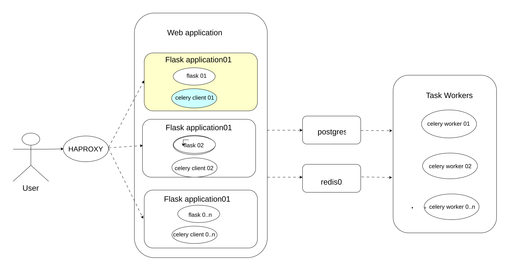
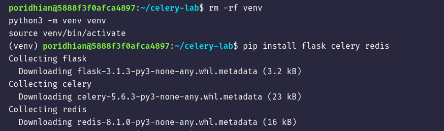
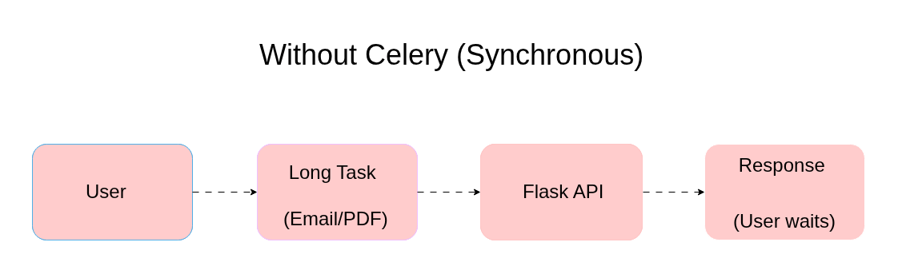
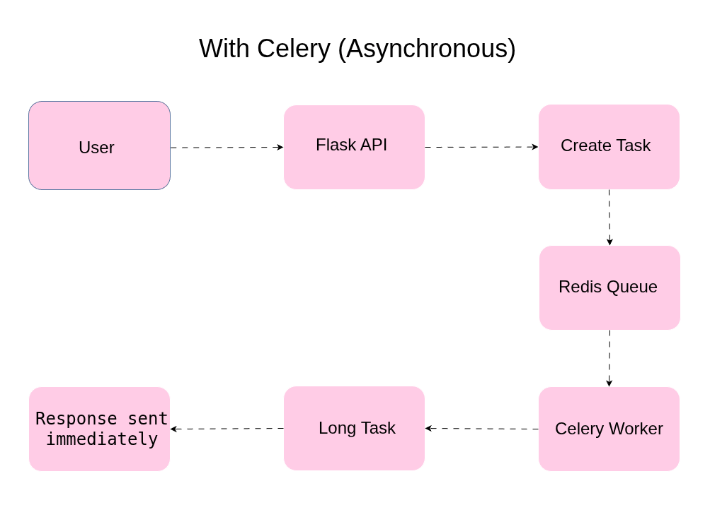
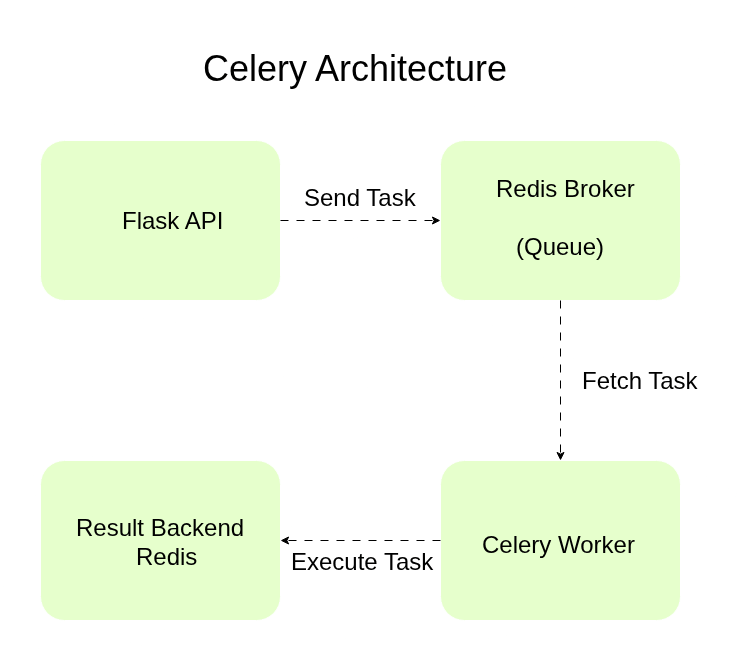
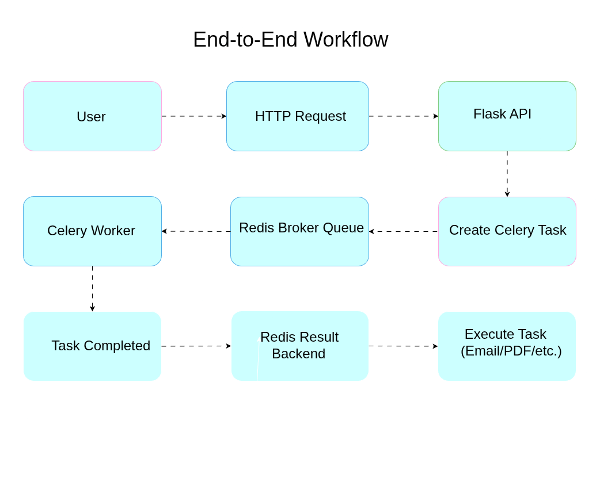
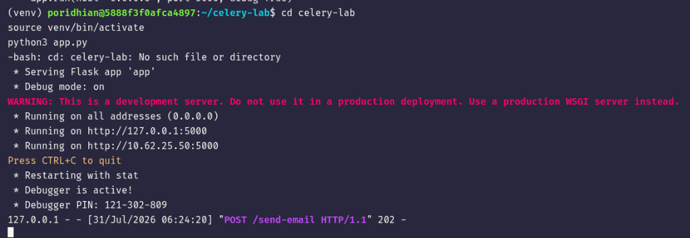
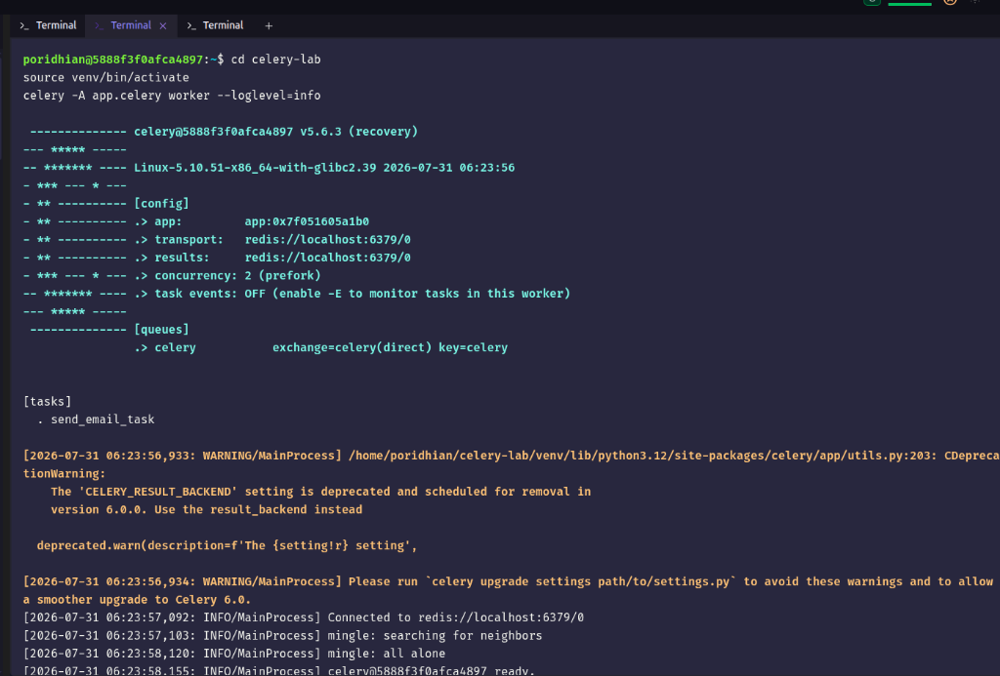
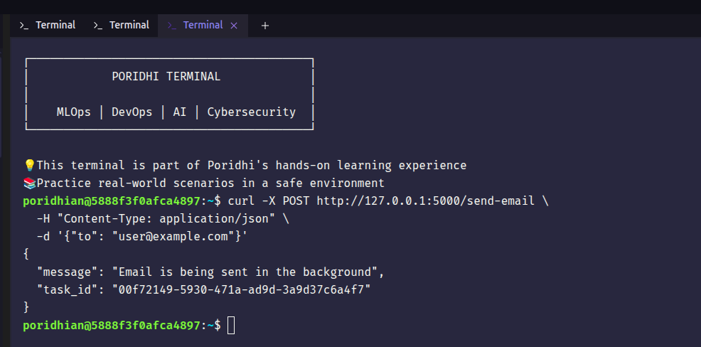

# Lab 5: Asynchronous Processing with Celery

## Introduction

A web API is expected to respond quickly. When a request triggers a task that takes several seconds or minutes to complete, such as sending an email, generating a PDF, or processing an image, keeping the client waiting for that task creates a poor user experience and exhausts server resources under load.

This lab covers Celery, a distributed task queue used to run time-consuming operations outside the request-response cycle. It explains why synchronous processing becomes a bottleneck, the core components of the Celery architecture, and the criteria for deciding when a task should run in the background instead of inline.

This lab is written for developers who have already built a basic REST API (Flask or similar) and need to move a slow operation out of the request handler.

## Learning Objectives

By the end of this lab you will be able to:

- Explain the difference between synchronous and asynchronous task execution in a web API
- Identify the three core components of the Celery architecture: broker, worker, and result backend
- Trace a task from creation to completion using the workflow diagram
- Determine when a task should be offloaded to Celery instead of processed inline
- Build a working Flask + Celery + Redis application and verify it end-to-end

**Prerequisites:**
- Basic understanding of REST APIs and HTTP request/response cycles
- Familiarity with Python and Flask
- Basic understanding of processes and message queues (helpful but not required)

<p align="center">
  
</p>

## Environment Setup

Update system packages:
```bash
sudo apt update -y
```

Before starting fresh, make sure ports `6379` (Redis) and `5000` (Flask) are not already in use by an old process:
```bash
sudo fuser -k 6379/tcp || true
sudo fuser -k 5000/tcp || true
sudo systemctl stop redis-server || true
```

Create a working directory:
```bash
mkdir -p celery-lab && cd celery-lab
```

Create a virtual environment:
```bash
python3 -m venv venv
```

Activate the virtual environment:
```bash
source venv/bin/activate
```

Install Flask, Celery, and the Redis client library:
```bash
pip install flask celery redis
```

<p align="center">
  
</p>


Install and start Redis (used as the broker and result backend for this lab):
```bash
sudo apt install -y redis-server
sudo systemctl start redis-server
```

Verify Redis is running:
```bash
redis-cli ping
```

Expected output:
```
PONG
```

## Chapter 1: Why Synchronous Processing Fails Under Load

### Context

In a synchronous single-threaded worker, the worker process stays occupied for the full duration of a long-running task. Other requests routed to that worker wait until it becomes free. With a limited number of worker processes, this produces request queuing and increased latency across the entire service.

Adding more API server instances only partially addresses this. It increases the number of concurrent long-running requests the system can absorb, but it does not reduce the cost of any individual request. Resources stay tied up for the full task duration, and scaling API servers to absorb long-running work is significantly more expensive than scaling dedicated background workers.

### Comparing the Two Flows

**Without Celery (Synchronous):**

<p align="center">
  
</p>

```text
The client sends a request.
The Flask API performs the long task (such as sending an email or generating a PDF) immediately.
The client waits until the task finishes.
Only after the task completes does the API send a response back to the client.
```

**With Celery (Asynchronous):**

<p align="center">
  
</p>

```text
The client sends a request to the Flask API.
The Flask API creates a background task and places it in the Redis queue.
The API immediately returns a response to the client without waiting.
A Celery worker picks up the task from the Redis queue and executes the long-running task (e.g., sending an email or generating a PDF) in the background.
```

In the synchronous diagram, `Response (User waits)` sits at the end of the chain — the client only gets a response after the entire chain finishes. In the asynchronous diagram, `Response (Immediate)` branches off early — the Flask API returns as soon as the task is queued, while the `Celery Worker → Background Execution` chain runs in parallel. The client's waiting time is no longer tied to the task duration.

## Chapter 2: The Celery Architecture

### Context

Celery solves the blocking problem by moving task execution out of the API process entirely. Instead of running a task directly, the API schedules the task and returns immediately. A separate process picks up the task and executes it independently.

Since the API does not execute the task itself, an intermediary is required to receive the task from the API and hold it until a worker is available to process it. This intermediary is the message broker.

### The Architecture Diagram

<p align="center">
  
</p>

| Component | Responsibility |
|---|---|
| Flask API | Receives the HTTP request, creates a task message, sends it to the broker, and returns an immediate response |
| Redis Broker (Queue) | Stores task messages until a worker is available to fetch and process them |
| Celery Worker | A separate process that continuously fetches tasks from the broker and executes them |
| Result Backend | Stores the outcome of a completed task so it can be retrieved later, independent of the original request |

### Understanding the Components

**Broker:** The broker is a message queue. It does not process tasks; it only holds them. Redis is a common choice for a broker because it is fast and simple to operate, though RabbitMQ is also widely used in production systems.

**Worker:** The worker is a separate long-running process from the API. It has no direct connection to the original HTTP request. It only knows about the task message it received from the broker.

**Result Backend:** The result backend is optional in some designs, but it is necessary whenever the client needs to check the status or outcome of a task after the initial response has been returned. Redis can serve as both broker and result backend, or two separate systems can be used.

## Chapter 3: Tracing the End-to-End Workflow

### Context

With the individual components defined, this section traces a single task through the complete system, from the moment a client sends a request to the moment the task result becomes available.

### The Workflow Diagram

<p align="center">
  
</p>

At the moment the Flask API returns its HTTP response, the underlying task (sending the email or generating the PDF) has not been completed yet. The API returns a response as soon as the task has been created and placed on the broker queue. The actual execution happens afterward, in the Celery worker process, independent of the API response.

If the Celery worker process is stopped, a task that was already sent to the broker is not lost. It remains in the broker's queue and is not executed until a worker process is running and able to fetch it. This is one reason Redis (or another persistent broker) is used instead of holding tasks only in the API's memory.

### Comparing Synchronous and Asynchronous Flows

| Aspect | Without Celery (Synchronous) | With Celery (Asynchronous) |
|---|---|---|
| Request duration | Equal to task duration | Near-instant |
| Task execution location | Inside the API request handler | Separate worker process |
| API availability during task | Blocked | Free to handle other requests |
| Result retrieval | Returned directly in the response | Retrieved separately via result backend |

## Chapter 4: Building the Application

### Context

With the theory and architecture covered, this chapter builds a small working Flask + Celery application: an endpoint that "sends an email" (simulated with a 10-second delay) as a background task, plus a second endpoint to check that task's status.

### Creating `app.py`

Inside the `celery-lab` directory, create `app.py` by copying and pasting the following command into your terminal:

```bash
cat << 'EOF' > app.py
import time
from flask import Flask, jsonify, request
from celery import Celery

app = Flask(__name__)

# Celery config - Redis is used as both broker and result backend
app.config['CELERY_BROKER_URL'] = 'redis://localhost:6379/0'
app.config['CELERY_RESULT_BACKEND'] = 'redis://localhost:6379/0'

celery = Celery(
    app.import_name,
    broker=app.config['CELERY_BROKER_URL'],
    backend=app.config['CELERY_RESULT_BACKEND']
)
celery.conf.update(app.config)


@celery.task(name='send_email_task')
def send_email_task(to_email):
    # Simulates a slow operation, e.g. calling a real mail server
    time.sleep(10)
    return f"Email sent to {to_email}"


@app.route('/send-email', methods=['POST'])
def send_email():
    data = request.get_json()
    to_email = data.get('to')

    if not to_email:
        return jsonify({"error": "to field is required"}), 400

    # Task is placed on the broker; the worker will process it later
    task = send_email_task.delay(to_email)

    return jsonify({
        "message": "Email is being sent in the background",
        "task_id": task.id
    }), 202


@app.route('/task-status/<task_id>', methods=['GET'])
def task_status(task_id):
    task = send_email_task.AsyncResult(task_id)

    response = {
        "task_id": task_id,
        "status": task.status,
    }

    if task.status == "SUCCESS":
        response["result"] = task.result

    return jsonify(response)


if __name__ == '__main__':
    app.run(host='0.0.0.0', port=5000, debug=True)
EOF
```

> **Note on the task name:** The `@celery.task(name='send_email_task')` decorator explicitly names the task. Without this, the task's registered name depends on how the module was imported (`__main__.send_email_task` if run directly vs. `app.send_email_task` if imported as `app`). Since the Flask process and the Celery worker process import the file differently, a missing explicit name causes a `KeyError: unregistered task` error in the worker. Naming the task explicitly avoids this mismatch entirely.

### Endpoints Summary

| Endpoint | Method | Purpose |
|---|---|---|
| `/send-email` | POST | Accepts `{"to": "<email>"}`, queues the background task, returns immediately with a `task_id` |
| `/task-status/<task_id>` | GET | Looks up the task's current status (`PENDING`, `SUCCESS`, `FAILURE`) and result once available |

## Chapter 5: Running the Application

### Context

The application has three moving parts that must run as separate processes: the Flask API, the Celery worker, and Redis. Each runs in its own terminal.

### Terminal 1 — Start the Flask API

```bash
cd celery-lab
source venv/bin/activate
python3 app.py
```

Expected output:
```
 * Serving Flask app 'app'
 * Debug mode: on
 * Running on all addresses (0.0.0.0)
 * Running on http://127.0.0.1:5000
Press CTRL+C to quit
 * Debugger is active!
 * Debugger PIN: 827-844-583
```

<p align="center">
  
</p>

### Terminal 2 — Start the Celery Worker

```bash
cd celery-lab
source venv/bin/activate
celery -A app.celery worker --loglevel=info
```

Expected output (note the `[tasks]` section lists `send_email_task`, confirming the task registered correctly):
```
 -------------- celery@iftakhar-PC v5.6.3
--- ***** ----- 
-- ******* ---- 
- *** --- * --- [config]
- ** ---------- .> app:         app:0x...
- ** ---------- .> transport:   redis://localhost:6379/0
- ** ---------- .> results:     redis://localhost:6379/0
- *** --- * --- .> concurrency: 16 (prefork)
-- ******* ---- 
--- ***** ----- 
 -------------- [queues]
                .> celery           exchange=celery(direct) key=celery

[tasks]
  . send_email_task

[INFO/MainProcess] Connected to redis://localhost:6379/0
[INFO/MainProcess] celery@iftakhar-PC ready.
```

<p align="center">
  
</p>

### Terminal 3 — Send a Request

```bash
curl -X POST http://127.0.0.1:5000/send-email \
  -H "Content-Type: application/json" \
  -d '{"to": "user@example.com"}'
```

Expected response (returned immediately, without waiting for the 10-second task):
```json
{
  "message": "Email is being sent in the background",
  "task_id": "c67eb4a5-6031-4bab-ae80-4dd8e0d42832"
}
```

<p align="center">
  
</p>

Now check the task status using the `task_id` returned above:
```bash
curl http://127.0.0.1:5000/task-status/c67eb4a5-6031-4bab-ae80-4dd8e0d42832
```

Checked immediately, the task may still show `PENDING`. Checked again after ~10 seconds, it returns:
```json
{
  "result": "Email sent to user@example.com",
  "status": "SUCCESS",
  "task_id": "c67eb4a5-6031-4bab-ae80-4dd8e0d42832"
}
```

## Chapter 6: Deciding When to Use Celery

### Context

Celery is not appropriate for every operation. Deciding when to use it is as important as understanding how it works.

### Guideline

Offload a task to Celery when it depends on an external, slow, or unreliable resource — a mail server, a transcoding pipeline, a third-party API — or when it takes more than a few hundred milliseconds to complete. Keep a task synchronous when it is fast (a validation check, a simple database read) and the client needs the result immediately to proceed.

| Task type | Handling | Reason |
|---|---|---|
| Form validation | Synchronous | Fast; client needs the result immediately to know whether the form was accepted |
| Video transcoding | Asynchronous | Can take minutes; API should accept the upload and return a processing status |
| Password reset email | Asynchronous | Depends on an external mail server and network latency outside the API's control |
| Account balance lookup | Synchronous | Simple, fast database read; queuing overhead is not justified |

### Verifying Broker Behavior

Run the following sequence to confirm that queued tasks survive a stopped worker:

```bash
# 1. Stop the Celery worker process (Ctrl+C in Terminal 2), keep Flask API and Redis running
# 2. Send a request to an endpoint that creates a Celery task
curl -X POST http://127.0.0.1:5000/send-email \
  -H "Content-Type: application/json" \
  -d "{\"to\": \"user@example.com\"}"
```

Expected result: the API still returns a fast response, because the task was placed on the broker queue. The task itself does not execute yet, since no worker is available to fetch it.

```bash
# 3. Restart the Celery worker
celery -A app.celery worker --loglevel=info
```

Expected result: the previously queued task is picked up and executed shortly after the worker restarts. Restore the worker to a running state before continuing.

## The Principles

- A web API should return a response as quickly as possible; long-running work does not belong inside a request handler.
- The broker decouples task creation from task execution, allowing workers to process tasks independently of the API's lifecycle.
- Tasks placed on the broker are not lost if a worker is temporarily unavailable; they wait in the queue.
- A result backend is only necessary when a task's outcome must be retrieved after the original request has completed.
- Not every operation should be offloaded; fast, low-latency operations are typically better handled synchronously.
- Explicitly naming Celery tasks (`@celery.task(name=...)`) avoids task-registration mismatches between how different processes import the same module.