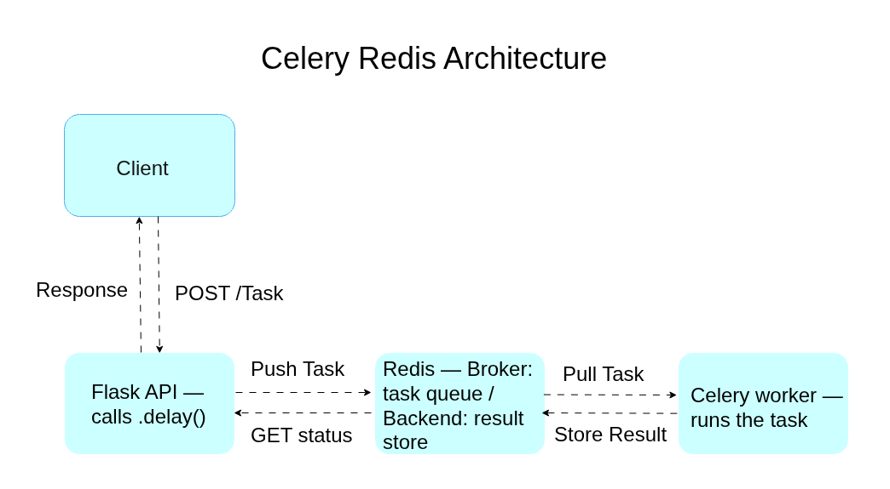
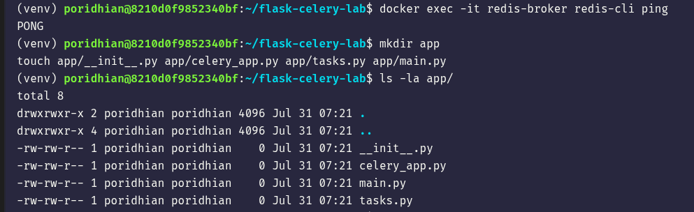
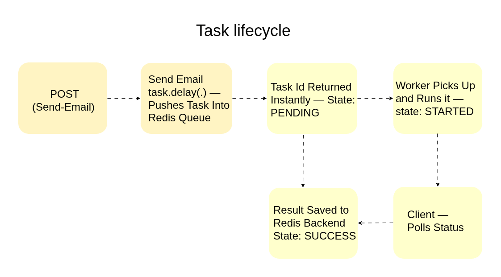
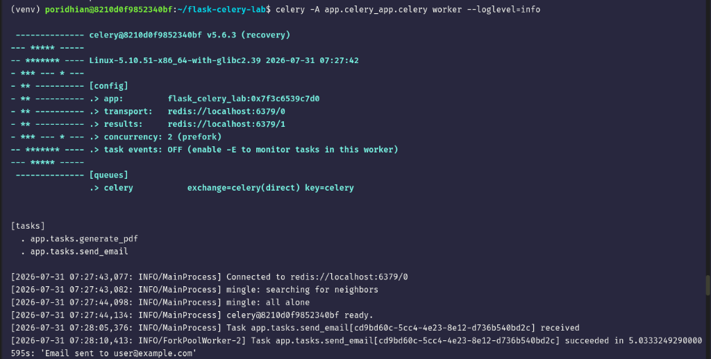
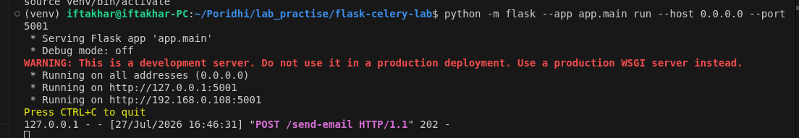
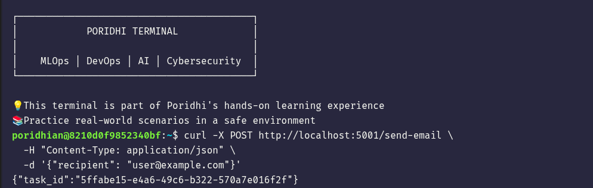
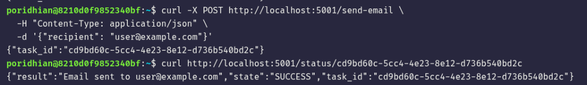

# Lab 6: Building a Flask API with Celery and Redis

**Module 52 | Asynchronous Processing with Celery**

## Introduction

Web applications often need to perform work that takes longer than a typical HTTP request should wait for, such as sending an email, generating a PDF report, or processing an uploaded file. Running this work directly inside a request handler blocks the client and wastes server resources during the wait.

This lab is intended for students who have completed Lab 5 and understand the conceptual architecture of Celery, including the roles of the broker, the worker, and the result backend. This lab moves from theory to implementation by connecting a Flask API to Celery, using Redis as both the broker and the result backend.

By working through this lab, you gain the ability to offload long-running work from an API request and track its progress asynchronously — a pattern used in production systems that need to remain responsive under load.

<p align="center">
  
</p>

## Learning Objectives

By the end of this lab you will be able to:

- Configure a Flask API to submit background tasks instead of executing them inline
- Install and configure `celery[redis]` in a Python project
- Connect Celery to Redis as both the message broker and the result backend
- Implement Celery tasks for operations such as sending an email and generating a PDF
- Verify asynchronous task execution using task IDs and status polling

## Environment Setup

Update the system package index.

```bash
sudo apt update
```

Create a project directory and a virtual environment.

```bash
mkdir flask-celery-lab
cd flask-celery-lab
python3 -m venv venv
```

Activate the virtual environment.

```bash
source venv/bin/activate
```

> **Note:** The virtual environment must be activated separately in **every new terminal tab**. If a terminal prompt does not show `(venv)` at the start, Python and pip commands will use the system Python instead of the project's virtual environment, and packages like Flask will appear to be "not installed" even though they were installed correctly earlier.

Install the required packages.

```bash
pip install flask celery[redis]
```

Start a Redis instance using Docker.

```bash
docker run -d --name redis-broker -p 6379:6379 redis:7-alpine
```

Confirm Redis is reachable:

```bash
redis-cli ping
# → PONG
```

> **Troubleshooting — port already in use:** If `docker run` fails with `Conflict. The container name "/redis-broker" is already in use`, a container with that name already exists. Either reuse it (`docker start redis-broker`) or remove it and create a fresh one:
> ```bash
> docker rm -f redis-broker
> docker run -d --name redis-broker -p 6379:6379 redis:7-alpine
> ```
> If instead you see `failed to bind host port 0.0.0.0:6379/tcp: address already in use`, something else on the machine is already listening on port 6379 — commonly a system-installed Redis service. Check with:
> ```bash
> sudo lsof -i :6379
> ```
> If it shows `redis-server`, stop the system service so Docker can bind the port:
> ```bash
> sudo systemctl stop redis-server
> sudo systemctl disable redis-server
> ```
> Also note that a container's port mapping is fixed at creation time — if a `redis-broker` container was originally created **without** `-p 6379:6379`, simply `start`-ing it later will never expose the port. In that case remove it and recreate it with the `-p` flag as shown above.

Create the project structure.

```bash
mkdir app
touch app/__init__.py app/celery_app.py app/tasks.py app/main.py
```

<p align="center">
  
</p>

---

## Chapter 1: Connecting Celery to Redis

### Opening Context

Celery does not process tasks by itself. It requires a message broker to hold pending tasks and, when results are needed, a result backend to store task outcomes. This chapter configures Redis to serve both roles.

### What You Will Build

A `celery_app.py` module that creates a Celery application instance configured to use Redis as both the broker and the backend. This instance is imported by both the Flask API and the worker process.

### Implementation

Create `app/celery_app.py` using the following command:

```bash
cat << 'EOF' > app/celery_app.py
from celery import Celery

celery = Celery(
    "flask_celery_lab",
    broker="redis://localhost:6379/0",
    backend="redis://localhost:6379/1",
)
EOF
```

### Understanding the Code

The `Celery` constructor takes a name that identifies the application, typically matching the module name. The `broker` argument tells Celery where to publish and consume task messages. The `backend` argument tells Celery where to store task state and return values. Database `0` on the Redis instance is used for the broker, and database `1` is used for the backend — this keeps the two roles logically separated even though they share the same Redis server.

## Chapter 2: Defining Background Tasks

### Opening Context

A Celery task is a regular Python function decorated so that Celery can route calls to it through the broker instead of executing them in the caller's process.

### What You Will Build

Two Celery tasks: one that simulates sending an email, and one that simulates generating a PDF report. Both tasks include an artificial delay to represent real processing time.

### Implementation

Create `app/tasks.py` using the following command:

```bash
cat << 'EOF' > app/tasks.py
import time
from app.celery_app import celery

@celery.task
def send_email(recipient):
    time.sleep(5)  # simulate slow email delivery
    return f"Email sent to {recipient}"

@celery.task
def generate_pdf(document_id):
    time.sleep(8)  # simulate slow PDF rendering
    return f"PDF generated for document {document_id}"
EOF
```

### Understanding the Code

The `@celery.task` decorator registers a function with the Celery application so it can be invoked asynchronously. Once registered, the function gains methods such as `.delay()` and `.apply_async()`, which submit the function call as a message to the broker instead of executing it immediately in the current process.

## Chapter 3: Submitting Tasks from Flask

### Opening Context

The Flask API is responsible for accepting client requests and submitting tasks to Celery. It does not execute the task logic itself.

<p align="center">
  
</p>

### What You Will Build

A Flask application with two routes: one that queues an email task, and one that checks the status of a previously submitted task.

### Implementation

Create `app/main.py` using the following command:

```bash
cat << 'EOF' > app/main.py
from flask import Flask, jsonify, request
from app.tasks import send_email
from app.celery_app import celery

app = Flask(__name__)

@app.route("/send-email", methods=["POST"])
def trigger_email():
    recipient = request.json.get("recipient")
    task = send_email.delay(recipient)
    return jsonify({"task_id": task.id}), 202

@app.route("/status/<task_id>", methods=["GET"])
def check_status(task_id):
    result = celery.AsyncResult(task_id)
    return jsonify({
        "task_id": task_id,
        "state": result.state,
        "result": result.result if result.ready() else None
    })

if __name__ == "__main__":
    app.run(host="0.0.0.0", port=5001)
EOF
```

### Understanding the Code

The `202 Accepted` status code is used instead of `200 OK` because the request has been accepted for processing, but the work is not yet complete. `celery.AsyncResult(task_id)` reconstructs a result handle from a task ID, allowing state to be queried from any process, not only the one that submitted the task, because state is stored in the shared Redis backend.

---

## Test and Verify

Start the Celery worker in one terminal. Make sure the virtual environment is activated first.

```bash
source venv/bin/activate
celery -A app.celery_app.celery worker --loglevel=info
```

Expected output on successful startup:

**Output from a successful run:**

<p align="center">
  
</p>

Notice the `.> transport:` and `.> results:` lines confirm the worker connected to Redis on databases `0` and `1`, and the final line `celery@<hostname> ready.` confirms the worker is waiting for tasks.

Start the Flask application in a **second terminal** (remember to `source venv/bin/activate` here too — activation does not carry over between terminals). This lab runs Flask on port **5001**:

```bash
source venv/bin/activate
python -m flask --app app.main run --host 0.0.0.0 --port 5001
```

**Actual output from a successful run:**

<p align="center">
  
</p>

Submit a task from a **third terminal**:

```bash
curl -X POST http://localhost:5001/send-email \
  -H "Content-Type: application/json" \
  -d '{"recipient": "user@example.com"}'
```

Actual output:

**Output from a successful run:**

<p align="center">
  
</p>

You can also confirm the request was received by checking the Flask terminal — a line like `"POST /send-email HTTP/1.1" 202 -` will appear there, matching the screenshot above.

Check the task status using the returned ID:

```bash
curl http://localhost:5001/status/05323108-90de-4cce-8acb-cb0c847f2cf6
```

Immediately after submission:

```json
{"task_id":"05323108-90de-4cce-8acb-cb0c847f2cf6","state":"PENDING","result":null}
```

After the 5-second simulated delay completes, re-running the same command returns:

```json
{"task_id":"05323108-90de-4cce-8acb-cb0c847f2cf6","state":"SUCCESS","result":"Email sent to user@example.com"}
```

<p align="center">
  
</p>

> **Note:** Use the `task_id` value returned by your **own** curl request from the previous step, not the example ID shown above — every submission gets a unique ID.

## Experiment

Stop the Redis container while the Flask server and Celery worker are still running.

```bash
docker stop redis-broker
```

Submit a new task using the `/send-email` endpoint and observe the result.

Restore Redis and confirm your observation.

```bash
docker start redis-broker
```

---

## The Principles

* A web API should return a response as quickly as possible; long-running work does not belong inside a request handler.
* The broker decouples task creation from task execution, allowing workers to process tasks independently of the API's lifecycle.
* Tasks placed on the broker are not lost if a worker is temporarily unavailable; they wait in the queue.
* A result backend is only necessary when a task's outcome must be retrieved after the original request has completed.
* Not every operation should be offloaded; fast, low-latency operations are typically better handled synchronously.
* Explicitly naming Celery tasks (`@celery.task(name=...)`) avoids task-registration mismatches between how different processes import the same module.