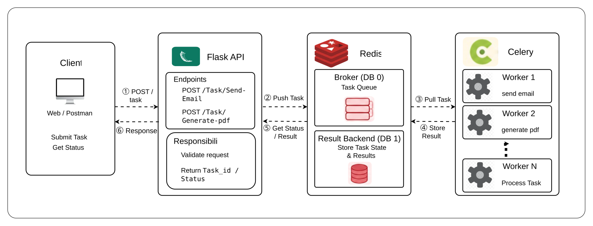

# Lab 6: Building a Flask API with Celery and Redis

## Overview

Building scalable background processing in production requires a clean, modular project architecture. This lab demonstrates how to structure a Flask application connected to Celery, using Dockerized Redis as both the message broker and result backend. You will implement asynchronous tasks for sending emails and generating PDF reports, then verify task queues and state polling using HTTP endpoints. By separating task declarations from application handlers, you ensure your backend remains maintainable and responsive.

<p align="center">
  
</p>

---

## Step-by-Step Implementation

### Step 1: Environment & Container Setup

1. Create project workspace and virtual environment:
   ```bash
   mkdir flask-celery-lab && cd flask-celery-lab
   python3 -m venv venv
   source venv/bin/activate
   pip install flask "celery[redis]"
   ```

2. Start Redis container via Docker:
   ```bash
   docker run -d --name redis-broker -p 6379:6379 redis:7-alpine
   redis-cli ping # Expected: PONG
   ```

3. Create application folder structure:
   ```bash
   mkdir app
   touch app/__init__.py app/celery_app.py app/tasks.py app/main.py
   ```

<p align="center">
  
</p>

---

### Step 2: Configure Celery Instance (`app/celery_app.py`)

Create `app/celery_app.py` to establish connection parameters to Redis:

```python
from celery import Celery

celery = Celery(
    "flask_celery_lab",
    broker="redis://localhost:6379/0",
    backend="redis://localhost:6379/1",
)
```

---

### Step 3: Define Background Tasks (`app/tasks.py`)

Create `app/tasks.py` containing long-running task definitions:

```python
import time
from app.celery_app import celery

@celery.task
def send_email(recipient):
    time.sleep(5)  # Simulate email processing
    return f"Email sent to {recipient}"

@celery.task
def generate_pdf(document_id):
    time.sleep(8)  # Simulate PDF rendering
    return f"PDF generated for document {document_id}"
```

---

### Step 4: Implement Flask Routes (`app/main.py`)

Create `app/main.py` to expose submission and polling endpoints:

```python
from flask import Flask, jsonify, request
from app.tasks import send_email
from app.celery_app import celery

app = Flask(__name__)

@app.route("/send-email", methods=["POST"])
def trigger_email():
    recipient = request.json.get("recipient")
    task = send_email.delay(recipient)
    return jsonify({"task_id": task.id}), 202

@app.route("/status/<task_id>", methods=["GET"])
def check_status(task_id):
    result = celery.AsyncResult(task_id)
    return jsonify({
        "task_id": task_id,
        "state": result.state,
        "result": result.result if result.ready() else None
    })

if __name__ == "__main__":
    app.run(host="0.0.0.0", port=5001)
```

---

### Step 5: Test and Verify

1. **Start Celery Worker** (Terminal 1):
   ```bash
   celery -A app.celery_app.celery worker --loglevel=info
   ```

2. **Start Flask Server** (Terminal 2):
   ```bash
   python -m flask --app app.main run --host 0.0.0.0 --port 5001
   ```

3. **Execute Requests** (Terminal 3):
   ```bash
   # Submit task
   curl -X POST http://localhost:5001/send-email \
     -H "Content-Type: application/json" \
     -d '{"recipient": "user@example.com"}'

   # Check task status
   curl http://localhost:5001/status/<TASK_ID>
   ```

<p align="center">
  
</p>

---

## Conclusion

In this lab, you built a modular Flask and Celery application utilizing Docker for lightweight Redis infrastructure management. You implemented separated task definitions and asynchronous API routes to handle slow jobs seamlessly. This modular setup allows easy maintenance, straightforward unit testing, and effortless horizontal worker scaling in production environments.