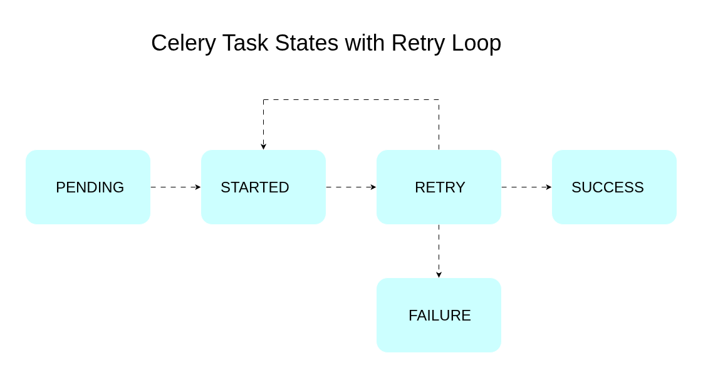
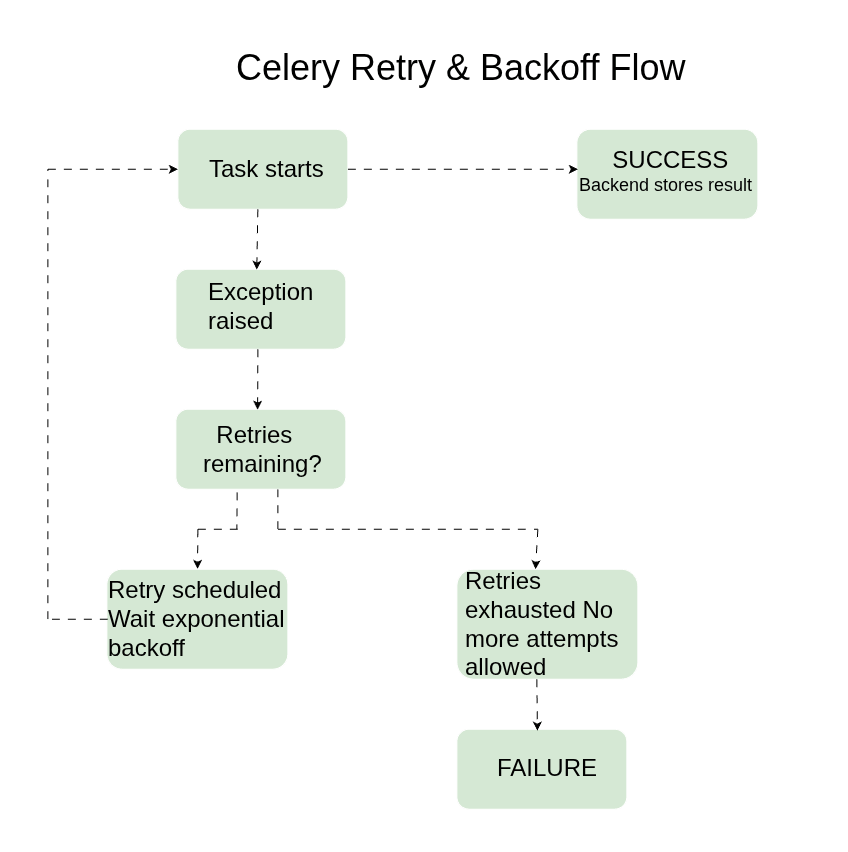

# Module 53 — Lab 7: Celery Task Retries, Timeouts, and Task Status Tracking

You will build a Flask service backed by Celery that retries failing tasks with exponential backoff, enforces execution timeouts, exposes an endpoint to check task status by ID, and logs every state transition and exception. The service uses Redis as both broker and result backend. Two components are involved: a Flask API (`app.py`) that triggers tasks and reports their state, and a Celery worker (`tasks.py`) that executes the task, retries it on failure, and records the final result.

## Concepts

| Term | Meaning |
|---|---|
| PENDING | Task ID exists in the backend but no worker has picked it up yet, or the ID is unknown. |
| STARTED | A worker has picked up the task and begun execution. Requires `task_track_started=True`. |
| RETRY | The task raised an exception, caught by `autoretry_for` or an explicit `self.retry()` call, and has been rescheduled. |
| SUCCESS | The task function returned without raising an exception. The return value is stored in the result backend. |
| FAILURE | The task exhausted its retry budget, or raised an exception not covered by the retry policy. |
| `max_retries` | Upper bound on retry attempts before the task is marked FAILURE. |
| `retry_backoff` | When `True`, delay before each retry grows exponentially (1s, 2s, 4s, 8s, ...). |
| `retry_backoff_max` | Ceiling on the backoff delay, in seconds, regardless of retry count. |
| `retry_jitter` | Adds random variance to the backoff delay to prevent synchronized retries across workers. |
| `soft_time_limit` | Seconds after which Celery raises `SoftTimeLimitExceeded` inside the task, allowing cleanup. |
| `time_limit` | Seconds after which Celery kills the worker process running the task, no cleanup possible. |

A Celery task moves through a fixed set of states from the moment it is submitted to the moment it settles. On submission the task is PENDING. Once a worker starts executing it, the state becomes STARTED. If the task function raises an exception that matches the task's `autoretry_for` tuple, Celery catches it, computes a backoff delay, moves the state to RETRY, and re-queues the task with the same ID. This RETRY-to-STARTED cycle repeats until the task either returns successfully (SUCCESS) or exhausts `max_retries` (FAILURE). Every transition and every exception is written to the log so the sequence can be reconstructed from `docker compose logs -f worker` or the worker's stdout.

<p align="center">
  
</p>

*Figure 1. The five states a Celery task can be in. A task starts PENDING, moves to STARTED once a worker picks it up, and from there either settles at SUCCESS or, on a caught exception, moves to RETRY and loops back to STARTED for another attempt. The loop repeats until the task succeeds or `max_retries` is exhausted, at which point it settles at FAILURE.*

<p align="center">
  
</p>

*Figure 2. What happens inside a single retry cycle. When the task raises `UpstreamServiceError`, Celery checks whether retries remain. If they do, it schedules a retry after an exponential backoff delay and re-enters the task; if not, the task is marked FAILURE with no further attempts. A task that returns without raising an exception exits the loop immediately and the backend stores its result as SUCCESS.*

## Objectives

- Build a Flask API with an endpoint to submit a task and an endpoint to check its status by task ID.
- Configure Celery with Redis as broker and result backend, with `task_track_started` enabled.
- Implement automatic retries with exponential backoff and a maximum retry ceiling on a task that simulates an unreliable external call.
- Implement `soft_time_limit` and `time_limit` on the same task to bound execution time.
- Implement structured logging that records every state transition and every caught exception with the task ID.
- Verify all task outcomes: SUCCESS, RETRY-then-SUCCESS, and FAILURE after retries are exhausted.

## Prerequisites

- Ubuntu 22.04 LTS.
- Python 3.11.
- Redis 7 running locally on port 6379.
- `curl` for verification requests.

Install system packages and Redis:

```bash
sudo apt update
sudo apt install -y python3.11 python3.11-venv redis-server curl
sudo systemctl enable redis-server
sudo systemctl start redis-server
redis-cli ping
```

Expected output of the last command:

```
PONG
```

## What You Will Build

```
celery-retry-lab/
├── requirements.txt
├── celery_app.py
├── tasks.py
├── app.py
└── logs/
    └── worker.log
```

`app.py` runs the Flask API and imports the task from `tasks.py`. `tasks.py` defines the task and imports its Celery instance from `celery_app.py`. `celery_app.py` configures the broker, result backend, and logging so both the API process and the worker process share the same Celery configuration. The Flask API submits work to Redis; the Celery worker consumes it from Redis and writes results back to Redis, where the API reads them for the status endpoint.

## Step 1: Create the project and install dependencies

Create the project directory and a virtual environment:

```bash
mkdir -p celery-retry-lab/logs
cd celery-retry-lab
python3.11 -m venv venv
source venv/bin/activate
```

Create a file named `requirements.txt` with the following contents:

```
flask==3.0.3
celery==5.4.0
redis==5.0.8
```

Install the dependencies:

```bash
pip install -r requirements.txt
```

Explanation:

- `flask` serves the two HTTP endpoints: task submission and task status lookup.
- `celery` provides the task queue, worker, retry, and timeout machinery.
- `redis` is the Python client Celery uses to talk to the Redis broker and result backend.
- Versions are pinned so the retry and timeout behavior shown in this lab is reproducible.

## Step 2: Configure the Celery application

Create a file named `celery_app.py` with the following contents:

```python
import logging
from celery import Celery
from celery.signals import task_prerun, task_postrun, task_failure, task_retry

logging.basicConfig(
    level=logging.INFO,
    format="%(asctime)s [%(levelname)s] %(message)s",
    handlers=[
        logging.FileHandler("logs/worker.log"),
        logging.StreamHandler(),
    ],
)
logger = logging.getLogger("celery_retry_lab")

celery_app = Celery(
    "celery_retry_lab",
    broker="redis://localhost:6379/0",
    backend="redis://localhost:6379/1",
)

celery_app.conf.update(
    task_track_started=True,
    result_extended=True,
    task_serializer="json",
    result_serializer="json",
    accept_content=["json"],
    timezone="UTC",
    enable_utc=True,
)


@task_prerun.connect
def log_task_prerun(task_id, task, *args, **kwargs):
    logger.info("task_id=%s name=%s state=STARTED", task_id, task.name)


@task_postrun.connect
def log_task_postrun(task_id, task, retval=None, state=None, *args, **kwargs):
    logger.info("task_id=%s name=%s state=%s result=%s", task_id, task.name, state, retval)


@task_retry.connect
def log_task_retry(request, reason, **kwargs):
    logger.warning("task_id=%s state=RETRY reason=%s", request.id, reason)


@task_failure.connect
def log_task_failure(task_id, exception, *args, **kwargs):
    logger.error("task_id=%s state=FAILURE exception=%s", task_id, repr(exception))
```

Explanation:

- The broker is Redis DB 0 and the result backend is Redis DB 1, so queued work and stored results are kept in separate keyspaces.
- `task_track_started=True` makes Celery emit the STARTED state; without it, a task jumps straight from PENDING to SUCCESS/FAILURE with no visible in-progress state.
- `result_extended=True` stores extra metadata (task name, arguments) alongside the result, which is read back in the status endpoint.
- The four signal handlers (`task_prerun`, `task_postrun`, `task_retry`, `task_failure`) log every state transition to both a file and stdout, independent of what the task function itself logs. This guarantees a full audit trail even if the task's own logging is incomplete.
- JSON serialization is used for both tasks and results so payloads stay inspectable in Redis with `redis-cli`.

## Step 3: Implement the task with retries, backoff, and timeouts

Create a file named `tasks.py` with the following contents:

```python
import logging
import random
import time

from celery.exceptions import SoftTimeLimitExceeded
from celery_app import celery_app

logger = logging.getLogger("celery_retry_lab")


class UpstreamServiceError(Exception):
    """Raised when the simulated upstream call fails."""


@celery_app.task(
    bind=True,
    autoretry_for=(UpstreamServiceError,),
    retry_backoff=True,
    retry_backoff_max=30,
    retry_jitter=True,
    max_retries=4,
    soft_time_limit=8,
    time_limit=12,
)
def call_upstream_service(self, payload: str, fail_probability: float = 0.7):
    """Simulate an unreliable upstream call that succeeds, fails, or hangs."""
    try:
        logger.info(
            "task_id=%s attempt=%s payload=%s", self.request.id, self.request.retries + 1, payload
        )
        time.sleep(1)

        if random.random() < fail_probability:
            raise UpstreamServiceError(f"upstream rejected payload '{payload}'")

        return {"payload": payload, "processed": True, "attempts": self.request.retries + 1}

    except SoftTimeLimitExceeded:
        logger.error("task_id=%s exceeded soft_time_limit, aborting cleanly", self.request.id)
        raise

    except UpstreamServiceError as exc:
        logger.warning(
            "task_id=%s attempt=%s failed: %s", self.request.id, self.request.retries + 1, exc
        )
        raise
```

Explanation:

- `bind=True` gives the task access to `self.request`, which exposes the task ID and current retry count used in every log line.
- `autoretry_for=(UpstreamServiceError,)` tells Celery to automatically retry only on this specific exception. Any other exception type is not retried and moves the task straight to FAILURE.
- `retry_backoff=True` with `retry_backoff_max=30` produces delays of roughly 1s, 2s, 4s, 8s, 16s, capped at 30s, so retries do not hammer the upstream service.
- `retry_jitter=True` randomizes the delay slightly, which matters when many task instances retry at the same time.
- `max_retries=4` allows one initial attempt plus four retries, five attempts total, before the task settles as FAILURE.
- `soft_time_limit=8` gives the task a chance to catch `SoftTimeLimitExceeded` and log a clean failure; `time_limit=12` is the hard kill switch if the soft limit is ignored.
- `fail_probability` is a parameter, not a hardcoded constant, so the verification section can force deterministic SUCCESS and FAILURE cases without editing the task.
- The `except UpstreamServiceError` block logs before re-raising; re-raising is required for `autoretry_for` to catch it and trigger the retry.

## Step 4: Build the Flask API

Create a file named `app.py` with the following contents:

```python
import logging

from celery.result import AsyncResult
from flask import Flask, jsonify, request

from celery_app import celery_app
from tasks import call_upstream_service

app = Flask(__name__)
logger = logging.getLogger("celery_retry_lab")


@app.post("/tasks")
def submit_task():
    body = request.get_json(silent=True) or {}
    payload = body.get("payload")
    fail_probability = body.get("fail_probability", 0.7)

    if not payload:
        return jsonify({"error": "field 'payload' is required"}), 400

    async_result = call_upstream_service.apply_async(
        args=[payload], kwargs={"fail_probability": fail_probability}
    )
    logger.info("task_id=%s state=PENDING submitted via API", async_result.id)

    return jsonify({"task_id": async_result.id, "state": "PENDING"}), 202


@app.get("/tasks/<task_id>")
def get_task_status(task_id):
    result = AsyncResult(task_id, app=celery_app)

    response = {"task_id": task_id, "state": result.state}

    if result.state == "PENDING":
        response["detail"] = "task ID unknown or not yet started"
    elif result.state == "STARTED":
        response["detail"] = "task is currently executing"
    elif result.state == "RETRY":
        response["detail"] = "task failed and is scheduled for retry"
    elif result.state == "SUCCESS":
        response["result"] = result.result
    elif result.state == "FAILURE":
        response["error"] = str(result.result)

    return jsonify(response), 200


if __name__ == "__main__":
    app.run(host="0.0.0.0", port=5000)
```

Explanation:

- `POST /tasks` validates that `payload` is present, returns `400` if missing, and otherwise queues the task with `apply_async` and returns `202 Accepted` with the task ID immediately, without blocking on the result.
- `fail_probability` is accepted from the request body so verification can send `0.0` or `1.0` to force a deterministic outcome.
- `GET /tasks/<task_id>` wraps `AsyncResult` and branches on `result.state`, returning a different payload shape for each of the five states covered in the Concepts table.
- For `FAILURE`, `result.result` holds the exception raised by the task; it is cast to a string so the API never tries to JSON-serialize an exception object directly.
- The endpoint returns `200` for every valid state, including `FAILURE`, because checking status successfully is distinct from the task itself failing; only a malformed request returns a `4xx`.

## Step 5: Run the worker and the API

Open a first terminal and start the Celery worker:

```bash
cd celery-retry-lab
source venv/bin/activate
celery -A celery_app.celery_app worker --loglevel=info
```

Expected output (tail):

```
[tasks]
  . tasks.call_upstream_service

[2026-07-30 10:00:01,000: INFO/MainProcess] celery@worker ready.
```

Open a second terminal and start the Flask API:

```bash
cd celery-retry-lab
source venv/bin/activate
python app.py
```

Expected output:

```
 * Running on http://0.0.0.0:5000
```

## Verification

### Scenario 1: Guaranteed success (`fail_probability = 0.0`)

Submit the task:

```bash
curl -s -X POST http://localhost:5000/tasks \
  -H "Content-Type: application/json" \
  -d '{"payload": "order-1001", "fail_probability": 0.0}'
```

Expected output:

```json
{"task_id": "5f2b9e3a-1c44-4a6a-9d21-7a5e2f9b1a01", "state": "PENDING"}
```

Poll the status after a few seconds:

```bash
curl -s http://localhost:5000/tasks/5f2b9e3a-1c44-4a6a-9d21-7a5e2f9b1a01
```

Expected output:

```json
{
  "task_id": "5f2b9e3a-1c44-4a6a-9d21-7a5e2f9b1a01",
  "state": "SUCCESS",
  "result": {"payload": "order-1001", "processed": true, "attempts": 1}
}
```

Worker log excerpt:

```
[INFO] task_id=5f2b9e3a... attempt=1 payload=order-1001
[INFO] task_id=5f2b9e3a... name=tasks.call_upstream_service state=SUCCESS result={'payload': 'order-1001', 'processed': True, 'attempts': 1}
```

### Scenario 2: Retry then success (`fail_probability = 0.7`, default)

Submit the task:

```bash
curl -s -X POST http://localhost:5000/tasks \
  -H "Content-Type: application/json" \
  -d '{"payload": "order-1002"}'
```

Expected output:

```json
{"task_id": "8a1d4c77-9e02-4b31-8f6e-3c0a2d5b7c12", "state": "PENDING"}
```

Poll while retries are in progress:

```bash
curl -s http://localhost:5000/tasks/8a1d4c77-9e02-4b31-8f6e-3c0a2d5b7c12
```

Expected output while a retry is scheduled:

```json
{
  "task_id": "8a1d4c77-9e02-4b31-8f6e-3c0a2d5b7c12",
  "state": "RETRY",
  "detail": "task failed and is scheduled for retry"
}
```

Poll again after the backoff delay:

```json
{
  "task_id": "8a1d4c77-9e02-4b31-8f6e-3c0a2d5b7c12",
  "state": "SUCCESS",
  "result": {"payload": "order-1002", "processed": true, "attempts": 3}
}
```

Worker log excerpt showing the retry loop:

```
[INFO] task_id=8a1d4c77... attempt=1 payload=order-1002
[WARNING] task_id=8a1d4c77... attempt=1 failed: upstream rejected payload 'order-1002'
[WARNING] task_id=8a1d4c77... state=RETRY reason=upstream rejected payload 'order-1002'
[INFO] task_id=8a1d4c77... attempt=2 payload=order-1002
[WARNING] task_id=8a1d4c77... attempt=2 failed: upstream rejected payload 'order-1002'
[WARNING] task_id=8a1d4c77... state=RETRY reason=upstream rejected payload 'order-1002'
[INFO] task_id=8a1d4c77... attempt=3 payload=order-1002
[INFO] task_id=8a1d4c77... name=tasks.call_upstream_service state=SUCCESS result={'payload': 'order-1002', 'processed': True, 'attempts': 3}
```

### Scenario 3: Retries exhausted (`fail_probability = 1.0`)

Submit the task:

```bash
curl -s -X POST http://localhost:5000/tasks \
  -H "Content-Type: application/json" \
  -d '{"payload": "order-1003", "fail_probability": 1.0}'
```

Expected output:

```json
{"task_id": "c3e9f1a0-6b58-4d19-a2c7-1e9f4a8b0d33", "state": "PENDING"}
```

Poll after all five attempts (roughly 30-40 seconds given the backoff schedule):

```bash
curl -s http://localhost:5000/tasks/c3e9f1a0-6b58-4d19-a2c7-1e9f4a8b0d33
```

Expected output:

```json
{
  "task_id": "c3e9f1a0-6b58-4d19-a2c7-1e9f4a8b0d33",
  "state": "FAILURE",
  "error": "upstream rejected payload 'order-1003'"
}
```

Worker log excerpt:

```
[WARNING] task_id=c3e9f1a0... state=RETRY reason=upstream rejected payload 'order-1003'
[WARNING] task_id=c3e9f1a0... state=RETRY reason=upstream rejected payload 'order-1003'
[WARNING] task_id=c3e9f1a0... state=RETRY reason=upstream rejected payload 'order-1003'
[WARNING] task_id=c3e9f1a0... state=RETRY reason=upstream rejected payload 'order-1003'
[ERROR] task_id=c3e9f1a0... state=FAILURE exception=UpstreamServiceError("upstream rejected payload 'order-1003'")
```

### Scenario 4: Invalid submission (missing payload)

```bash
curl -s -X POST http://localhost:5000/tasks \
  -H "Content-Type: application/json" \
  -d '{}'
```

Expected output:

```json
{"error": "field 'payload' is required"}
```

### Scenario 5: Unknown task ID

```bash
curl -s http://localhost:5000/tasks/does-not-exist
```

Expected output:

```json
{
  "task_id": "does-not-exist",
  "state": "PENDING",
  "detail": "task ID unknown or not yet started"
}
```

### Summary

| # | Call | Status | Body snippet |
|---|---|---|---|
| 1 | `POST /tasks` (`fail_probability=0.0`) | 202 | `{"state": "PENDING"}` |
| 1 | `GET /tasks/<id>` after success | 200 | `{"state": "SUCCESS", "result": {...}}` |
| 2 | `GET /tasks/<id>` mid-retry | 200 | `{"state": "RETRY"}` |
| 2 | `GET /tasks/<id>` after eventual success | 200 | `{"state": "SUCCESS", "attempts": 3}` |
| 3 | `GET /tasks/<id>` after retries exhausted | 200 | `{"state": "FAILURE", "error": "..."}` |
| 4 | `POST /tasks` with no payload | 400 | `{"error": "field 'payload' is required"}` |
| 5 | `GET /tasks/<unknown id>` | 200 | `{"state": "PENDING", "detail": "task ID unknown..."}` |

## Conclusion

You built a Flask and Celery service that retries a failing task with exponential backoff up to a fixed retry ceiling, bounds task execution with soft and hard time limits, and exposes a status endpoint that reports every Celery task state. Worker-side logging captured each STARTED, RETRY, SUCCESS, and FAILURE transition, giving a complete, verifiable trail from task submission to final outcome.