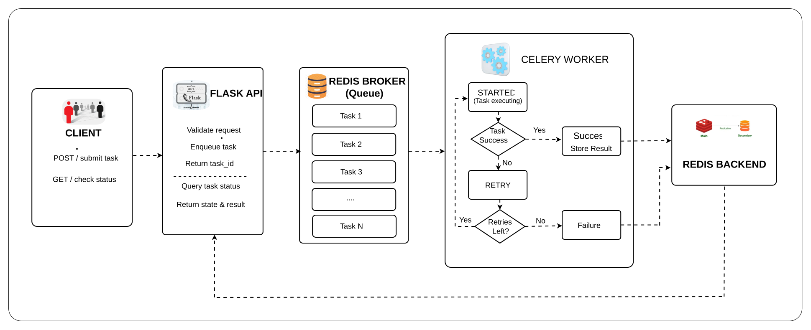
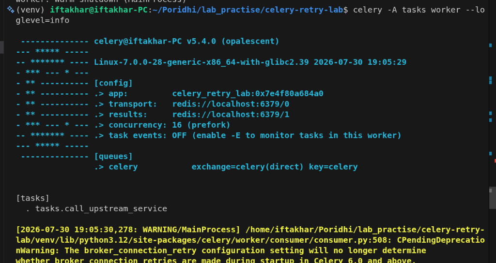
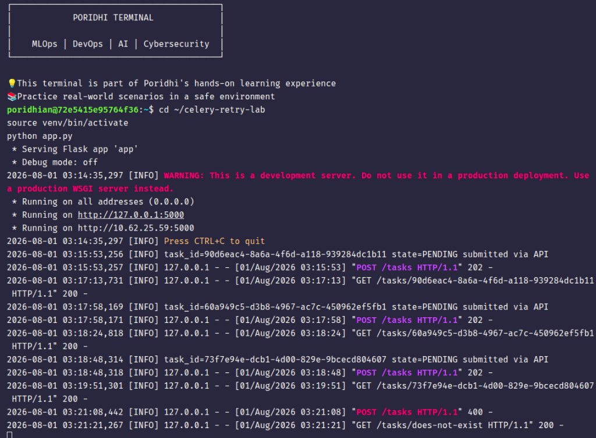
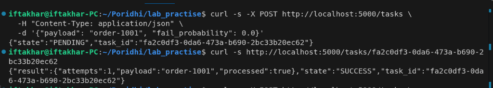
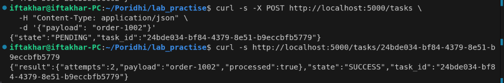
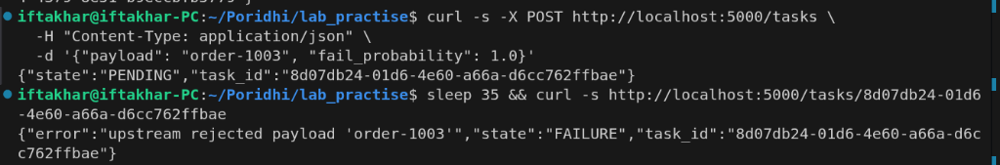
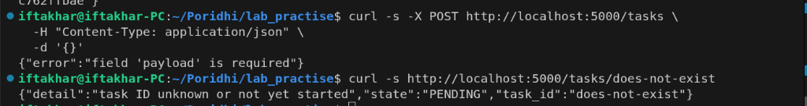

# Lab 7: Celery Task Retries, Timeouts, and Task Status Tracking

## Overview

Distributed background tasks frequently encounter external service outages, network latency, or unexpected execution delays. To prevent silent failures and resource exhaustion, systems must implement automatic retries with exponential backoff, enforce soft and hard timeouts, and log every state transition. In this lab, you will build a resilient Flask and Celery pipeline backed by Redis that handles transient upstream errors, tracks lifecycle states, and exposes status diagnostics.

<p align="center">
  
</p>

---

## Concepts & Architecture

### Key Concepts

| Term | Meaning |
|---|---|
| PENDING | Task ID exists in the backend but no worker has picked it up yet, or the ID is unknown. |
| STARTED | A worker has picked up the task and begun execution. Requires `task_track_started=True`. |
| RETRY | The task raised an exception, caught by `autoretry_for` or an explicit `self.retry()` call, and has been rescheduled. |
| SUCCESS | The task function returned without raising an exception. The return value is stored in the result backend. |
| FAILURE | The task exhausted its retry budget, or raised an exception not covered by the retry policy. |
| `max_retries` | Upper bound on retry attempts before the task is marked FAILURE. |
| `retry_backoff` | When `True`, delay before each retry grows exponentially (1s, 2s, 4s, 8s, ...). |
| `retry_backoff_max` | Ceiling on the backoff delay, in seconds, regardless of retry count. |
| `retry_jitter` | Adds random variance to the backoff delay to prevent synchronized retries across workers. |
| `soft_time_limit` | Seconds after which Celery raises `SoftTimeLimitExceeded` inside the task, allowing cleanup. |
| `time_limit` | Seconds after which Celery kills the worker process running the task, no cleanup possible. |

### Celery Task State Transitions

The state diagram below demonstrates how a task moves between PENDING, STARTED, RETRY, SUCCESS, and FAILURE states during execution:

<p align="center">
  
</p>

### Exponential Backoff & Delay Flow

When a task fails and triggers a retry attempt, Celery computes an increasing delay using exponential backoff to avoid overloading external services:

<p align="center">
  
</p>

### Objectives

- Build a Flask API with an endpoint to submit a task and an endpoint to check its status by task ID.
- Configure Celery with Redis as broker and result backend, with `task_track_started` enabled.
- Implement automatic retries with exponential backoff and a maximum retry ceiling on a task that simulates an unreliable external call.
- Implement `soft_time_limit` and `time_limit` on the same task to bound execution time.
- Implement structured logging that records every state transition and every caught exception with the task ID.
- Verify all task outcomes: SUCCESS, RETRY-then-SUCCESS, and FAILURE after retries are exhausted.

### Prerequisites

- Ubuntu 22.04 LTS.
- Python 3.11.
- Redis 7 running locally on port 6379.
- `curl` for verification requests.

Install system packages and Redis:
```bash
sudo apt update
sudo apt install -y python3.11 python3.11-venv redis-server curl
sudo systemctl enable redis-server
sudo systemctl start redis-server
redis-cli ping # Expected: PONG
```

### What You Will Build

```
celery-retry-lab/
├── requirements.txt
├── celery_app.py
├── tasks.py
├── app.py
└── logs/
    └── worker.log
```

---

## Step-by-Step Implementation

### Step 1: Create the project and install dependencies

Create the project directory and a virtual environment:

```bash
mkdir -p celery-retry-lab/logs
cd celery-retry-lab
python3.11 -m venv venv
source venv/bin/activate
```

Create `requirements.txt` by running:

```bash
cat << 'EOF' > requirements.txt
flask==3.0.3
celery==5.4.0
redis==5.0.8
EOF
```

Install the dependencies:

```bash
pip install -r requirements.txt
```

**Explanation:**
- `flask` serves the two HTTP endpoints: task submission and task status lookup.
- `celery` provides the task queue, worker, retry, and timeout machinery.
- `redis` is the Python client Celery uses to talk to the Redis broker and result backend.

---

### Step 2: Configure the Celery application (`celery_app.py`)

Create `celery_app.py` using the following command:

```bash
cat << 'EOF' > celery_app.py
import logging
from celery import Celery
from celery.signals import task_prerun, task_postrun, task_failure, task_retry

logging.basicConfig(
    level=logging.INFO,
    format="%(asctime)s [%(levelname)s] %(message)s",
    handlers=[
        logging.FileHandler("logs/worker.log"),
        logging.StreamHandler(),
    ],
)
logger = logging.getLogger("celery_retry_lab")

celery_app = Celery(
    "celery_retry_lab",
    broker="redis://localhost:6379/0",
    backend="redis://localhost:6379/1",
)

celery_app.conf.update(
    task_track_started=True,
    result_extended=True,
    task_serializer="json",
    result_serializer="json",
    accept_content=["json"],
    timezone="UTC",
    enable_utc=True,
)


@task_prerun.connect
def log_task_prerun(task_id, task, *args, **kwargs):
    logger.info("task_id=%s name=%s state=STARTED", task_id, task.name)


@task_postrun.connect
def log_task_postrun(task_id, task, retval=None, state=None, *args, **kwargs):
    logger.info("task_id=%s name=%s state=%s result=%s", task_id, task.name, state, retval)


@task_retry.connect
def log_task_retry(request, reason, **kwargs):
    logger.warning("task_id=%s state=RETRY reason=%s", request.id, reason)


@task_failure.connect
def log_task_failure(task_id, exception, *args, **kwargs):
    logger.error("task_id=%s state=FAILURE exception=%s", task_id, repr(exception))
EOF
```

**Explanation:**
- The broker is Redis DB 0 and the result backend is Redis DB 1.
- `task_track_started=True` enables emitting the STARTED state.
- `result_extended=True` stores extra metadata alongside the result.
- Signal handlers (`task_prerun`, `task_postrun`, `task_retry`, `task_failure`) log every state transition to file and stdout.

---

### Step 3: Implement the task with retries, backoff, and timeouts (`tasks.py`)

Create `tasks.py` using the following command:

```bash
cat << 'EOF' > tasks.py
import logging
import random
import time

from celery.exceptions import SoftTimeLimitExceeded
from celery_app import celery_app

logger = logging.getLogger("celery_retry_lab")


class UpstreamServiceError(Exception):
    """Raised when the simulated upstream call fails."""


@celery_app.task(
    bind=True,
    autoretry_for=(UpstreamServiceError,),
    retry_backoff=True,
    retry_backoff_max=30,
    retry_jitter=True,
    max_retries=4,
    soft_time_limit=8,
    time_limit=12,
)
def call_upstream_service(self, payload: str, fail_probability: float = 0.7):
    """Simulate an unreliable upstream call that succeeds, fails, or hangs."""
    try:
        logger.info(
            "task_id=%s attempt=%s payload=%s", self.request.id, self.request.retries + 1, payload
        )
        time.sleep(1)

        if random.random() < fail_probability:
            raise UpstreamServiceError(f"upstream rejected payload '{payload}'")

        return {"payload": payload, "processed": True, "attempts": self.request.retries + 1}

    except SoftTimeLimitExceeded:
        logger.error("task_id=%s exceeded soft_time_limit, aborting cleanly", self.request.id)
        raise

    except UpstreamServiceError as exc:
        logger.warning(
            "task_id=%s attempt=%s failed: %s", self.request.id, self.request.retries + 1, exc
        )
        raise
EOF
```

**Explanation:**
- `bind=True` gives access to `self.request` (task ID and retry count).
- `autoretry_for=(UpstreamServiceError,)` retries automatically on this exception type.
- `retry_backoff=True` with `retry_backoff_max=30` produces exponential backoff up to 30s.
- `retry_jitter=True` adds random variance to retry delays.
- `max_retries=4` allows up to 5 total attempts before settled as FAILURE.
- `soft_time_limit=8` and `time_limit=12` bound execution time.

---

### Step 4: Build the Flask API (`app.py`)

Create `app.py` using the following command:

```bash
cat << 'EOF' > app.py
import logging

from celery.result import AsyncResult
from flask import Flask, jsonify, request

from celery_app import celery_app
from tasks import call_upstream_service

app = Flask(__name__)
logger = logging.getLogger("celery_retry_lab")


@app.post("/tasks")
def submit_task():
    body = request.get_json(silent=True) or {}
    payload = body.get("payload")
    fail_probability = body.get("fail_probability", 0.7)

    if not payload:
        return jsonify({"error": "field 'payload' is required"}), 400

    async_result = call_upstream_service.apply_async(
        args=[payload], kwargs={"fail_probability": fail_probability}
    )
    logger.info("task_id=%s state=PENDING submitted via API", async_result.id)

    return jsonify({"task_id": async_result.id, "state": "PENDING"}), 202


@app.get("/tasks/<task_id>")
def get_task_status(task_id):
    result = AsyncResult(task_id, app=celery_app)

    response = {"task_id": task_id, "state": result.state}

    if result.state == "PENDING":
        response["detail"] = "task ID unknown or not yet started"
    elif result.state == "STARTED":
        response["detail"] = "task is currently executing"
    elif result.state == "RETRY":
        response["detail"] = "task failed and is scheduled for retry"
    elif result.state == "SUCCESS":
        response["result"] = result.result
    elif result.state == "FAILURE":
        response["error"] = str(result.result)

    return jsonify(response), 200


if __name__ == "__main__":
    app.run(host="0.0.0.0", port=5000)
EOF
```

**Explanation:**
- `POST /tasks` validates `payload`, queues task with `apply_async`, and returns `202 Accepted` immediately.
- `GET /tasks/<task_id>` queries `AsyncResult` and formats responses for each state (`PENDING`, `STARTED`, `RETRY`, `SUCCESS`, `FAILURE`).

---

### Step 5: Run the worker and the API

1. Terminal 1 — Start Celery worker:
   ```bash
   cd celery-retry-lab
   source venv/bin/activate
   celery -A celery_app.celery_app worker --loglevel=info
   ```

   <p align="center">
     
   </p>

2. Terminal 2 — Start Flask API:
   ```bash
   cd celery-retry-lab
   source venv/bin/activate
   python app.py
   ```

   <p align="center">
     
   </p>

---

## Verification & Scenarios

### Scenario 1: Guaranteed success (`fail_probability = 0.0`)

Submit task:
```bash
curl -s -X POST http://localhost:5000/tasks \
  -H "Content-Type: application/json" \
  -d '{"payload": "order-1001", "fail_probability": 0.0}'
# → {"task_id": "5f2b9e3a-1c44-4a6a-9d21-7a5e2f9b1a01", "state": "PENDING"}
```

Poll status:
```bash
curl -s http://localhost:5000/tasks/5f2b9e3a-1c44-4a6a-9d21-7a5e2f9b1a01
```

Expected output:
```json
{
  "task_id": "5f2b9e3a-1c44-4a6a-9d21-7a5e2f9b1a01",
  "state": "SUCCESS",
  "result": {"payload": "order-1001", "processed": true, "attempts": 1}
}
```

<p align="center">
  
</p>

---

### Scenario 2: Retry then success (`fail_probability = 0.7`)

Submit task:
```bash
curl -s -X POST http://localhost:5000/tasks \
  -H "Content-Type: application/json" \
  -d '{"payload": "order-1002"}'
```

Poll status during retry:
```json
{
  "task_id": "8a1d4c77-9e02-4b31-8f6e-3c0a2d5b7c12",
  "state": "RETRY",
  "detail": "task failed and is scheduled for retry"
}
```

Poll status after backoff completion:
```json
{
  "task_id": "8a1d4c77-9e02-4b31-8f6e-3c0a2d5b7c12",
  "state": "SUCCESS",
  "result": {"payload": "order-1002", "processed": true, "attempts": 3}
}
```

<p align="center">
  
</p>

---

### Scenario 3: Retries exhausted (`fail_probability = 1.0`)

Submit task:
```bash
curl -s -X POST http://localhost:5000/tasks \
  -H "Content-Type: application/json" \
  -d '{"payload": "order-1003", "fail_probability": 1.0}'
```

Poll after retries are exhausted (~30s):
```json
{
  "task_id": "c3e9f1a0-6b58-4d19-a2c7-1e9f4a8b0d33",
  "state": "FAILURE",
  "error": "upstream rejected payload 'order-1003'"
}
```

<p align="center">
  
</p>

---

### Scenario 4 & 5: Invalid submission & Unknown task ID

```bash
# Missing payload
curl -s -X POST http://localhost:5000/tasks -H "Content-Type: application/json" -d '{}'
# → {"error": "field 'payload' is required"}

# Unknown ID
curl -s http://localhost:5000/tasks/does-not-exist
# → {"task_id": "does-not-exist", "state": "PENDING", "detail": "task ID unknown..."}
```

<p align="center">
  
</p>

### Verification Summary

| # | Call | Status | Body snippet |
|---|---|---|---|
| 1 | `POST /tasks` (`fail_probability=0.0`) | 202 | `{"state": "PENDING"}` |
| 1 | `GET /tasks/<id>` after success | 200 | `{"state": "SUCCESS", "result": {...}}` |
| 2 | `GET /tasks/<id>` mid-retry | 200 | `{"state": "RETRY"}` |
| 2 | `GET /tasks/<id>` after eventual success | 200 | `{"state": "SUCCESS", "attempts": 3}` |
| 3 | `GET /tasks/<id>` after retries exhausted | 200 | `{"state": "FAILURE", "error": "..."}` |
| 4 | `POST /tasks` with no payload | 400 | `{"error": "field 'payload' is required"}` |
| 5 | `GET /tasks/<unknown id>` | 200 | `{"state": "PENDING", "detail": "task ID unknown..."}` |

---

## Conclusion

In this lab, you built a production-ready asynchronous task worker capable of handling transient external failures gracefully. You configured exponential backoff, random jitter, and execution time limits to protect downstream dependencies while keeping workers operational. Furthermore, signal-based event logging ensured comprehensive operational audit trails across all task execution states.