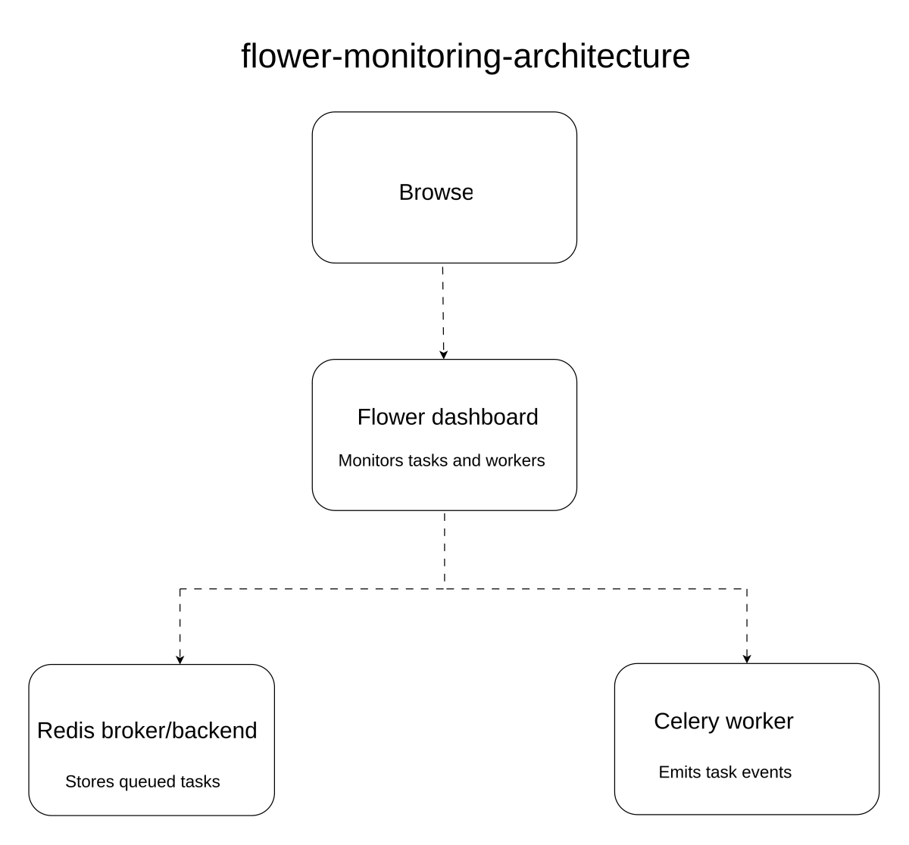
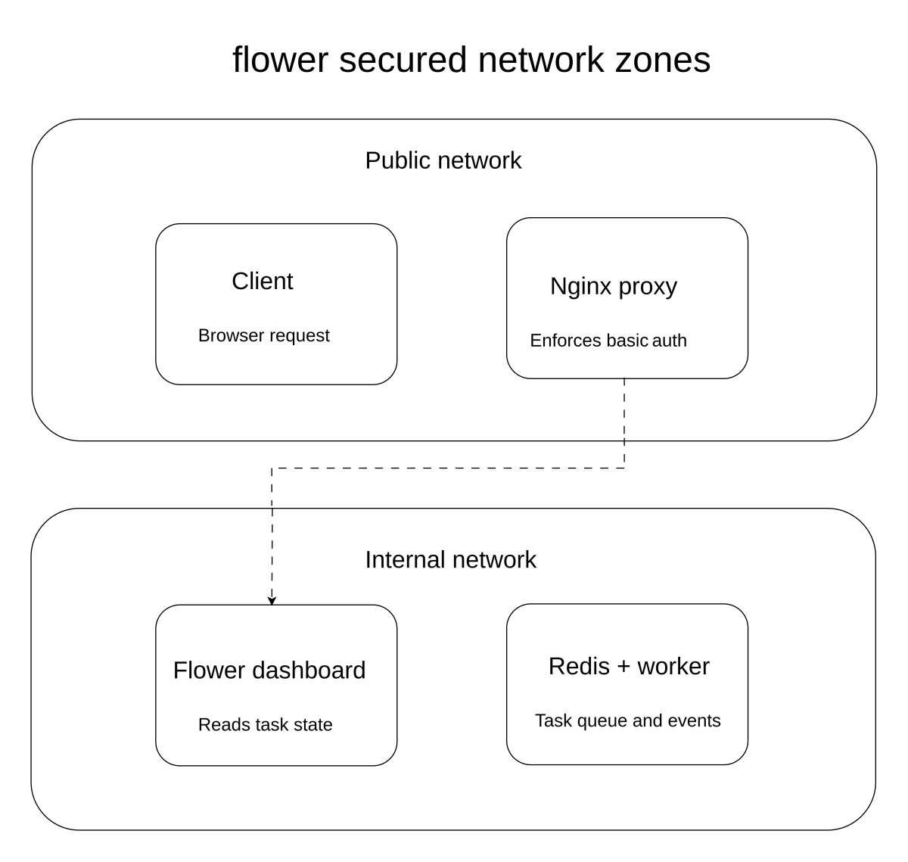

# Lab 8: Monitoring Celery with Flower

## Introduction

Once a Celery application is running in production, the operations team needs a way to observe task execution in real time: which tasks are running, which have failed, which workers are active, and how many tasks each worker has processed. The Celery command-line tools provide some of this information, but a web dashboard is more practical for ongoing monitoring.

This lab introduces Flower, the official Celery monitoring tool. Flower exposes a web UI that shows active workers, task history, task states, and runtime statistics. It also provides a REST API that can be used by external alerting and automation systems.

## Diagrams

### Flower Monitoring Architecture

<p align="center">
  
</p>

This diagram shows how Flower sits alongside the Celery worker and the broker. The worker publishes events to the broker as tasks are received, started, succeeded, or failed. Flower subscribes to those events and renders them in the web dashboard. Clients connect to Flower over HTTP to view task state and worker activity.

### Flower Secured Network Zones

<p align="center">
  
</p>

This diagram shows a typical production deployment where the Flower dashboard is not exposed directly to the public internet. The dashboard is placed inside an internal network, accessible only to operators through a VPN or a bastion host. The Celery workers and the broker remain inside a private network, and only the API is reachable from the outside.

## Concepts Covered

- **celery flower** — command to launch the Flower web server
- **Events** — task lifecycle signals (task-received, task-started, task-succeeded, task-failed) emitted by the worker
- **Dashboard tabs** — Tasks, Workers, Broker, Monitor
- **REST API** — programmatic access to task and worker state
- **Basic auth** — protecting the dashboard with a username and password
- **Network placement** — running Flower behind a reverse proxy or inside a private network

## Setup

Install Flower alongside Celery:

```bash
pip install flower
```

Start the dashboard (default port 5555):

```bash
celery -A app.celery_app flower
```

Open `http://localhost:5555` in a browser to view the dashboard.

## Next Steps

Future labs will build on Flower by adding alerting rules, integrating with external observability stacks, and exploring more advanced worker supervision patterns.
