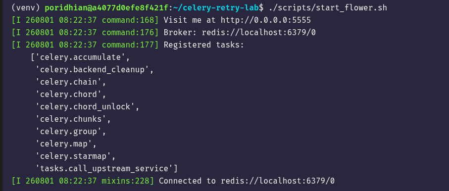
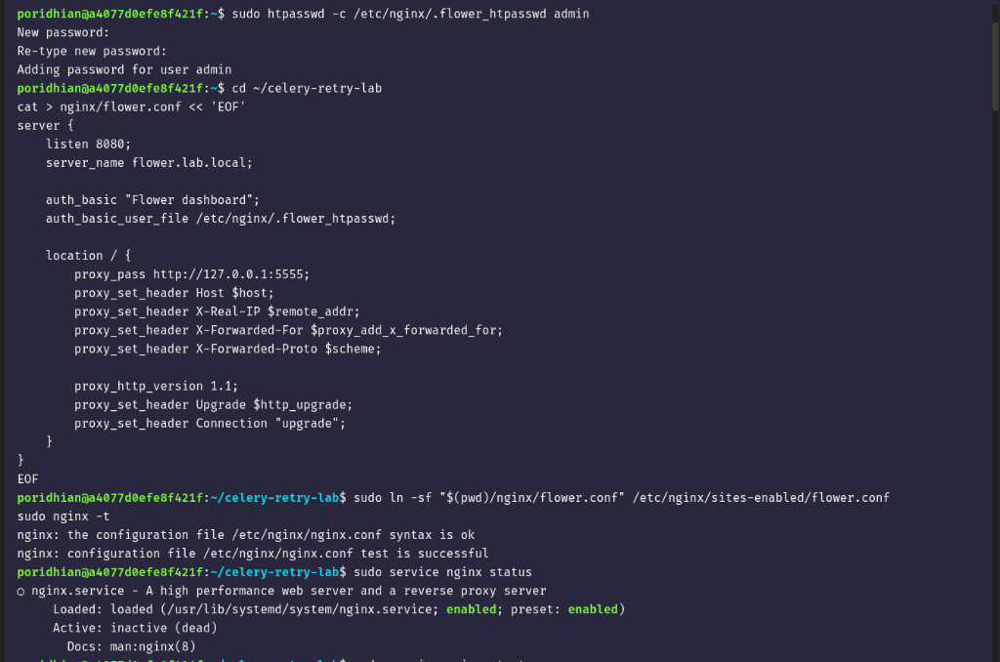
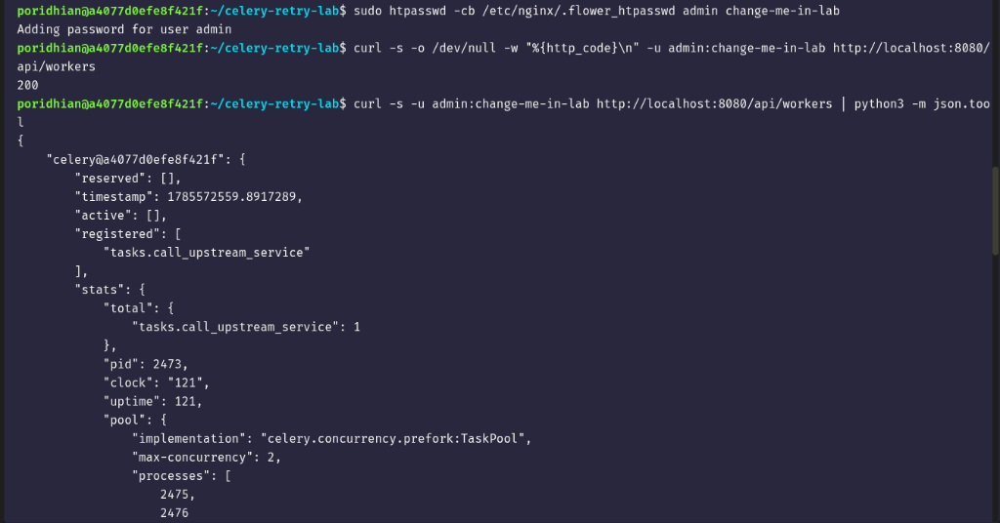

# Lab 8: Monitoring Celery with Flower

## Overview

Real-time visibility into background worker health, task queue depth, execution latency, and failure rates is essential for operating distributed applications. Flower provides a web-based management dashboard and REST API for Celery clusters by passively consuming worker event streams from Redis. In this lab, you will deploy Flower with SQLite state persistence, enforce HTTP basic authentication, and secure access behind an Nginx reverse proxy running at the network edge.

<p align="center">
  
</p>

---

## Step-by-Step Implementation

### Step 1: Install Flower Dependencies

1. Install system prerequisites (Nginx & htpasswd tool):
   ```bash
   sudo apt update
   sudo apt install -y nginx apache2-utils
   ```

2. Add `flower` to your project virtual environment (`celery-retry-lab`):
   ```bash
   source venv/bin/activate
   pip install flower==2.0.1
   ```

---

### Step 2: Create Flower Startup Script (`scripts/start_flower.sh`)

Create executable startup script configuring Flower port, persistence database, and basic credentials:

```bash
mkdir -p scripts
cat << 'EOF' > scripts/start_flower.sh
#!/usr/bin/env bash
set -euo pipefail

cd "$(dirname "$0")/.."
source venv/bin/activate

mkdir -p flower_data

celery -A celery_app.celery_app flower \
  --port=5555 \
  --persistent=True \
  --db=flower_data/flower.db \
  --basic_auth=admin:change-me-in-lab \
  --url_prefix=""
EOF

chmod +x scripts/start_flower.sh
```

---

### Step 3: Launch Flower & Query REST API

1. Start Flower service:
   ```bash
   ./scripts/start_flower.sh
   ```

2. Query active Celery workers via Flower REST API:
   ```bash
   curl -s -u admin:change-me-in-lab http://localhost:5555/api/workers
   ```

<p align="center">
  
</p>

---

### Step 4: Configure Nginx Reverse Proxy (`nginx/flower.conf`)

1. Generate Nginx basic auth password file:
   ```bash
   sudo htpasswd -c /etc/nginx/.flower_htpasswd admin
   ```

2. Create proxy configuration file `nginx/flower.conf`:
   ```nginx
   server {
       listen 8080;
       server_name flower.lab.local;

       auth_basic "Flower Dashboard Access";
       auth_basic_user_file /etc/nginx/.flower_htpasswd;

       location / {
           proxy_pass http://127.0.0.1:5555;
           proxy_set_header Host $host;
           proxy_set_header X-Real-IP $remote_addr;
           proxy_set_header X-Forwarded-For $proxy_add_x_forwarded_for;
           proxy_set_header X-Forwarded-Proto $scheme;

           proxy_http_version 1.1;
           proxy_set_header Upgrade $http_upgrade;
           proxy_set_header Connection "upgrade";
       }
   }
   ```

3. Enable configuration and reload Nginx:
   ```bash
   sudo ln -sf "$(pwd)/nginx/flower.conf" /etc/nginx/sites-enabled/flower.conf
   sudo nginx -t
   sudo systemctl reload nginx
   ```

<p align="center">
  
</p>

---

### Step 5: Verification & Authentication Security Checks

1. **Verify Direct Unauthenticated Request Blocked (401)**:
   ```bash
   curl -s -o /dev/null -w "%{http_code}\n" http://localhost:8080/
   ```

2. **Verify Authenticated Nginx Proxy Request (200)**:
   ```bash
   curl -s -o /dev/null -w "%{http_code}\n" -u admin:<NGINX_PASSWORD> http://localhost:8080/api/workers
   ```

<p align="center">
  
</p>

---

## Conclusion

In this lab, you successfully integrated Flower real-time monitoring into your Celery task processing stack. You enabled persistent state retention across service restarts and configured WebSocket support for live web metrics. By placing Flower behind an Nginx reverse proxy with basic authentication, you established network edge security while maintaining full visibility into your distributed background system.