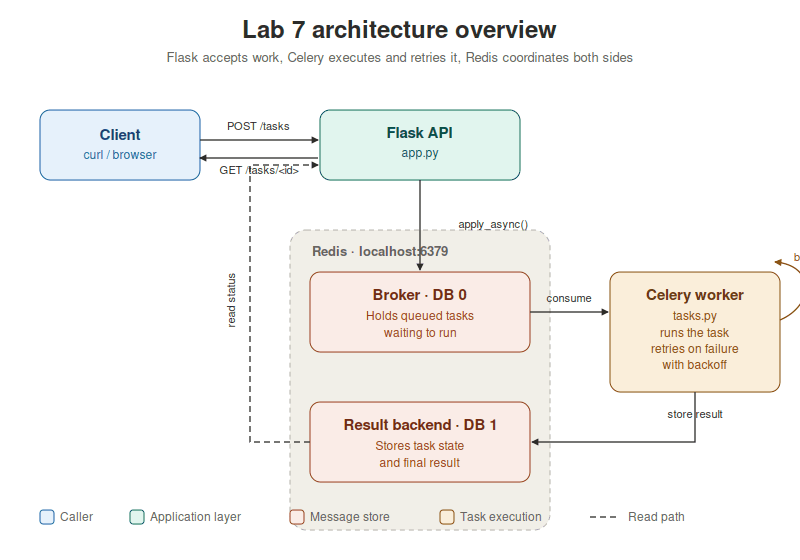
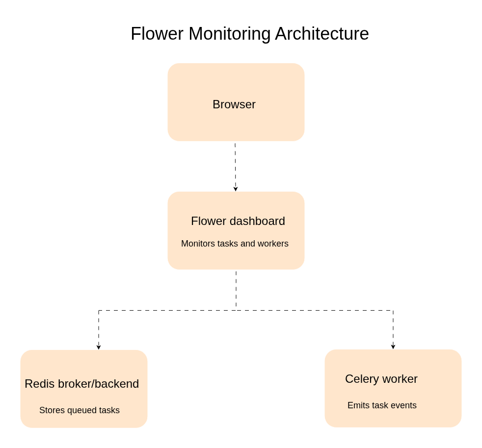
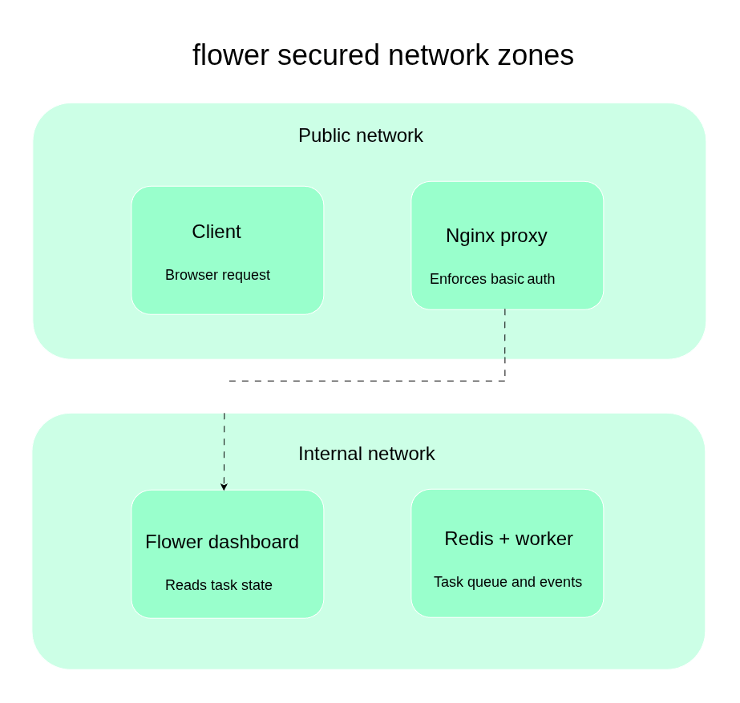

# Module 54 — Lab 8: Monitoring Celery with Flower

You will extend the `celery-retry-lab` project from Lab 7 with Flower, a real-time monitoring dashboard for Celery. Flower attaches to the same Redis broker as the existing worker, gives you a live view of task state, retries, and worker activity, and exposes a REST API you can query from the command line. You will then place Flower behind an Nginx reverse proxy with basic authentication so the dashboard is not reachable directly from outside the internal network.



*Figure 1. Architecture overview of the baseline Celery system. Flask accepts requests and enqueues tasks in Redis, while the Celery worker consumes and executes them.*



*Figure 2. The browser talks to the Flower dashboard. Flower does not talk to the Flask API or the task code directly — it connects to the same Redis broker/backend the Celery worker uses. The worker emits an event every time a task changes state, and Flower consumes that event stream to keep its dashboard and REST API up to date.*

## Concepts

| Term | Meaning |
|---|---|
| Flower | A web-based monitor for Celery that shows live task and worker state, built on Celery's event system. |
| Event stream | Messages a Celery worker emits on every state change (`task-received`, `task-started`, `task-succeeded`, `task-retried`, `task-failed`). Flower subscribes to this stream. |
| Broker URL | The Redis connection string Flower uses to reach the same queue the Celery worker consumes from. Must match the worker's broker exactly. |
| Workers view | Flower's list of connected worker processes, their pool size, uptime, and current load. |
| Tasks view | Flower's searchable table of tasks with state, arguments, runtime, and retry count. |
| REST API | Flower's `/api/tasks` and `/api/workers` endpoints, returning the same data as the dashboard as JSON. |
| `--persistent` | A Flower flag that saves task and worker history to a local database file so it survives a Flower restart. |
| `--basic_auth` | A Flower flag that gates the dashboard and API behind a username and password. |

Flower does not modify the task code or the Flask API in any way. It connects to the same Redis instance the Celery worker already uses, listens for the event messages the worker emits on every state transition, and keeps an in-memory (or, with `--persistent`, on-disk) record of every task and worker it has seen. The dashboard and the REST API are two views over that same record. Because Flower is a passive listener, you can attach or detach it from a running system at any time without affecting task processing.

## Objectives

- Install Flower and connect it to the Redis broker used by the Lab 7 Celery worker.
- Configure Flower to persist task and worker history across restarts.
- Implement basic authentication on the Flower dashboard.
- Verify task state, retries, and worker activity through the Flower REST API.
- Configure an Nginx reverse proxy that restricts direct access to Flower and enforces authentication at the network edge.

## Prerequisites

- Ubuntu 22.04 LTS.
- Python 3.11.
- Redis 7 running locally on port 6379.
- The `celery-retry-lab` project from Lab 7, with its virtual environment already created.
- `curl` for verification requests.

Install Nginx and the `htpasswd` utility, used for the optional secured-proxy step:

```bash
sudo apt update
sudo apt install -y nginx apache2-utils
```

Install Flower into the existing Lab 7 virtual environment:

```bash
cd celery-retry-lab
source venv/bin/activate
```

## What You Will Build

```
celery-retry-lab/
├── requirements.txt          (updated)
├── celery_app.py             (from Lab 7, unchanged)
├── tasks.py                  (from Lab 7, unchanged)
├── app.py                    (from Lab 7, unchanged)
├── flower_data/
│   └── flower.db
├── scripts/
│   └── start_flower.sh
└── nginx/
    └── flower.conf
```

Flower runs as a third process alongside the Flask API and the Celery worker, all three pointed at the same Redis instance. `scripts/start_flower.sh` starts Flower with persistence and basic auth. `nginx/flower.conf` puts Nginx in front of Flower's port so the dashboard is only reachable through the proxy, which enforces its own basic auth layer before ever forwarding a request to Flower.

## Step 1: Add Flower to the project dependencies

Update `requirements.txt` to add Flower. Create the file with the following contents:

```
flask==3.0.3
celery==5.4.0
redis==5.0.8
flower==2.0.1
```

Install the new dependency:

```bash
pip install -r requirements.txt
```

Explanation:

- `flower==2.0.1` is pinned alongside the existing `celery==5.4.0` from Lab 7; Flower 2.x requires Celery 5.x and will not correctly render events from mismatched major versions.
- No other dependency changes are needed. Flower reads the same `celery_app.py` used by the worker and the Flask API, so it inherits the broker and backend URLs already configured there.

## Step 2: Create the Flower startup script

Create a file named `scripts/start_flower.sh` with the following contents:

```bash
#!/usr/bin/env bash
set -euo pipefail

cd "$(dirname "$0")/.."
source venv/bin/activate

mkdir -p flower_data

celery -A celery_app.celery_app flower \
  --port=5555 \
  --persistent=True \
  --db=flower_data/flower.db \
  --basic_auth=admin:change-me-in-lab \
  --url_prefix=""
```

Make the script executable:

```bash
chmod +x scripts/start_flower.sh
```

Explanation:

- `set -euo pipefail` stops the script on the first error, on use of an unset variable, or on a failed command inside a pipeline, so a misconfigured environment fails loudly instead of starting a broken Flower instance.
- `cd "$(dirname "$0")/.."` makes the script runnable from any directory by resolving paths relative to the project root, not the caller's current directory.
- `-A celery_app.celery_app` points Flower at the exact same Celery application object the worker uses, which is how Flower learns the broker URL, the backend URL, and the registered task names.
- `--port=5555` is Flower's default port; it is set explicitly here so the Nginx configuration in Step 4 has a known upstream target.
- `--persistent=True --db=flower_data/flower.db` stores task and worker history in a local SQLite-backed file, so restarting Flower does not lose the history of tasks that already completed.
- `--basic_auth=admin:change-me-in-lab` gates both the dashboard and the REST API behind HTTP basic authentication. The placeholder password is intentionally weak and is meant to be replaced before any real deployment; this lab treats it as a lab credential, not a production one.
- `--url_prefix=""` keeps Flower mounted at the site root, which matches the Nginx `location /` block used in Step 4.

## Step 3: Start Flower

With the Redis server and the Lab 7 Celery worker both already running, start Flower in a third terminal:

```bash
cd celery-retry-lab
./scripts/start_flower.sh
```

Expected output (tail):

```
[I 260730 10:15:02 command:168] Visit me at http://0.0.0.0:5555
[I 260730 10:15:02 command:176] Broker: redis://localhost:6379/0
[I 260730 10:15:02 command:179] Registered tasks:
    ['tasks.call_upstream_service']
[I 260730 10:15:02 mixins:229] Connected to redis://localhost:6379/0
```

Explanation:

- The `Broker:` line confirms Flower resolved the same Redis DB 0 the worker publishes to; a mismatch here means Flower will show zero workers and zero tasks even while the worker is healthy.
- `Registered tasks` lists `tasks.call_upstream_service` because Flower introspects the Celery app object, the same one `tasks.py` registers the task against.

## Step 4: Verify task and worker data through the REST API

With Flower running, resubmit a task through the Lab 7 Flask API so there is fresh data for Flower to report:

```bash
curl -s -X POST http://localhost:5000/tasks \
  -H "Content-Type: application/json" \
  -d '{"payload": "order-2001", "fail_probability": 0.0}'
```

Query Flower's worker list:

```bash
curl -s -u admin:change-me-in-lab http://localhost:5555/api/workers
```

Expected output shape:

```json
{
  "celery@worker-host": {
    "status": true,
    "pool": {
      "max-concurrency": 4,
      "processes": [12345, 12346, 12347, 12348]
    },
    "active": 0,
    "processed": 3
  }
}
```

Query the task list, filtered to the task you just submitted:

```bash
curl -s -u admin:change-me-in-lab \
  "http://localhost:5555/api/tasks?taskname=tasks.call_upstream_service" \
  | python3 -m json.tool
```

Expected output shape for one entry:

```json
{
  "5f2b9e3a-1c44-4a6a-9d21-7a5e2f9b1a01": {
    "name": "tasks.call_upstream_service",
    "state": "SUCCESS",
    "received": 1785395702.11,
    "started": 1785395702.15,
    "succeeded": 1785395703.16,
    "retries": 0,
    "args": "['order-2001']",
    "kwargs": "{'fail_probability': 0.0}"
  }
}
```

## Step 5: Secure the dashboard with an Nginx reverse proxy

This step matches the network layout in Figure 3: the client only ever reaches Nginx, Nginx enforces its own authentication check, and only then forwards the request to Flower on the internal network. Flower's own `--basic_auth` from Step 2 stays in place as a second layer.



*Figure 3. The client's browser request lands on Nginx, which sits in the public network and enforces basic auth before proxying anywhere. Flower and the Redis broker/worker stay in the internal network and are never exposed directly; Flower's own role is limited to reading task state from Redis and rendering it.*

Create the Nginx credentials file:

```bash
sudo htpasswd -c /etc/nginx/.flower_htpasswd admin
```

Enter a password when prompted. Create a file named `nginx/flower.conf` with the following contents:

```nginx
server {
    listen 8080;
    server_name flower.lab.local;

    auth_basic "Flower dashboard";
    auth_basic_user_file /etc/nginx/.flower_htpasswd;

    location / {
        proxy_pass http://127.0.0.1:5555;
        proxy_set_header Host $host;
        proxy_set_header X-Real-IP $remote_addr;
        proxy_set_header X-Forwarded-For $proxy_add_x_forwarded_for;
        proxy_set_header X-Forwarded-Proto $scheme;

        proxy_http_version 1.1;
        proxy_set_header Upgrade $http_upgrade;
        proxy_set_header Connection "upgrade";
    }
}
```

Link the config and reload Nginx:

```bash
sudo ln -sf "$(pwd)/nginx/flower.conf" /etc/nginx/sites-enabled/flower.conf
sudo nginx -t
sudo systemctl reload nginx
```

Expected output of `nginx -t`:

```
nginx: the configuration file /etc/nginx/nginx.conf syntax is ok
nginx: configuration file /etc/nginx/nginx.conf test is successful
```

Explanation:

- `listen 8080` puts Nginx on a distinct port from Flower's own `5555`, matching the public/internal split in Figure 3. In a real deployment, port 8080 (or 443 with TLS) is the only one opened to the network the client sits on; port 5555 stays bound to `127.0.0.1` or an internal-only interface.
- `auth_basic` and `auth_basic_user_file` add an authentication layer at the proxy, independent of Flower's own `--basic_auth`. A request must satisfy both to reach the dashboard content, since Nginx checks its credentials first and Flower checks its own credentials on the proxied request.
- `proxy_pass http://127.0.0.1:5555` forwards authenticated requests to the local Flower process; this is the only path into Flower once Nginx is the sole listener on a public interface.
- The `Upgrade`/`Connection` headers keep WebSocket connections working, which Flower's dashboard uses for live updates without polling.

## Verification

### Scenario 1: Worker list reflects the running Celery worker

```bash
curl -s -u admin:change-me-in-lab http://localhost:5555/api/workers | python3 -m json.tool
```

Expected: HTTP 200, one worker entry with `"status": true`.

### Scenario 2: Task list shows a SUCCESS state after a successful run

```bash
curl -s -u admin:change-me-in-lab \
  "http://localhost:5555/api/tasks?taskname=tasks.call_upstream_service&limit=1" \
  | python3 -m json.tool
```

Expected: HTTP 200, one task entry with `"state": "SUCCESS"` and `"retries": 0`.

### Scenario 3: Task list shows RETRY history for a task that failed and recovered

Resubmit with the default `fail_probability` to force at least one retry, then query:

```bash
curl -s -X POST http://localhost:5000/tasks -H "Content-Type: application/json" -d '{"payload": "order-2002"}'
curl -s -u admin:change-me-in-lab \
  "http://localhost:5555/api/tasks?taskname=tasks.call_upstream_service&limit=1" \
  | python3 -m json.tool
```

Expected: the returned entry shows `"retries"` greater than `0` and `"state": "SUCCESS"` once it finally completes.

### Scenario 4: Flower rejects requests without credentials

```bash
curl -s -o /dev/null -w "%{http_code}\n" http://localhost:5555/api/workers
```

Expected output:

```
401
```

### Scenario 5: Nginx rejects requests without its own credentials

```bash
curl -s -o /dev/null -w "%{http_code}\n" http://localhost:8080/
```

Expected output:

```
401
```

### Scenario 6: Nginx accepts requests with valid credentials and proxies through to Flower

```bash
curl -s -o /dev/null -w "%{http_code}\n" -u admin:<nginx-password> http://localhost:8080/api/workers
```

Expected output:

```
200
```

### Summary

| # | Call | Status | Body snippet |
|---|---|---|---|
| 1 | `GET /api/workers` (direct, with Flower auth) | 200 | `{"celery@...": {"status": true, ...}}` |
| 2 | `GET /api/tasks` after a clean success | 200 | `{"state": "SUCCESS", "retries": 0}` |
| 3 | `GET /api/tasks` after a retried task succeeds | 200 | `{"state": "SUCCESS", "retries": >0}` |
| 4 | `GET /api/workers` (direct, no auth header) | 401 | empty |
| 5 | `GET /` via Nginx (no auth header) | 401 | empty |
| 6 | `GET /api/workers` via Nginx (with Nginx auth) | 200 | `{"celery@...": {"status": true, ...}}` |

## Conclusion

You installed Flower and connected it to the Redis broker already used by the Lab 7 Celery worker, giving you a live view of task state, retries, and worker activity through both the dashboard and the REST API. You then placed Nginx in front of Flower with its own basic authentication layer, so the dashboard is reachable only through an authenticated proxy on the public network while Flower and Redis stay confined to the internal network.