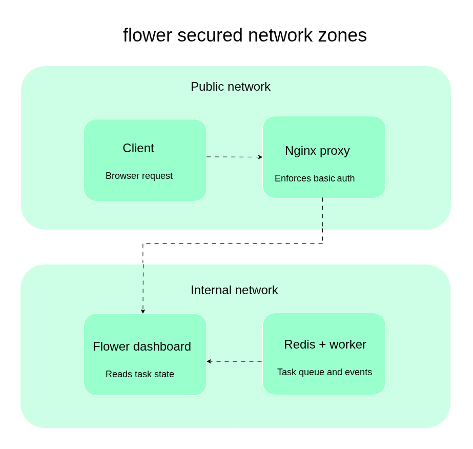

# Lab 8: Monitoring Celery with Flower

## Overview

Real-time visibility into background worker health, task queue depth, execution latency, and failure rates is essential for operating distributed applications. Flower provides a web-based management dashboard and REST API for Celery clusters by passively consuming worker event streams from Redis. In this lab, you will deploy Flower with SQLite state persistence, enforce HTTP basic authentication, and secure access behind an Nginx reverse proxy running at the network edge.

<p align="center">
  
</p>

---

## Concepts & Architecture

### Key Concepts

| Term | Meaning |
|---|---|
| Flower | A web-based monitor for Celery that shows live task and worker state, built on Celery's event system. |
| Event stream | Messages a Celery worker emits on every state change (`task-received`, `task-started`, `task-succeeded`, `task-retried`, `task-failed`). Flower subscribes to this stream. |
| Broker URL | The Redis connection string Flower uses to reach the same queue the Celery worker consumes from. Must match the worker's broker exactly. |
| Workers view | Flower's list of connected worker processes, their pool size, uptime, and current load. |
| Tasks view | Flower's searchable table of tasks with state, arguments, runtime, and retry count. |
| REST API | Flower's `/api/tasks` and `/api/workers` endpoints, returning the same data as the dashboard as JSON. |
| `--persistent` | A Flower flag that saves task and worker history to a local database file so it survives a Flower restart. |
| `--basic_auth` | A Flower flag that gates the dashboard and API behind a username and password. |

Flower does not modify the task code or the Flask API in any way. It connects to the same Redis instance the Celery worker already uses, listens for event messages emitted on state transitions, and keeps an in-memory or on-disk record. Because Flower is a passive listener, you can attach or detach it at any time without impacting worker performance.

### Objectives

- Install Flower and connect it to the Redis broker used by the Lab 7 Celery worker.
- Configure Flower to persist task and worker history across restarts.
- Implement basic authentication on the Flower dashboard.
- Verify task state, retries, and worker activity through the Flower REST API.
- Configure an Nginx reverse proxy that restricts direct access to Flower and enforces authentication at the network edge.

### Prerequisites

- Ubuntu 22.04 LTS.
- Python 3.11.
- Redis 7 running locally on port 6379.
- `curl` for verification requests.

Install Nginx and the `htpasswd` utility:
```bash
sudo apt update
sudo apt install -y nginx apache2-utils
```

Install Flower into the existing virtual environment:
```bash
cd celery-retry-lab
source venv/bin/activate
```

### What You Will Build

```
celery-retry-lab/
├── requirements.txt
├── celery_app.py
├── tasks.py
├── app.py
├── flower_data/
│   └── flower.db
├── scripts/
│   └── start_flower.sh
└── nginx/
    └── flower.conf
```

---

## Step-by-Step Implementation

### Step 1: Add Flower to project dependencies

Update `requirements.txt` by running:

```bash
cat << 'EOF' > requirements.txt
flask==3.0.3
celery==5.4.0
redis==5.0.8
flower==2.0.1
EOF
```

Install the new dependency:

```bash
pip install -r requirements.txt
```

**Explanation:**
- `flower==2.0.1` is pinned alongside `celery==5.4.0` from Lab 7.
- Flower reads the same `celery_app.py` used by the worker and Flask API, inheriting the broker and backend URLs.

---

### Step 2: Create the Flower startup script (`scripts/start_flower.sh`)

Create `scripts/start_flower.sh` using the following command:

```bash
mkdir -p scripts
cat << 'EOF' > scripts/start_flower.sh
#!/usr/bin/env bash
set -euo pipefail

cd "$(dirname "$0")/.."
source venv/bin/activate

mkdir -p flower_data

celery -A celery_app.celery_app flower \
  --port=5555 \
  --persistent=True \
  --db=flower_data/flower.db \
  --basic_auth=admin:change-me-in-lab \
  --url_prefix=""
EOF
```

Make the script executable:

```bash
chmod +x scripts/start_flower.sh
```

**Explanation:**
- `set -euo pipefail` stops execution on errors.
- `-A celery_app.celery_app` points Flower to the Celery application instance.
- `--port=5555` sets Flower's listening port.
- `--persistent=True --db=flower_data/flower.db` stores history in SQLite.
- `--basic_auth=admin:change-me-in-lab` secures dashboard with HTTP basic auth.

---

### Step 3: Start Flower

Make sure Celery worker and Redis are running, then start Flower:

<p align="center">
  
</p>

```bash
cd celery-retry-lab
./scripts/start_flower.sh
```

Expected output:
```
[I 260730 10:15:02 command:168] Visit me at http://0.0.0.0:5555
[I 260730 10:15:02 command:176] Broker: redis://localhost:6379/0
[I 260730 10:15:02 command:179] Registered tasks:
    ['tasks.call_upstream_service']
[I 260730 10:15:02 mixins:229] Connected to redis://localhost:6379/0
```

<p align="center">
  
</p>

---

### Step 4: Verify task and worker data through the REST API

Resubmit a task through Flask API:

```bash
curl -s -X POST http://localhost:5000/tasks \
  -H "Content-Type: application/json" \
  -d '{"payload": "order-2001", "fail_probability": 0.0}'
```

<p align="center">
  
</p>

Query Flower worker list:
```bash
curl -s -u admin:change-me-in-lab http://localhost:5555/api/workers
```

Query task list:
```bash
curl -s -u admin:change-me-in-lab \
  "http://localhost:5555/api/tasks?taskname=tasks.call_upstream_service" \
  | python3 -m json.tool
```

Expected output snippet:
```json
{
  "5f2b9e3a-1c44-4a6a-9d21-7a5e2f9b1a01": {
    "name": "tasks.call_upstream_service",
    "state": "SUCCESS",
    "retries": 0,
    "args": "['order-2001']",
    "kwargs": "{'fail_probability': 0.0}"
  }
}
```

---

### Step 5: Secure the dashboard with an Nginx reverse proxy

The network diagram depicts placing Nginx in front of Flower to check credentials before proxying traffic:

<p align="center">
  
</p>

Create Nginx credentials:
```bash
sudo htpasswd -c /etc/nginx/.flower_htpasswd admin
```

Create `nginx/flower.conf`:
```bash
mkdir -p nginx
cat << 'EOF' > nginx/flower.conf
server {
    listen 8080;
    server_name flower.lab.local;

    auth_basic "Flower dashboard";
    auth_basic_user_file /etc/nginx/.flower_htpasswd;

    location / {
        proxy_pass http://127.0.0.1:5555;
        proxy_set_header Host $host;
        proxy_set_header X-Real-IP $remote_addr;
        proxy_set_header X-Forwarded-For $proxy_add_x_forwarded_for;
        proxy_set_header X-Forwarded-Proto $scheme;

        proxy_http_version 1.1;
        proxy_set_header Upgrade $http_upgrade;
        proxy_set_header Connection "upgrade";
    }
}
EOF
```

Link config and reload Nginx:
```bash
sudo ln -sf "$(pwd)/nginx/flower.conf" /etc/nginx/sites-enabled/flower.conf
sudo nginx -t
sudo systemctl reload nginx
```

<p align="center">
  
</p>

---

## Verification & Summary

### Scenarios

1. **Worker list reflects running worker:**
   ```bash
   curl -s -u admin:change-me-in-lab http://localhost:5555/api/workers
   ```
2. **Task list shows SUCCESS state:**
   ```bash
   curl -s -u admin:change-me-in-lab "http://localhost:5555/api/tasks?limit=1"
   ```
3. **Task list shows RETRY history:**
   ```bash
   curl -s -X POST http://localhost:5000/tasks -H "Content-Type: application/json" -d '{"payload": "order-2002"}'
   curl -s -u admin:change-me-in-lab "http://localhost:5555/api/tasks?limit=1"
   ```
4. **Flower rejects missing credentials (401):**
   ```bash
   curl -s -o /dev/null -w "%{http_code}\n" http://localhost:5555/api/workers
   # → 401
   ```
5. **Nginx rejects missing credentials (401):**
   ```bash
   curl -s -o /dev/null -w "%{http_code}\n" http://localhost:8080/
   # → 401
   ```
6. **Nginx proxies valid credentials (200):**
   ```bash
   curl -s -o /dev/null -w "%{http_code}\n" -u admin:<password> http://localhost:8080/api/workers
   # → 200
   ```

<p align="center">
  
</p>

### Verification Summary

| # | Call | Status | Body snippet |
|---|---|---|---|
| 1 | `GET /api/workers` (direct, with Flower auth) | 200 | `{"celery@...": {"status": true, ...}}` |
| 2 | `GET /api/tasks` after a clean success | 200 | `{"state": "SUCCESS", "retries": 0}` |
| 3 | `GET /api/tasks` after a retried task succeeds | 200 | `{"state": "SUCCESS", "retries": >0}` |
| 4 | `GET /api/workers` (direct, no auth header) | 401 | empty |
| 5 | `GET /` via Nginx (no auth header) | 401 | empty |
| 6 | `GET /api/workers` via Nginx (with Nginx auth) | 200 | `{"celery@...": {"status": true, ...}}` |

---

## Conclusion

In this lab, you successfully integrated Flower real-time monitoring into your Celery task processing stack. You enabled persistent state retention across service restarts and configured WebSocket support for live web metrics. By placing Flower behind an Nginx reverse proxy with basic authentication, you established network edge security while maintaining full visibility into your distributed background system.