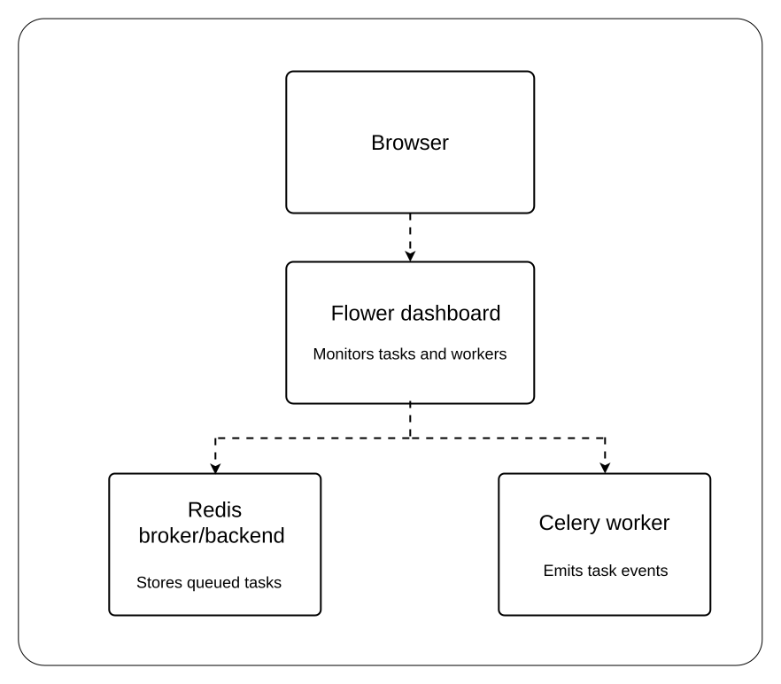
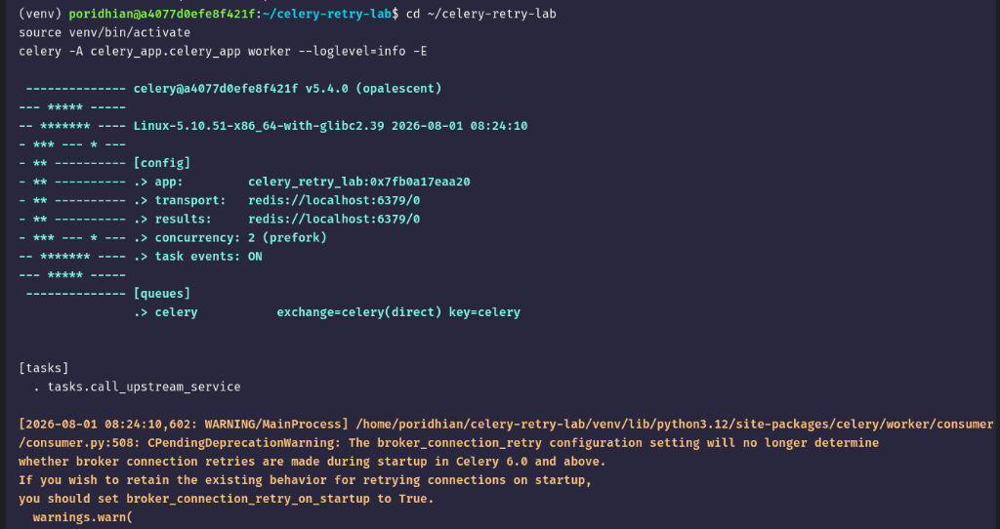
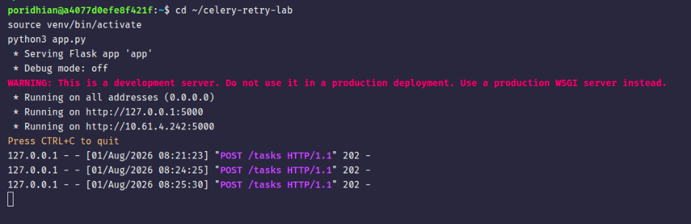

# Lab 8: Monitoring Celery with Flower

## Overview

Real-time visibility into background worker health, task queue depth, execution latency, and failure rates is essential for operating distributed applications. Flower provides a web-based management dashboard and REST API for Celery clusters by passively consuming worker event streams from Redis. In this lab, you will deploy Flower with SQLite state persistence, enforce HTTP basic authentication, and secure access behind an Nginx reverse proxy running at the network edge.

<p align="center">
  
</p>

---

## 1. Core Concepts & Architecture

### Key Concepts

| Term | Meaning |
|---|---|
| Flower | A web-based monitor for Celery showing live task and worker state via event streams. |
| Event stream | Messages emitted on state changes (`task-received`, `task-started`, `task-succeeded`, etc.). |
| Broker URL | Redis connection string matching the worker's broker queue. |
| Workers view | Dashboard page listing connected worker processes, pool size, uptime, and load. |
| Tasks view | Searchable table of tasks with state, arguments, execution runtime, and retries. |
| REST API | Endpoints (`/api/tasks`, `/api/workers`) returning monitoring data in JSON format. |
| `--persistent` | Flag saving task and worker history to a local SQLite database (`flower.db`). |
| `--basic_auth` | Flag gating dashboard and API access behind username and password credentials. |

---

### Flower Monitoring Architecture

<p align="center">
  
</p>

---

### Objectives & Target Structure

- Install Flower and connect to Redis DB 0.
- Persist task history with `--persistent=True --db=flower_data/flower.db`.
- Gate access using `--basic_auth` and Nginx reverse proxy HTTP basic auth.

```
celery-retry-lab/
├── requirements.txt
├── celery_app.py
├── tasks.py
├── app.py
├── flower_data/
│   └── flower.db
├── scripts/
│   └── start_flower.sh
└── nginx/
    └── flower.conf
```

---

## 2. Environment Setup & Prerequisites

1. Install system prerequisites (Nginx & htpasswd utility):
   ```bash
   sudo apt update
   sudo apt install -y nginx apache2-utils
   ```

2. Activate virtual environment:
   ```bash
   cd celery-retry-lab
   source venv/bin/activate
   ```

---

## 3. Step-by-Step Code Implementation

### Step 3.1: Add Flower to Dependencies

Update `requirements.txt`:

```bash
cat << 'EOF' > requirements.txt
flask==3.0.3
celery==5.4.0
redis==5.0.8
flower==2.0.1
EOF
```

Install updated requirements:

```bash
pip install -r requirements.txt
```

---

### Step 3.2: Create Flower Startup Script (`scripts/start_flower.sh`)

Create `scripts/start_flower.sh`:

```bash
mkdir -p scripts
cat << 'EOF' > scripts/start_flower.sh
#!/usr/bin/env bash
set -euo pipefail

cd "$(dirname "$0")/.."
source venv/bin/activate

mkdir -p flower_data

celery -A celery_app.celery_app flower \
  --port=5555 \
  --persistent=True \
  --db=flower_data/flower.db \
  --basic_auth=admin:change-me-in-lab \
  --url_prefix=""
EOF
```

Make executable:

```bash
chmod +x scripts/start_flower.sh
```

---

### Step 3.3: Configure Nginx Reverse Proxy (`nginx/flower.conf`)

1. Create Nginx basic auth password file:
   ```bash
   sudo htpasswd -c /etc/nginx/.flower_htpasswd admin
   ```

2. Create `nginx/flower.conf`:
   ```nginx
   server {
       listen 8080;
       server_name flower.lab.local;

       auth_basic "Flower dashboard";
       auth_basic_user_file /etc/nginx/.flower_htpasswd;

       location / {
           proxy_pass http://127.0.0.1:5555;
           proxy_set_header Host $host;
           proxy_set_header X-Real-IP $remote_addr;
           proxy_set_header X-Forwarded-For $proxy_add_x_forwarded_for;
           proxy_set_header X-Forwarded-Proto $scheme;

           proxy_http_version 1.1;
           proxy_set_header Upgrade $http_upgrade;
           proxy_set_header Connection "upgrade";
       }
   }
   ```

3. Enable configuration and reload Nginx:
   ```bash
   sudo ln -sf "$(pwd)/nginx/flower.conf" /etc/nginx/sites-enabled/flower.conf
   sudo nginx -t
   sudo systemctl reload nginx
   ```

<p align="center">
  
</p>

---

## 4. Execution & Verification Scenarios

### Service Execution

1. Make sure Celery worker is running:
   <p align="center">
     
   </p>

2. Launch Flower startup script:
   ```bash
   ./scripts/start_flower.sh
   ```

   <p align="center">
     
   </p>

---

### REST API Verification

Submit job via Flask API:
```bash
curl -s -X POST http://localhost:5000/tasks \
  -H "Content-Type: application/json" \
  -d '{"payload": "order-2001", "fail_probability": 0.0}'
```

<p align="center">
  
</p>

Query Flower REST API for worker and task list:
```bash
curl -s -u admin:change-me-in-lab http://localhost:5555/api/workers
curl -s -u admin:change-me-in-lab "http://localhost:5555/api/tasks?limit=1" | python3 -m json.tool
```

---

### Verification Scenarios

1. **Worker list reflects running worker:**
   ```bash
   curl -s -u admin:change-me-in-lab http://localhost:5555/api/workers
   # → HTTP 200, "status": true
   ```

2. **Task list shows SUCCESS state:**
   ```bash
   curl -s -u admin:change-me-in-lab "http://localhost:5555/api/tasks?limit=1"
   # → HTTP 200, "state": "SUCCESS"
   ```

3. **Flower rejects missing credentials:**
   ```bash
   curl -s -o /dev/null -w "%{http_code}\n" http://localhost:5555/api/workers
   # → 401
   ```

4. **Nginx rejects missing credentials:**
   ```bash
   curl -s -o /dev/null -w "%{http_code}\n" http://localhost:8080/
   # → 401
   ```

5. **Nginx proxies authenticated requests:**
   ```bash
   curl -s -o /dev/null -w "%{http_code}\n" -u admin:<NGINX_PASSWORD> http://localhost:8080/api/workers
   # → 200
   ```

<p align="center">
  
</p>

### Verification Summary

| # | Call | Status | Body snippet |
|---|---|---|---|
| 1 | `GET /api/workers` (direct, with Flower auth) | 200 | `{"celery@...": {"status": true, ...}}` |
| 2 | `GET /api/tasks` after clean success | 200 | `{"state": "SUCCESS", "retries": 0}` |
| 3 | `GET /api/tasks` after retried task | 200 | `{"state": "SUCCESS", "retries": >0}` |
| 4 | `GET /api/workers` (direct, no auth) | 401 | empty |
| 5 | `GET /` via Nginx (no auth) | 401 | empty |
| 6 | `GET /api/workers` via Nginx (authenticated) | 200 | `{"celery@...": {"status": true, ...}}` |

---

## Conclusion

In this lab, you successfully integrated Flower real-time monitoring into your Celery task processing stack. You enabled persistent state retention across service restarts and configured WebSocket support for live web metrics. By placing Flower behind an Nginx reverse proxy with basic authentication, you established network edge security while maintaining full visibility into your distributed background system.