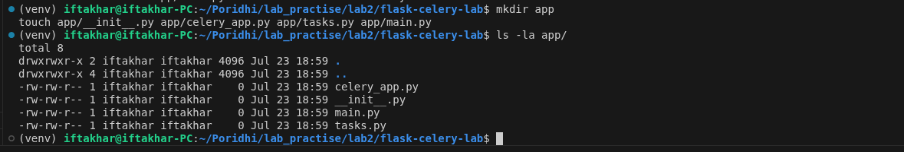
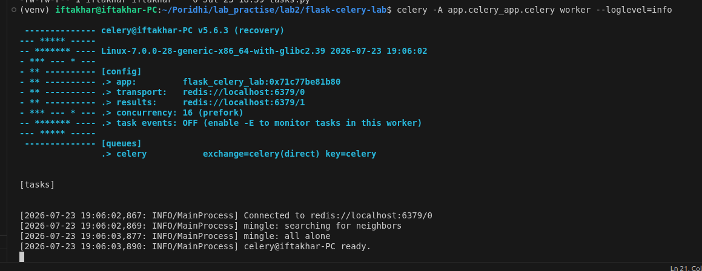
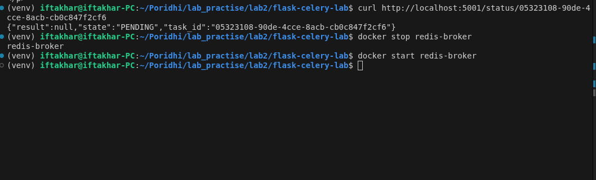
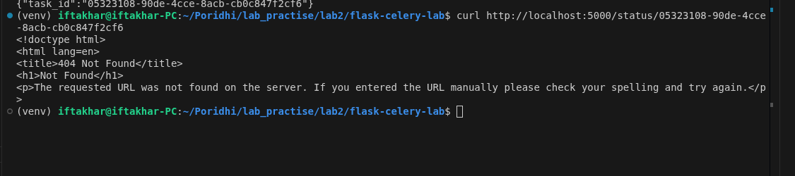

# Lab 6: Building a Flask API with Celery and Redis

**Module 52 | Asynchronous Processing with Celery**

## Introduction

Web applications often need to perform work that takes longer than a typical HTTP request should wait for, such as sending an email, generating a PDF report, or processing an uploaded file. Running this work directly inside a request handler blocks the client and wastes server resources during the wait.

This lab is intended for students who have completed Lab 5 and understand the conceptual architecture of Celery, including the roles of the broker, the worker, and the result backend. This lab moves from theory to implementation by connecting a Flask API to Celery, using Redis as both the broker and the result backend.

By working through this lab, you gain the ability to offload long-running work from an API request and track its progress asynchronously — a pattern used in production systems that need to remain responsive under load.

<p align="center">
  
</p>

## Learning Objectives

By the end of this lab you will be able to:

- Configure a Flask API to submit background tasks instead of executing them inline
- Install and configure `celery[redis]` in a Python project
- Connect Celery to Redis as both the message broker and the result backend
- Implement Celery tasks for operations such as sending an email and generating a PDF
- Verify asynchronous task execution using task IDs and status polling

### Prerequisites

- Lab 5 completed (Celery architecture: broker, worker, result backend)
- Working knowledge of Flask routes and request handling
- Python 3.10 or later installed
- Docker installed and running
- Basic familiarity with the command line

## Prologue

You join the backend team of a document processing platform. The current API generates invoice PDFs directly inside the request handler. During peak hours, PDF generation takes several seconds, and clients experience timeouts.

The engineering lead assigns you the task of moving this work into a background task queue. The goal is an API that accepts a request, immediately returns a task ID, and processes the actual work separately. The client should be able to check the task status using the returned ID.

The system consists of three components: a Flask API that accepts requests and queues tasks, a Redis instance that stores pending tasks and results, and a Celery worker that executes the tasks.

## Environment Setup

Update the system package index.

```bash
sudo apt update
```

Create a project directory and a virtual environment.

```bash
mkdir flask-celery-lab
cd flask-celery-lab
python3 -m venv venv
```

Activate the virtual environment.

```bash
source venv/bin/activate
```

Install the required packages.

```bash
pip install flask celery[redis]
```

Start a Redis instance using Docker.

```bash
docker run -d --name redis-broker -p 6379:6379 redis:7-alpine
```

Confirm Redis is reachable:

```bash
redis-cli ping
# → PONG
```

Create the project structure.

```bash
mkdir app
touch app/__init__.py app/celery_app.py app/tasks.py app/main.py
```

<p align="center">
  
</p>

**Prediction question:** Redis stores data in memory. If the Redis container is stopped while a task is still `PENDING`, what happens to that task once the container is restarted?

<details>
<summary>Reveal answer</summary>
By default, the Redis image used here persists no data to disk, so anything queued while the container was down is lost once it restarts. In a production setup, Redis persistence (RDB or AOF) or a managed Redis service would be used to avoid losing queued work.
</details>

---

## Chapter 1: Connecting Celery to Redis

### Opening Context

Celery does not process tasks by itself. It requires a message broker to hold pending tasks and, when results are needed, a result backend to store task outcomes. This chapter configures Redis to serve both roles.

<p align="center">
  
</p>

### What You Will Build

A `celery_app.py` module that creates a Celery application instance configured to use Redis as both the broker and the backend. This instance is imported by both the Flask API and the worker process.

### Think First

**Question:** Redis can serve as both the broker and the backend at the same time. What is the difference between what Redis stores in each role?

<details>
<summary>Reveal answer</summary>
As a broker, Redis stores a queue of pending task messages waiting to be picked up by a worker, structured as a first-in-first-out list. As a backend, Redis stores the result of a completed task, indexed by task ID, so that a client can retrieve it later. The same Redis instance can perform both roles using different key namespaces, but in production these are often separated into different Redis databases or instances to isolate load.
</details>

### Implementation

```python
# app/celery_app.py
from celery import Celery

celery = Celery(
    "flask_celery_lab",
    broker="redis://localhost:6379/0",
    backend="redis://localhost:6379/1",
)
```

### Understanding the Code

The `Celery` constructor takes a name that identifies the application, typically matching the module name. The `broker` argument tells Celery where to publish and consume task messages. The `backend` argument tells Celery where to store task state and return values. Database `0` on the Redis instance is used for the broker, and database `1` is used for the backend — this keeps the two roles logically separated even though they share the same Redis server.

**Concept question:** If the `backend` argument is omitted, what capability is lost?

<details>
<summary>Reveal answer</summary>
Without a backend, Celery can still queue and execute tasks, but the result and state of a task cannot be retrieved afterward. Calling `.get()` or checking `.status` on a task result raises an error, since there is nowhere to look up that information.
</details>

## Chapter 2: Defining Background Tasks

### Opening Context

A Celery task is a regular Python function decorated so that Celery can route calls to it through the broker instead of executing them in the caller's process.

### What You Will Build

Two Celery tasks: one that simulates sending an email, and one that simulates generating a PDF report. Both tasks include an artificial delay to represent real processing time.

### Think First

**Question:** A task function uses `time.sleep(5)` to simulate slow work. If this function is called directly as `send_email("user@example.com")` instead of `send_email.delay("user@example.com")`, what happens to the Flask request that called it?

<details>
<summary>Reveal answer</summary>
The Flask request thread blocks for the full 5 seconds, since the function executes synchronously inside the request handler. The client waiting on that request also waits 5 seconds. Calling `.delay()` instead hands the task to Celery, and the request handler returns immediately with a task ID.
</details>

### Implementation

```python
# app/tasks.py
import time
from app.celery_app import celery

@celery.task
def send_email(recipient):
    time.sleep(5)  # simulate slow email delivery
    return f"Email sent to {recipient}"

@celery.task
def generate_pdf(document_id):
    time.sleep(8)  # simulate slow PDF rendering
    return f"PDF generated for document {document_id}"
```

### Understanding the Code

The `@celery.task` decorator registers a function with the Celery application so it can be invoked asynchronously. Once registered, the function gains methods such as `.delay()` and `.apply_async()`, which submit the function call as a message to the broker instead of executing it immediately in the current process.

## Chapter 3: Submitting Tasks from Flask

### Opening Context

The Flask API is responsible for accepting client requests and submitting tasks to Celery. It does not execute the task logic itself.

<p align="center">
  
</p>

### What You Will Build

A Flask application with two routes: one that queues an email task, and one that checks the status of a previously submitted task.

### Think First

**Question:** After calling `send_email.delay(recipient)`, the Flask route immediately has access to a task ID. At that moment, has the email actually been sent?

<details>
<summary>Reveal answer</summary>
No. The task has only been placed on the Redis queue. The email is sent only when a Celery worker process picks up the message and executes the function. Without a running worker, the task remains in the `PENDING` state indefinitely.
</details>

### Implementation

```python
# app/main.py
from flask import Flask, jsonify, request
from app.tasks import send_email
from app.celery_app import celery

app = Flask(__name__)

@app.route("/send-email", methods=["POST"])
def trigger_email():
    recipient = request.json.get("recipient")
    task = send_email.delay(recipient)
    return jsonify({"task_id": task.id}), 202

@app.route("/status/<task_id>", methods=["GET"])
def check_status(task_id):
    result = celery.AsyncResult(task_id)
    return jsonify({
        "task_id": task_id,
        "state": result.state,
        "result": result.result if result.ready() else None
    })
```

### Understanding the Code

The `202 Accepted` status code is used instead of `200 OK` because the request has been accepted for processing, but the work is not yet complete. `celery.AsyncResult(task_id)` reconstructs a result handle from a task ID, allowing state to be queried from any process, not only the one that submitted the task, because state is stored in the shared Redis backend.

**Matching exercise:** Match each Celery task state to its meaning.

| State | Meaning |
|---|---|
| PENDING | ? |
| STARTED | ? |
| SUCCESS | ? |
| FAILURE | ? |

<details>
<summary>Reveal answers</summary>

| State | Meaning |
|---|---|
| PENDING | Task has been queued but has not yet been picked up by a worker |
| STARTED | A worker has begun executing the task |
| SUCCESS | The task completed and the return value is available |
| FAILURE | The task raised an exception during execution |

</details>

## Test and Verify

Start the Celery worker in one terminal.

```bash
celery -A app.celery_app.celery worker --loglevel=info
```

Expected output on successful startup:

```
-------------- celery@your-hostname v5.6.3 (recovery)
--- ***** -----
-- ******* ---- Linux ...
- *** --- * --- [config]
- ** ---------- .> app:         flask_celery_lab:0x...
- ** ---------- .> transport:   redis://localhost:6379/0
- ** ---------- .> results:     redis://localhost:6379/1
- *** --- * --- .> concurrency: 16 (prefork)
[INFO/MainProcess] Connected to redis://localhost:6379/0
[INFO/MainProcess] celery@your-hostname ready.
```

<p align="center">
  
</p>

**Prediction question:** Before starting the Flask server, predict what happens if a request is sent to `/send-email` while the worker above is not running.

<details>
<summary>Reveal answer</summary>
The Flask route still returns a `202` response with a task ID, since queuing a task only requires the broker, not the worker. The task remains in the `PENDING` state in Redis until a worker becomes available to process it.
</details>

Start the Flask application in a second terminal. This lab runs Flask on port **5001**:

```bash
python -m flask --app app.main run --host 0.0.0.0 --port 5001
```

Submit a task from a third terminal:

```bash
curl -X POST http://localhost:5001/send-email \
  -H "Content-Type: application/json" \
  -d '{"recipient": "user@example.com"}'
```

Actual output:

```json
{"task_id":"05323108-90de-4cce-8acb-cb0c847f2cf6"}
```

Status code: `202`

<p align="center">
  
</p>

Check the task status using the returned ID:

```bash
curl http://localhost:5001/status/05323108-90de-4cce-8acb-cb0c847f2cf6
```

Immediately after submission:

```json
{"task_id":"05323108-90de-4cce-8acb-cb0c847f2cf6","state":"PENDING","result":null}
```

After the 5-second simulated delay completes, re-running the same command returns:

```json
{"task_id":"05323108-90de-4cce-8acb-cb0c847f2cf6","state":"SUCCESS","result":"Email sent to user@example.com"}
```

## Checkpoint

Verify the following before moving on.

- [x] Redis is running and accessible on port 6379
- [x] Celery worker starts without connection errors, connects to `redis://localhost:6379/0`
- [x] `/send-email` returns a task ID with status `202`
- [x] `/status/<task_id>` reflects state transitions from `PENDING` to `SUCCESS`
- [x] The Flask process remains responsive while a task is still executing

## Experiment

Stop the Redis container while the Flask server and Celery worker are still running.

```bash
docker stop redis-broker
```

Submit a new task using the `/send-email` endpoint and observe the result.

**Question:** Does the Flask route return an error immediately, or does it hang?

Restore Redis and confirm your observation.

```bash
docker start redis-broker
```

<p align="center">
  
</p>

## Epilogue

This lab connected a Flask API to Celery using Redis as both the broker and the result backend, and implemented tasks that execute independently of the request-response cycle. The API now returns immediately while work continues in the background, and clients can poll for status using a task ID.

This lab did not address what happens when a task fails partway through, how to retry failed tasks automatically, or how to enforce timeouts on tasks that run too long. These concerns are addressed in Lab 7.

## Next Steps

Lab 7 extends this setup with task retries, timeouts, and structured error handling, along with a dedicated endpoint for tracking task state transitions in more detail.

## Additional Resources

- Celery official documentation: First Steps with Celery
- Redis documentation: Data Types
- Flask documentation: Handling JSON requests