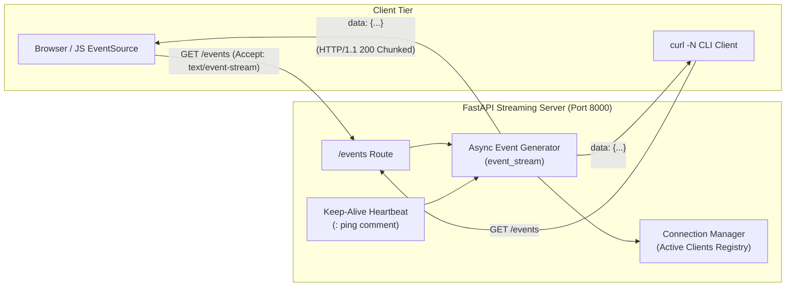

# Lab 56: SSE Server Implementation

In this lab, you will implement a high-performance, asynchronous Server-Sent Events (SSE) streaming server using **FastAPI** and **Uvicorn** inside your Poridhi environment. You will explore the theoretical foundation of SSE versus WebSockets, learn how the HTTP streaming protocol operates, configure critical response headers (`Content-Type: text/event-stream`, `Cache-Control`, `Connection`, `X-Accel-Buffering`), handle client disconnections gracefully, and build an interactive browser client to verify real-time event streaming.



---

## Theory: SSE vs WebSocket: Use Cases and Trade-offs

Real-time web applications require servers to push updates to connected clients without client polling. The two primary standards for real-time web communication are **Server-Sent Events (SSE)** and **WebSockets**.

### Comparison: Server-Sent Events vs WebSockets

| Dimension | Server-Sent Events (SSE) | WebSockets |
| :--- | :--- | :--- |
| **Communication Direction** | **Unidirectional** (Server to Client only) | **Full-Duplex / Bidirectional** (Client to Server & Server to Client) |
| **Underlying Protocol** | Standard **HTTP/1.1** or **HTTP/2** | **WebSocket Protocol (`ws://`, `wss://`)** upgraded from HTTP |
| **Data Format** | UTF-8 Text stream (structured plain text or JSON) | Binary (ArrayBuffer, Blob) and UTF-8 Text |
| **Reconnection Handling** | **Built-in native auto-reconnect** with `retry:` interval and `Last-Event-ID` tracking | Manual implementation required in application code |
| **Proxy / Firewall Traversal** | Seamless over standard HTTP ports (80/443); works with standard ALBs, CDNs, and reverse proxies | Requires explicit proxy upgrade support (`Upgrade: websocket`) and stateful gateway support |
| **Connection Limits** | HTTP/1.1: 6 concurrent connections per domain in browsers. HTTP/2: 100+ multiplexed streams over a single TCP connection | 1 dedicated TCP socket per WebSocket connection |
| **Implementation Complexity** | Simple: uses standard HTTP endpoints and browser `EventSource` API | Moderate to High: requires stateful protocol management and custom framing |

### When to Choose SSE Over WebSocket:
1. **Status Feeds and Dashboards:** Stock tickers, cryptocurrency prices, live telemetry, and sports scores.
2. **AI / LLM Token Streaming:** Real-time token-by-token output from Large Language Models (such as OpenAI or Google Gemini streaming APIs).
3. **Notification Systems:** System alerts, workflow step updates, background job progress bars.
4. **Log Streaming:** Real-time server or container log viewers.

### The SSE Wire Protocol

Server-Sent Events use a simple text-based format over an open HTTP response. Each message is terminated by a **double newline** (`\n\n`). A message can contain the following fields:

```text
id: 101\n
event: metric_update\n
retry: 5000\n
data: {"cpu": 42.5, "memory": 68.1}\n\n
```

- **`data:`** The payload of the event. Multiple consecutive `data:` lines are joined with a single newline by the client parser.
- **`event:`** An optional custom event type string. In the browser, this triggers `addEventListener('<event_name>', ...)` instead of `onmessage`.
- **`id:`** An event identifier. If the client disconnects, it sends this value in the `Last-Event-ID` request header upon reconnecting.
- **`retry:`** Reconnection time in milliseconds the browser must wait before retrying after a disconnection.
- **`: comment`** Any line starting with a colon is a comment. Used primarily as **heartbeat/ping** packets (`: ping\n\n`) to prevent intermediate NAT gateways and proxies from closing idle TCP sockets.

### Essential HTTP Response Headers for SSE

| Header | Value | Purpose |
| :--- | :--- | :--- |
| `Content-Type` | `text/event-stream` | Informs browser/proxy that the response is an infinite event stream. |
| `Cache-Control` | `no-cache, no-transform` | Prevents intermediate caches or browser from caching streamed data. |
| `Connection` | `keep-alive` | Keeps the underlying TCP socket open for continuous streaming. |
| `X-Accel-Buffering` | `no` | Instructs Nginx and reverse proxies to disable response buffering and flush chunks immediately to the client. |

---

## Objectives

- Initialize a Python virtual environment and install FastAPI and Uvicorn.
- Build an asynchronous event generator emitting structured SSE data and keep-alive heartbeats.
- Expose an `/events` SSE endpoint using FastAPI's `StreamingResponse` with appropriate streaming headers.
- Implement client connection lifecycle tracking and handle graceful disconnection without dangling coroutines.
- Build a responsive HTML5 dashboard utilizing the browser's native `EventSource` API.
- Test and verify the stream using `curl -N` (unbuffered) and observe event parsing in real-time.

---

## Project Structure

```text
sse-server-lab/
├── app/
│   ├── __init__.py
│   ├── main.py
│   └── static/
│       └── index.html
├── requirements.txt
└── run.sh
```

---

## Step 1: Create Lab Directory and Virtual Environment

Create a dedicated directory for your project and initialize a Python 3 virtual environment:

```bash
mkdir -p ~/sse-server-lab/app/static
cd ~/sse-server-lab
python3 -m venv venv
source venv/bin/activate
```

---

## Step 2: Define Dependencies and Install

Create `requirements.txt` specifying `fastapi` and `uvicorn`:

```bash
cat << 'EOF' > requirements.txt
fastapi>=0.110.0
uvicorn[standard]>=0.28.0
httpx>=0.27.0
EOF

pip install --upgrade pip
pip install -r requirements.txt
```

---

## Step 3: Implement the FastAPI SSE Server

Create `app/main.py`. This implementation includes:
1. An asynchronous generator that formats messages adhering to the SSE standard.
2. Interleaved heartbeat comments (`: keep-alive\n\n`) sent every 15 seconds to keep intermediate connections alive.
3. Client disconnection detection via `request.is_disconnected()` to ensure server resources are freed immediately.
4. Active connection count tracking.

```bash
cat << 'EOF' > app/main.py
import asyncio
import json
import random
import time
from typing import AsyncGenerator
from fastapi import FastAPI, Request
from fastapi.middleware.cors import CORSMiddleware
from fastapi.responses import HTMLResponse, StreamingResponse
from fastapi.staticfiles import StaticFiles

app = FastAPI(title="Scalable SSE Server", version="1.0.0")

# Enable CORS for cross-origin event consumption
app.add_middleware(
    CORSMiddleware,
    allow_origins=["*"],
    allow_credentials=True,
    allow_methods=["*"],
    allow_headers=["*"],
)

# Mount static files directory for frontend client
app.mount("/static", StaticFiles(directory="app/static"), name="static")

# Connection tracking
active_connections: int = 0


async def event_generator(request: Request) -> AsyncGenerator[str, None]:
    """Generates continuous SSE events with keep-alives and payload data."""
    global active_connections
    active_connections += 1
    event_id = 0
    print(f"[SSE] Client connected. Total active connections: {active_connections}")

    try:
        # Initial reconnection directive: instruct client to retry after 3 seconds on disconnect
        yield "retry: 3000\n\n"

        while True:
            # Check if the client closed the connection
            if await request.is_disconnected():
                print(f"[SSE] Client disconnected (detected before payload send).")
                break

            event_id += 1
            current_timestamp = time.strftime("%Y-%m-%d %H:%M:%S")

            # Payload: Simulated server metrics and telemetry
            payload = {
                "event_id": event_id,
                "timestamp": current_timestamp,
                "metrics": {
                    "cpu_percent": round(random.uniform(15.0, 75.0), 1),
                    "memory_percent": round(random.uniform(40.0, 85.0), 1),
                    "active_subscribers": active_connections,
                },
                "status": "HEALTHY",
            }

            # Format compliant with SSE wire specification
            # data: <json>\n\n
            sse_message = (
                f"id: {event_id}\n"
                f"event: server_telemetry\n"
                f"data: {json.dumps(payload)}\n\n"
            )
            yield sse_message

            # Sleep for 2 seconds between events
            await asyncio.sleep(2.0)

            # Emit a keep-alive comment every alternate cycle
            if event_id % 3 == 0:
                yield ": keep-alive heartbeat\n\n"

    except asyncio.CancelledError:
        print(f"[SSE] Task cancelled for client (stream aborted).")
    finally:
        active_connections -= 1
        print(f"[SSE] Connection closed. Remaining active connections: {active_connections}")


@app.get("/events")
async def sse_endpoint(request: Request):
    """
    SSE endpoint providing text/event-stream response with strict unbuffered headers.
    """
    return StreamingResponse(
        event_generator(request),
        media_type="text/event-stream",
        headers={
            "Content-Type": "text/event-stream; charset=utf-8",
            "Cache-Control": "no-cache, no-transform",
            "Connection": "keep-alive",
            "X-Accel-Buffering": "no",  # Critical for Nginx / reverse proxy unbuffered delivery
            "Access-Control-Allow-Origin": "*",
        },
    )


@app.get("/health")
async def health_check():
    """Health check endpoint for load balancers."""
    return {
        "status": "healthy",
        "active_sse_connections": active_connections,
        "timestamp": time.time(),
    }


@app.get("/", response_class=HTMLResponse)
async def serve_index():
    """Serves the test frontend client."""
    with open("app/static/index.html", "r") as f:
        return HTMLResponse(content=f.read())
EOF
```

---

## Step 4: Create the Frontend Browser Client

Create `app/static/index.html` to provide a live UI that subscribes to `/events` using the browser's native `EventSource` API:

```bash
cat << 'EOF' > app/static/index.html
<!DOCTYPE html>
<html lang="en">
<head>
    <meta charset="UTF-8">
    <meta name="viewport" content="width=device-width, initial-scale=1.0">
    <title>Poridhi Lab - SSE Real-Time Stream</title>
    <style>
        * { box-sizing: border-box; margin: 0; padding: 0; }
        body { font-family: -apple-system, BlinkMacSystemFont, "Segoe UI", Roboto, sans-serif; background: #0f172a; color: #f8fafc; padding: 2rem; }
        .container { max-width: 900px; margin: 0 auto; }
        header { display: flex; justify-content: space-between; align-items: center; border-bottom: 1px solid #334155; padding-bottom: 1rem; margin-bottom: 2rem; }
        h1 { font-size: 1.5rem; font-weight: 600; color: #38bdf8; }
        .badge { padding: 0.25rem 0.75rem; border-radius: 9999px; font-size: 0.85rem; font-weight: 600; }
        .badge-connected { background: #065f46; color: #34d399; }
        .badge-disconnected { background: #7f1d1d; color: #f87171; }
        .cards { display: grid; grid-template-columns: repeat(auto-fit, minmax(200px, 1fr)); gap: 1.5rem; margin-bottom: 2rem; }
        .card { background: #1e293b; border: 1px solid #334155; border-radius: 0.75rem; padding: 1.5rem; }
        .card-title { font-size: 0.85rem; text-transform: uppercase; letter-spacing: 0.05em; color: #94a3b8; margin-bottom: 0.5rem; }
        .card-value { font-size: 2rem; font-weight: 700; color: #f8fafc; }
        .log-container { background: #020617; border: 1px solid #1e293b; border-radius: 0.75rem; padding: 1rem; font-family: ui-monospace, SFMono-Regular, Menlo, monospace; font-size: 0.85rem; max-height: 350px; overflow-y: auto; }
        .log-entry { margin-bottom: 0.5rem; padding-bottom: 0.5rem; border-bottom: 1px solid #1e293b; }
        .log-time { color: #64748b; }
        .log-id { color: #eab308; }
        .controls { display: flex; gap: 1rem; margin-bottom: 1.5rem; }
        button { background: #2563eb; color: white; border: none; padding: 0.6rem 1.2rem; border-radius: 0.5rem; font-weight: 600; cursor: pointer; transition: background 0.2s; }
        button:hover { background: #1d4ed8; }
        button.btn-disconnect { background: #dc2626; }
        button.btn-disconnect:hover { background: #b91c1c; }
    </style>
</head>
<body>
    <div class="container">
        <header>
            <div>
                <h1>Server-Sent Events (SSE) Live Feed</h1>
                <p style="color: #94a3b8; font-size: 0.9rem;">Lab 56: High-Performance FastAPI Streaming Architecture</p>
            </div>
            <span id="connectionBadge" class="badge badge-disconnected">Connecting...</span>
        </header>

        <div class="controls">
            <button id="connectBtn" onclick="connectSSE()">Reconnect</button>
            <button class="btn-disconnect" onclick="disconnectSSE()">Disconnect</button>
        </div>

        <div class="cards">
            <div class="card">
                <div class="card-title">CPU Utilization</div>
                <div id="cpuVal" class="card-value">-- %</div>
            </div>
            <div class="card">
                <div class="card-title">Memory Utilization</div>
                <div id="memVal" class="card-value">-- %</div>
            </div>
            <div class="card">
                <div class="card-title">Active Subscribers</div>
                <div id="subsVal" class="card-value">--</div>
            </div>
        </div>

        <h2 style="font-size: 1.1rem; margin-bottom: 0.75rem; color: #cbd5e1;">Live Event Stream (Raw Frames)</h2>
        <div id="log" class="log-container"></div>
    </div>

    <script>
        let eventSource = null;
        const badge = document.getElementById("connectionBadge");
        const log = document.getElementById("log");

        function logMessage(text, id = "") {
            const entry = document.createElement("div");
            entry.className = "log-entry";
            const now = new Date().toLocaleTimeString();
            entry.innerHTML = `<span class="log-time">[${now}]</span> <span class="log-id">[ID: ${id || '-'}]</span> ${text}`;
            log.prepend(entry);
        }

        function connectSSE() {
            if (eventSource) {
                eventSource.close();
            }

            badge.className = "badge badge-disconnected";
            badge.innerText = "Connecting...";

            eventSource = new EventSource("/events");

            eventSource.onopen = function () {
                badge.className = "badge badge-connected";
                badge.innerText = "CONNECTED (Streaming)";
                logMessage("EventSource connection established.");
            };

            // Custom event listener for 'server_telemetry'
            eventSource.addEventListener("server_telemetry", function (e) {
                try {
                    const data = JSON.parse(e.data);
                    document.getElementById("cpuVal").innerText = `${data.metrics.cpu_percent}%`;
                    document.getElementById("memVal").innerText = `${data.metrics.memory_percent}%`;
                    document.getElementById("subsVal").innerText = data.metrics.active_subscribers;
                    logMessage(`Received payload: CPU ${data.metrics.cpu_percent}%, Mem ${data.metrics.memory_percent}%`, e.lastEventId);
                } catch (err) {
                    logMessage(`Raw data received: ${e.data}`, e.lastEventId);
                }
            });

            eventSource.onerror = function (err) {
                badge.className = "badge badge-disconnected";
                badge.innerText = "RECONNECTING...";
                logMessage("Connection dropped or interrupted. Automatic retry scheduled by browser.");
            };
        }

        function disconnectSSE() {
            if (eventSource) {
                eventSource.close();
                eventSource = null;
                badge.className = "badge badge-disconnected";
                badge.innerText = "DISCONNECTED";
                logMessage("Connection manually closed by user.");
            }
        }

        // Start connection automatically
        window.addEventListener("DOMContentLoaded", connectSSE);
    </script>
</body>
</html>
EOF
```

---

## Step 5: Start the FastAPI Server

Launch the Uvicorn application server on port `8000`:

```bash
uvicorn app.main:app --host 0.0.0.0 --port 8000 --workers 1
```

Expected Startup Output:

```text
INFO:     Started server process [12842]
INFO:     Waiting for application startup.
INFO:     Application startup complete.
INFO:     Uvicorn running on http://0.0.0.0:8000 (Press CTRL+C to quit)
```

---

## Step 6: Verify SSE Streaming with `curl`

Open a second terminal session and test the SSE stream using `curl`:

> [!IMPORTANT]
> Always pass the `-N` (or `--no-buffer`) flag to `curl` when testing streaming endpoints. Without `-N`, `curl` may buffer streamed data until the socket closes or its internal 4KB buffer fills up.

```bash
curl -N -i http://localhost:8000/events
```

Expected Output:

```text
HTTP/1.1 200 OK
content-type: text/event-stream; charset=utf-8
cache-control: no-cache, no-transform
connection: keep-alive
x-accel-buffering: no
access-control-allow-origin: *
transfer-encoding: chunked

retry: 3000

id: 1
event: server_telemetry
data: {"event_id": 1, "timestamp": "2026-09-21 12:00:00", "metrics": {"cpu_percent": 34.2, "memory_percent": 62.8, "active_subscribers": 1}, "status": "HEALTHY"}

id: 2
event: server_telemetry
data: {"event_id": 2, "timestamp": "2026-09-21 12:00:02", "metrics": {"cpu_percent": 41.5, "memory_percent": 63.1, "active_subscribers": 1}, "status": "HEALTHY"}

: keep-alive heartbeat

id: 3
event: server_telemetry
data: {"event_id": 3, "timestamp": "2026-09-21 12:00:04", "metrics": {"cpu_percent": 28.0, "memory_percent": 61.9, "active_subscribers": 1}, "status": "HEALTHY"}
```

Terminate the curl process with `Ctrl+C`. In the server terminal, observe the immediate cleanup log:

```text
[SSE] Client disconnected (detected before payload send).
[SSE] Connection closed. Remaining active connections: 0
```

---

## Step 7: Verify via Poridhi Load Balancer / Web Browser

If working in the Poridhi cloud environment:
1. Identify the public URL or load balancer port mapping for port `8000`.
2. Open `http://<YOUR_PORIDHI_HOST>:8000/` in your web browser.
3. Observe the green **CONNECTED** status badge, real-time metric cards updating every 2 seconds, and raw frames streaming into the console log.
4. Click **Disconnect** and notice how the active subscriber count on the server decrements immediately. Click **Reconnect** to observe automatic session recovery.

---

## Conclusion

In this lab, you built an asynchronous Server-Sent Events (SSE) server using FastAPI. You configured the necessary response headers (`Content-Type: text/event-stream`, `Cache-Control: no-cache`, `X-Accel-Buffering: no`), implemented periodic keep-alive heartbeats to keep sockets alive across intermediate gateways, and verified real-time event streaming from both the command line (`curl -N`) and a web browser client. In the next lab, you will place this streaming service behind an **Application Load Balancer (ALB)** and tune idle timeouts for persistent connections.
