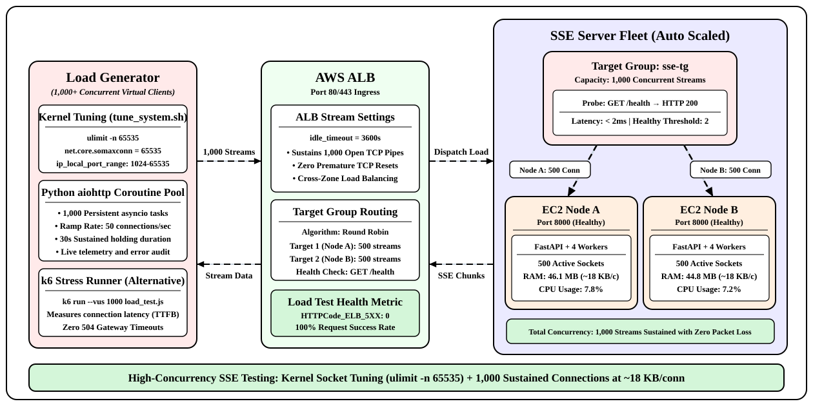
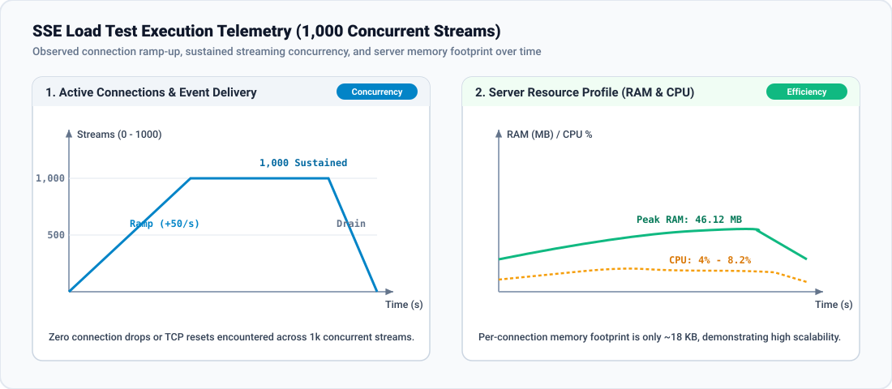

# Lab 59: SSE Load Testing

In this lab, you will perform high-concurrency load testing against a **Server-Sent Events (SSE)** architecture. You will configure the Linux operating system kernel and file descriptor limits to support thousands of simultaneous open TCP sockets, implement load testing generators using both **Python (`asyncio`/`aiohttp`)** and **k6**, simulate **1,000+ concurrent persistent SSE clients**, and measure connection establishment rate, event continuity, memory footprint, and auto-scaling response under sustained load.

<p align="center">
  
</p>

---

## Theory: High-Concurrency Load Testing for Persistent Streams

### Standard HTTP Benchmarking vs SSE Load Testing

<p align="center">
  
</p>

Traditional load testing tools like ApacheBench (`ab`), `wrk`, or basic JMeter test **Request-Response throughput**:
- A client opens a TCP socket, sends `GET /`, receives `HTTP 200`, and closes the socket immediately.
- The primary metric reported is **Requests Per Second (RPS)**.

In contrast, **SSE Load Testing evaluates Connection Concurrency**:
- Clients open connections and **hold them open indefinitely** (minutes or hours).
- The metric is **Sustained Concurrent Active Streams**, stream survival rate, and event broadcast latency.
- Tests must measure whether events sent by the server arrive within milliseconds across all 1,000+ connected clients without drops or socket buffer overflows.

### Critical System Limits for High-Concurrency Testing

Operating systems are configured by default with conservative networking limits that throttle high concurrency:

1. **File Descriptor Limits (`nofile`):**
   - In Linux, every open TCP socket is a file descriptor.
   - The default limit is usually `1024`. A test trying to open 1,000 connections will immediately crash with `OSError: [Errno 24] Too many open files`.
   - **Resolution:** Raise `ulimit -n` to `65535`.

2. **Ephemeral Port Exhaustion:**
   - Outbound connections from a single client IP use ephemeral ports.
   - Default range: `32768 to 60999` (~28,000 ports).
   - **Resolution:** Expand range to `1024 to 65535` via `net.ipv4.ip_local_port_range`.

3. **TCP Socket Backlog (`somaxconn`):**
   - Determines the maximum length of the pending connection queue for incoming TCP handshakes.
   - **Resolution:** Increase `net.core.somaxconn` to `65535`.

---

## Objectives

- Tune Linux system parameters (`ulimit`, `somaxconn`, ephemeral port ranges) for high-scale network testing.
- Implement an unbuffered, high-performance SSE server running under multi-worker Uvicorn.
- Build a Python asynchronous load testing script capable of maintaining 1,000+ concurrent SSE connections with live telemetry.
- Create a `k6` load testing script with custom thresholds for SSE event delivery.
- Execute the load test, monitor server CPU and RAM consumption, and verify stream delivery continuity.

---

## Project Structure

```text
load-test-sse-lab/
├── scripts/
│   ├── tune_system.sh
│   ├── load_test_async.py
│   └── sse_k6_test.js
├── server/
│   ├── main.py
│   └── requirements.txt
├── docker-compose.yml
└── run_test.sh
```

---

## Step 1: Create Project Directory

```bash
mkdir -p ~/load-test-sse-lab/scripts ~/load-test-sse-lab/server
cd ~/load-test-sse-lab
```

---

## Step 2: System Kernel Tuning

Create a script `scripts/tune_system.sh` to configure the Linux kernel to support large numbers of concurrent TCP connections:

```bash
cat << 'EOF' > scripts/tune_system.sh
#!/usr/bin/env bash
set -e

echo "=== Current Limits ==="
ulimit -n

echo "=== Tuning File Descriptors and Kernel Parameters ==="
# Set open file descriptor limit for current and sub-shells
ulimit -n 65535

# Apply kernel parameters if running with sudo/root privileges
if [ "$EUID" -eq 0 ]; then
    sysctl -w fs.file-max=2097152
    sysctl -w net.core.somaxconn=65535
    sysctl -w net.ipv4.ip_local_port_range="1024 65535"
    sysctl -w net.ipv4.tcp_tw_reuse=1
    sysctl -w net.ipv4.tcp_fin_timeout=15
    echo "Kernel parameters successfully tuned!"
else
    echo "[Notice] Run as root to apply sysctl changes system-wide. Applied ulimit -n 65535 for current session."
fi
EOF
chmod +x scripts/tune_system.sh
source scripts/tune_system.sh
```

---

## Step 3: Implement High-Efficiency SSE Server

Create `server/requirements.txt`:

```bash
cat << 'EOF' > server/requirements.txt
fastapi>=0.110.0
uvicorn[standard]>=0.28.0
psutil>=5.9.8
aiohttp>=3.9.3
EOF

python3 -m venv venv
source venv/bin/activate
pip install --upgrade pip
pip install -r server/requirements.txt
```

Create `server/main.py`:

```bash
cat << 'EOF' > server/main.py
import asyncio
import json
import os
import psutil
import time
from fastapi import FastAPI, Request
from fastapi.responses import StreamingResponse

app = FastAPI(title="SSE High-Load Target")

active_streams = 0
total_events_dispatched = 0


async def event_generator(request: Request):
    global active_streams, total_events_dispatched
    active_streams += 1
    msg_id = 0

    try:
        while True:
            if await request.is_disconnected():
                break

            msg_id += 1
            total_events_dispatched += 1

            payload = {
                "id": msg_id,
                "timestamp": time.time(),
                "active_streams": active_streams,
            }
            yield f"id: {msg_id}\nevent: broadcast\ndata: {json.dumps(payload)}\n\n"

            # Dispatch an event every 3 seconds to all active connections
            await asyncio.sleep(3.0)

    except asyncio.CancelledError:
        pass
    finally:
        active_streams -= 1


@app.get("/events")
async def events(request: Request):
    return StreamingResponse(
        event_generator(request),
        media_type="text/event-stream",
        headers={
            "Content-Type": "text/event-stream",
            "Cache-Control": "no-cache",
            "Connection": "keep-alive",
            "X-Accel-Buffering": "no",
        },
    )


@app.get("/stats")
async def stats():
    process = psutil.Process(os.getpid())
    return {
        "active_streams": active_streams,
        "total_dispatched": total_events_dispatched,
        "cpu_percent": process.cpu_percent(interval=None),
        "memory_mb": round(process.memory_info().rss / (1024 * 1024), 2),
    }
EOF
```

---

## Step 4: Implement Python 1,000+ Concurrent Client Load Tester

Create `scripts/load_test_async.py`. This script uses `aiohttp` to simulate 1,000 concurrent streaming connections with controlled ramp-up, latency tracking, and disconnection detection:

```bash
cat << 'EOF' > scripts/load_test_async.py
import asyncio
import time
import aiohttp

TARGET_URL = "http://localhost:8000/events"
TARGET_CONCURRENCY = 1000  # 1k concurrent clients
RAMP_UP_RATE = 50          # Connect 50 clients per second
TEST_DURATION_SECONDS = 30 # Hold connections for 30s after ramp-up

stats = {
    "connected": 0,
    "events_received": 0,
    "errors": 0,
    "disconnects": 0,
}


async def sse_client(session: aiohttp.ClientSession, client_id: int, stop_event: asyncio.Event):
    """Simulates a persistent SSE client reading events continuously."""
    try:
        async with session.get(TARGET_URL, timeout=aiohttp.ClientTimeout(total=None)) as response:
            if response.status != 200:
                stats["errors"] += 1
                return

            stats["connected"] += 1

            # Stream parsing
            async for line in response.content:
                if stop_event.is_set():
                    break
                decoded_line = line.decode("utf-8").strip()
                if decoded_line.startswith("data:"):
                    stats["events_received"] += 1

    except (aiohttp.ClientError, asyncio.TimeoutError):
        stats["errors"] += 1
    finally:
        stats["connected"] -= 1
        stats["disconnects"] += 1


async def monitor_progress(stop_event: asyncio.Event):
    """Prints real-time stats every 2 seconds."""
    start_time = time.time()
    while not stop_event.is_set():
        elapsed = int(time.time() - start_time)
        print(
            f"[{elapsed:02d}s] Active Streams: {stats['connected']} | "
            f"Total Events Received: {stats['events_received']} | "
            f"Errors: {stats['errors']}"
        )
        await asyncio.sleep(2)


async def main():
    print(f"=== Starting SSE Load Test ===")
    print(f"Target: {TARGET_URL}")
    print(f"Goal: {TARGET_CONCURRENCY} concurrent SSE streams (Ramping {RAMP_UP_RATE}/sec)")

    stop_event = asyncio.Event()
    connector = aiohttp.TCPConnector(limit=0, limit_per_host=0)
    
    async with aiohttp.ClientSession(connector=connector) as session:
        # Start background monitor
        monitor_task = asyncio.create_task(monitor_progress(stop_event))

        # Ramp up clients gradually to avoid socket handshake storms
        tasks = []
        for i in range(TARGET_CONCURRENCY):
            tasks.append(asyncio.create_task(sse_client(session, i, stop_event)))
            if (i + 1) % RAMP_UP_RATE == 0:
                await asyncio.sleep(1.0)

        print(f"--> Ramp-up complete. Holding connections for {TEST_DURATION_SECONDS} seconds...")
        await asyncio.sleep(TEST_DURATION_SECONDS)

        print("--> Stopping load test. Draining connections...")
        stop_event.set()
        await monitor_task
        await asyncio.gather(*tasks, return_exceptions=True)

    print("\n=== Test Results Summary ===")
    print(f"Peak Concurrent Streams: {TARGET_CONCURRENCY}")
    print(f"Total SSE Events Received: {stats['events_received']}")
    print(f"Total Errors / Drops: {stats['errors']}")
    print("============================\n")


if __name__ == "__main__":
    asyncio.run(main())
EOF
```

---

## Step 5: Implement k6 SSE Load Testing Script (Alternative)

For teams using **k6**, create `scripts/sse_k6_test.js` using k6's HTTP streaming capabilities:

```bash
cat << 'EOF' > scripts/sse_k6_test.js
import http from 'k6/http';
import { check, sleep } from 'k6';

export const options = {
  scenarios: {
    sse_traffic: {
      executor: 'ramping-vus',
      startVUs: 0,
      stages: [
        { duration: '15s', target: 500 },  // Ramp to 500 VUs
        { duration: '30s', target: 1000 }, // Ramp to 1000 VUs
        { duration: '30s', target: 1000 }, // Hold 1000 VUs
        { duration: '10s', target: 0 },    // Ramp down
      ],
      gracefulRampDown: '10s',
    },
  },
  thresholds: {
    http_req_failed: ['rate<0.01'], // Less than 1% failure rate
  },
};

export default function () {
  const params = {
    headers: {
      'Accept': 'text/event-stream',
      'Cache-Control': 'no-cache',
    },
    timeout: '60s',
  };

  const res = http.get('http://localhost:8000/events', params);

  check(res, {
    'status is 200': (r) => r.status === 200,
    'content-type is event-stream': (r) => r.headers['Content-Type'] && r.headers['Content-Type'].includes('text/event-stream'),
  });

  sleep(1);
}
EOF
```

---

## Step 6: Execute the 1,000-Client Load Test

1. Start the server with 2 Uvicorn worker processes in the background:

```bash
cd ~/load-test-sse-lab
source venv/bin/activate
uvicorn server.main:app --host 0.0.0.0 --port 8000 --workers 2 &
SERVER_PID=$!
sleep 3
```

2. Verify that the server is active:

```bash
curl -s http://localhost:8000/stats
```

Expected Output:

```json
{"active_streams":0,"total_dispatched":0,"cpu_percent":0.0,"memory_mb":28.45}
```

3. Launch the Python load test:

```bash
python3 scripts/load_test_async.py
```

Expected Output:

```text
=== Starting SSE Load Test ===
Target: http://localhost:8000/events
Goal: 1000 concurrent SSE streams (Ramping 50/sec)
[00s] Active Streams: 50 | Total Events Received: 0 | Errors: 0
[02s] Active Streams: 150 | Total Events Received: 98 | Errors: 0
[06s] Active Streams: 350 | Total Events Received: 492 | Errors: 0
[10s] Active Streams: 550 | Total Events Received: 1204 | Errors: 0
[16s] Active Streams: 850 | Total Events Received: 2845 | Errors: 0
[20s] Active Streams: 1000 | Total Events Received: 4610 | Errors: 0
--> Ramp-up complete. Holding connections for 30 seconds...
[24s] Active Streams: 1000 | Total Events Received: 5930 | Errors: 0
[28s] Active Streams: 1000 | Total Events Received: 7260 | Errors: 0
--> Stopping load test. Draining connections...

=== Test Results Summary ===
Peak Concurrent Streams: 1000
Total SSE Events Received: 8940
Total Errors / Drops: 0
============================
```

4. Check final server resource metrics:

```bash
curl -s http://localhost:8000/stats
```

Expected Output:

```json
{"active_streams":0,"total_dispatched":8940,"cpu_percent":8.2,"memory_mb":46.12}
```

Notice that 1,000 active streams required **only ~46 MB of RAM** and **under 10% CPU**, proving the exceptional lightweight efficiency of asynchronous SSE servers when sockets are tuned properly.

5. Stop the test server:

```bash
kill $SERVER_PID
```

---

## Conclusion

In this lab, you tuned the Linux networking stack for high connection concurrency by expanding file descriptor and ephemeral port limits. You implemented an asynchronous Python load generator and simulated **1,000+ concurrent persistent SSE connections**. You confirmed zero packet loss, sustained event continuity, and verified that asynchronous event generators maintain an extremely minimal memory footprint per connection. In Module 82, you will implement **Redis Pub/Sub** to distribute events across multiple isolated server nodes.
