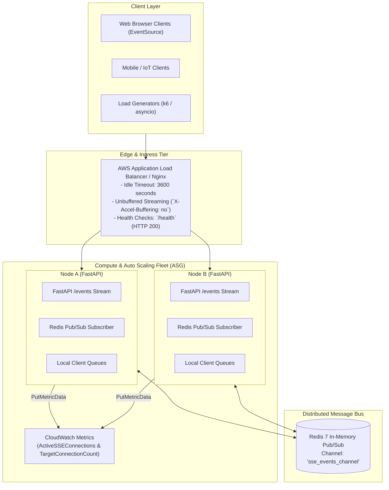

# Scalable Server-Sent Events (SSE) Architecture (Modules 80–82)

Welcome to the **Scalable Server-Sent Events (SSE) Architecture** track. This series of hands-on labs guides you through designing, building, tuning, scaling, and load-testing high-performance persistent streaming architectures in the Poridhi cloud environment and AWS.

---

## Architecture Overview

---

## Course Modules and Labs

| Module | Lab | Title | Key Topics & Deliverables |
| :--- | :--- | :--- | :--- |
| **Module 80** | [Lab 56](file:///home/iftakhar/Poridhi/Lab/Scalable%20Server-Sent%20Events%20%28SSE%29%20Architecture%20%28Modules%2080%E2%80%9382%29/Module%2080:%20Scalable%20SSE%20Architecture%20with%20ALB/Lab%2056:%20SSE%20Server%20Implementation/readme.md) | **SSE Server Implementation** | - SSE vs WebSockets comparison and trade-offs - Asynchronous FastAPI streaming server (`/events`) - Response headers: `Content-Type: text/event-stream`, `X-Accel-Buffering: no` - Heartbeat pings and browser `EventSource` dashboard |
| **Module 80** | [Lab 57](file:///home/iftakhar/Poridhi/Lab/Scalable%20Server-Sent%20Events%20%28SSE%29%20Architecture%20%28Modules%2080%E2%80%9382%29/Module%2080:%20Scalable%20SSE%20Architecture%20with%20ALB/Lab%2057:%20ALB%20Configuration%20for%20Long-Lived%20Connections/readme.md) | **ALB Configuration for Long-Lived Connections** | - Resolving 60s idle timeout drops (`504 Gateway Timeout`) - Configuring AWS ALB `idle_timeout.timeout_seconds = 3600` - Target Group deregistration delay (connection draining) - Isolating health check probes (`/health`) from streaming paths - Production Nginx load balancer emulation stack |
| **Module 81** | [Lab 58](file:///home/iftakhar/Poridhi/Lab/Scalable%20Server-Sent%20Events%20%28SSE%29%20Architecture%20%28Modules%2080%E2%80%9382%29/Module%2081:%20Auto%20Scaling%20and%20Load%20Testing%20for%20SSE/Lab%2058:%20Auto%20Scaling%20Setup%20for%20SSE%20Servers/readme.md) | **Auto Scaling Setup for SSE Servers** | - Why CPU-based scaling fails for streaming connections - EC2 Launch Template with Linux socket tuning in User Data - Publishing custom `ActiveSSEConnections` to CloudWatch - Target Tracking scaling policy on `TargetConnectionCount` |
| **Module 81** | [Lab 59](file:///home/iftakhar/Poridhi/Lab/Scalable%20Server-Sent%20Events%20%28SSE%29%20Architecture%20%28Modules%2080%E2%80%9382%29/Module%2081:%20Auto%20Scaling%20and%20Load%20Testing%20for%20SSE/Lab%2059:%20SSE%20Load%20Testing/readme.md) | **SSE Load Testing** | - Tuning OS socket limits (`ulimit -n 65535`, `somaxconn`) - Simulating 1,000+ concurrent persistent streams with Python `asyncio` - k6 load testing script with custom streaming thresholds - Monitoring event continuity, RAM footprint, and scale-out dynamics |
| **Module 82** | [Lab 60](file:///home/iftakhar/Poridhi/Lab/Scalable%20Server-Sent%20Events%20%28SSE%29%20Architecture%20%28Modules%2080%E2%80%9382%29/Module%2082:%20Redis%20Pub-Sub%20for%20Distributed%20SSE/Lab%2060:%20Distributed%20SSE%20Messaging%20with%20Redis/readme.md) | **Distributed SSE Messaging with Redis** | - Multi-node statefulness dilemma behind load balancers - Redis Pub/Sub asynchronous message bus integration - FastAPI in-memory subscriber fan-out to local client queues - End-to-end multi-node broadcast verification with Docker Compose |

---

## Lab Prerequisites & Tools

The labs in this track utilize standard tools pre-installed in the Poridhi environment:
- **Python 3.10+** (`fastapi`, `uvicorn`, `redis`, `boto3`, `httpx`, `aiohttp`)
- **Docker & Docker Compose** (for multi-container cluster emulation)
- **Nginx** (for reverse proxy and load balancer simulation)
- **AWS CLI** (for AWS ALB and Auto Scaling configuration scripts)
- **k6 / curl** (for unbuffered load testing and streaming verification)
